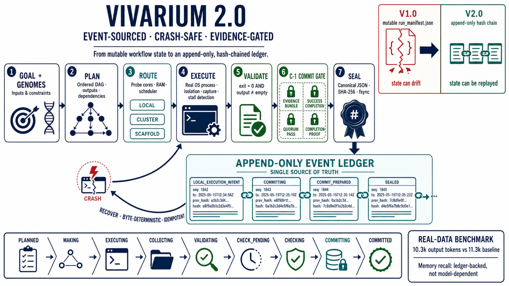

# vivarium

<p align="center">
  <a href="docs/media/vivarium-v2-durable-loop-4k.png">
    
  </a>
</p>

> **English** ｜ [中文](README.md)
>
> **A durable analysis-execution kernel for comparative genomics**—the pipeline is modeled as an event-sourced state machine, every numeric value is traceable back to a sealed committed fact, and after a crash at any point the process recovers byte-for-byte deterministically. Delivered as a Claude Code plugin, Codex skills, and a pure–standard-library kernel (not a cluster scheduler).

LLM-driven comparative-genomics analysis has two silent failure modes. First, a pipeline runs for an hour and is interrupted, the state recorded in a mutable manifest is corrupted, and the numbers already computed can no longer be trusted. Second, the context grows with each stage, and at the tail of the task the model recites "from memory" a value that no longer corresponds to any real computation. vivarium 2.0 puts the pipeline state into an **append-only, hash-chained event ledger**: after a crash the state is rebuilt byte-for-byte deterministically from the ledger, and the tail-end recitation is **read back from committed artifacts rather than recalled from memory**—the ledger is the memory.

**For:** PIs who need methodology-grade provenance and reproducibility; bioinformatics engineers who run long pipelines across laptop and cluster and require deterministic recovery after interruption; experimental biologists who want publication-grade figures.

---

## Project status

| Item | Current status |
|---|---|
| **Maintenance** | **Actively maintained and iterated**; subsequent versions will be released incrementally in response to real-data benchmarks, cross-client compatibility testing, and user feedback |
| **Current release line** | `v2.0.1`; 2.0 is the main development line, while the 1.0 analysis scripts remain independently usable |
| **Supported clients** | Claude Code plugin and Codex skills; both clients share the same `SKILL.md` workflow contracts |
| **Version record** | Semantic versioning, [`CHANGELOG.md`](CHANGELOG.md), and [GitHub Releases](https://github.com/Jason-0409-G/vivarium/releases) |
| **Development roadmap** | Public tasks, acceptance criteria, dependencies, risks, and phase status are documented in [`docs/VIVARIUM_V2_TASKS.zh-CN.md`](docs/VIVARIUM_V2_TASKS.zh-CN.md) |

> Continuous development does not conceal experimental boundaries. Incomplete capabilities are explicitly marked in the roadmap and release notes; automated cluster-job submission and polling remain in scope for a later version.

## Installation

Claude Code and Codex are **peer-supported clients** for vivarium and expose the same six workflow capabilities. Users may install either client or both; only the distribution and update mechanisms differ.

| | **Claude Code** | **Codex** |
|---|---|---|
| **Recommended entry point** | Plugin marketplace | `$skill-installer` |
| **Distribution unit** | One `vivarium` plugin containing the umbrella skill and five sub-skills | Six independent skill paths comprising the umbrella skill and five sub-skills |
| **Default installation location** | Claude Code plugin cache, managed by the plugin manager | `$CODEX_HOME/skills` (default: `~/.codex/skills`) |
| **Primary update path** | Refresh the marketplace, then run `/plugin update` | Synchronize the six paths again, or run `git pull` in the local repository targeted by symlinks |

### Claude Code

Installation through the plugin marketplace is recommended because it centralizes version and update management. The following commands register the marketplace, install the plugin, and reload the active session:

**Option 1 · Plugin marketplace (recommended)**
```
/plugin marketplace add Jason-0409-G/vivarium
/plugin install vivarium@vivarium
/reload-plugins
```
> The GitHub `owner/repo` form resolves the repository's default branch (currently `master`) and is not affected by Codex Skill Installer's `main` default. To pin the branch explicitly, use `/plugin marketplace add https://github.com/Jason-0409-G/vivarium.git#master` instead.

For source inspection or a pinned local checkout, clone the repository and run the installation script:

**Option 2 · Script (local installation)**
```bash
git clone https://github.com/Jason-0409-G/vivarium.git
cd vivarium
bash install.sh            # copies skills/ into ~/.claude/skills/
```

### Codex

`$skill-installer` installs skills into `$CODEX_HOME/skills` (default: `~/.codex/skills`). For manual installations, Codex also discovers skills from the user-level `$HOME/.agents/skills` directory and repository-level `.agents/skills` directories, and it follows symlinked skill folders. A complete vivarium installation must register the umbrella skill and all five sub-skills.

**Option 1 · `$skill-installer` (recommended)**

Paste the following request into Codex:

```text
Use $skill-installer to install these paths from repo Jason-0409-G/vivarium using --ref master:
skills/vivarium
skills/vivarium-prep
skills/vivarium-compare
skills/vivarium-phylo
skills/vivarium-search
skills/vivarium-report
```

> This repository's default branch is `master`, whereas `$skill-installer` defaults `--ref` to `main`. Do not omit `--ref master`; otherwise the download step will fail.

Newly installed skills are normally available on the next task. Restart Codex if the skill list does not refresh.

**Option 2 · Local clone with user-level symlinks**

```bash
git clone https://github.com/Jason-0409-G/vivarium.git
cd vivarium
mkdir -p "$HOME/.agents/skills"
for skill in vivarium vivarium-prep vivarium-compare vivarium-phylo vivarium-search vivarium-report; do
    ln -s "$PWD/skills/$skill" "$HOME/.agents/skills/$skill"
done
```

This method retains a single source checkout, so a subsequent `git pull` exposes updated skill content to Codex without copying files again. To scope the installation to one repository, create the links under that repository's `.agents/skills` directory instead. See the [Codex skills documentation](https://learn.chatgpt.com/docs/build-skills).

## Updating

Release identity is defined by the `version` field in `.claude-plugin/plugin.json` and follows semantic-versioning conventions; the root [`CHANGELOG.md`](CHANGELOG.md) is the authoritative record of version-specific changes. Because this plugin uses an explicit version, every formal release must increment that field; pushing code to `master` without changing the version does not trigger an upgrade for installed copies.

Claude Code and Codex expose the same workflow contracts and versioned content; the procedures below differ only because the two clients use different distribution mechanisms.

### Claude Code

Marketplace installations should refresh the catalog before installing the latest release and reloading the session:

**Marketplace install**
```
/plugin marketplace update vivarium     # pull the latest catalog
/plugin update vivarium@vivarium        # install the new version
/reload-plugins                         # take effect immediately in this session (or restart)
```
You may also enable **auto-update** for `vivarium` under `/plugin` → Marketplaces. Update detection remains governed by the marketplace catalog and plugin version.

Before a release, maintainers can run `claude plugin validate .` from the repository root to validate the marketplace, plugin manifest, and skill metadata.

A script-based installation does not synchronize the repository automatically. Update the checkout explicitly and rerun the installer:

**Script installation**
```bash
cd vivarium   # the previously cloned directory
git pull
bash install.sh
```

### Codex

For a local clone with symlinked skills, the link targets remain stable; update the source checkout directly:

```bash
cd vivarium
git pull
```

Codex normally detects changed skill files automatically. Restart Codex if the active session continues to expose the previous version. Independent copies installed through `$skill-installer` should be synchronized again from the same six repository paths with `--ref master` specified explicitly; for continuous repository tracking, prefer the local-clone-and-symlink method.

## Triggering the complete workflow

The “complete workflow” means invoking the umbrella `vivarium` skill to drive the **`full` goal of the 2.0 durable kernel**. Both clients can also infer the skill from natural-language requests such as “run the complete comparative-genomics workflow” or “analyze these genomes end to end and make figures”; use the explicit invocation below to prevent routing to a single-step sub-skill.

| **Claude Code** | **Codex** |
|---|---|
| Use the plugin namespace `/vivarium:vivarium` | Use `$vivarium` |

**Claude Code**

```text
/vivarium:vivarium Run the complete vivarium 2.0 durable workflow over ./genomes. Use the full goal, print the DAG and local/cluster routing before execution, persist state under ./vivarium_store, run eligible local stages, and pause at cluster or scaffold stages with the exact command, expected artifacts, and collection path.
```

**Codex**

```text
Use $vivarium to run the full vivarium 2.0 durable workflow over ./genomes. Use the full goal, print the DAG and local/cluster routing before execution, persist state under ./vivarium_store, run eligible local stages, and pause at cluster or scaffold stages with the exact command, expected artifacts, and collection path.
```

The same kernel can be driven directly from the repository root:

```bash
# Review the complete stage graph, resource routing, commands, and artifacts first
PYTHONPATH=. python3 -m skills.vivarium.vivarium_v2.cli \
    plan --root ./vivarium_store --goal full --genomes ./genomes

# Execute; repeat the same command after collecting external-stage artifacts to resume from the ledger
PYTHONPATH=. python3 -m skills.vivarium.vivarium_v2.cli \
    run --root ./vivarium_store --goal full --genomes ./genomes
```

The current `full` goal expands to assembly statistics → annotation → ANI → AAI → orthology → synteny → phylogenetic tree → heatmap. Sequence searches and PAML selection analyses require additional query, database, orthogroup, or codon-alignment inputs, so complete mode does not invent them when those inputs are absent; invoke the corresponding sub-skill or the `selection` goal explicitly after the primary workflow.

## Why use vivarium (rather than just running scripts)

Three value propositions, each addressing one class of adopter, each backed by code or benchmark:

- **Reproducible down to the methodology (for PIs).** Every step emits a uniform provenance footnote `tool + version + exact command`; six analysis scripts and two plotting backends have been unified, whereas unguided bare runs record inconsistently (Benchmark 1, [`benchmark/benchmark.md`](benchmark/benchmark.md)).
- **Crash-safe long pipelines (for bioinformatics engineers).** State lives in an append-only event ledger, rebuilt byte-for-byte deterministically after interruption, idempotent (no re-run) over already-committed stages; routed between laptop and cluster according to the device's core count / memory / scheduler (kernel `loop.py` / `pipeline.py`).
- **Publication-grade delivery (for experimental biologists).** Constant export of editable SVG + PDF + TIFF (600 dpi, LZW); the unguided baseline produces only screen-resolution PNG (Benchmark 1 plotting task, 4/4 vs 2/4).

**When you don't need the kernel.** If you only want to run a single step (one BLAST, one heatmap, one ANI), just trigger the corresponding sub-skill directly—no need to drive the kernel. If you need mature cluster job auto-submission and polling, or a purely static pipeline that does not involve LLM orchestration, use Snakemake / Nextflow—vivarium generates submittable sbatch/qsub scripts but **does not auto-submit** (see the "Resource-aware routing" section).

## What only vivarium 2.0 does

The points of difference, gathered into one place, each annotated with its source in code:

1. **The event-sourced ledger as the single source of authority**—state is immutable, hash-chained, rebuilt byte-for-byte deterministically after a crash (`ledger.py` fsync + torn-tail isolation; `canonical.py` domain-separated SHA-256).
2. **The C-1 four-evidence commit gate**—before a stage enters COMMITTED, four persisted evidence objects are re-validated and bound to the committed run/cut/claim/contract; empty artifacts or non-zero exit codes are intercepted before entering the ledger (`loop.py` fail-closed before commit; `project.py` four-evidence re-check at commit time).
3. **Memory drift as a first-class measurable metric**—recitation is read-back from sealed artifacts, correctness independent of context length (Benchmark 2, [`benchmark/benchmark_v2.md`](benchmark/benchmark_v2.md)).
4. **Resource-aware local/cluster routing over one drivable, recoverable DAG**—the three routes `local_inline` / `cluster` / `scaffold_local` (`pipeline.py`).

## Positioning relative to other approaches

An honest comparison: Snakemake / Nextflow are stronger on the mature DAG and cluster job submission (precisely where vivarium explicitly defers to later), and no claim is made here to the contrary; what is unique to vivarium 2.0 is **the ledger as the single source of authority + pre-commit four-evidence validation + elimination of memory drift + LLM-native goal→DAG orchestration**—things none of the other approaches provide.

| Dimension | Hand-written scripts | Mutable-manifest pipeline<br>(incl. vivarium 1.0) | Snakemake / Nextflow | Generic agent skill | **vivarium 2.0** |
|---|---|---|---|---|---|
| Deterministic recovery after a crash | None | None (manifest can silently corrupt) | Partial (re-run rules) | None | **Yes (byte-for-byte rebuild from ledger)** |
| Pre-commit evidence validation | None | None | None | None | **C-1 four-evidence gate (empty artifact / non-zero exit intercepted)** |
| Source of state authority | No carrier | Mutable file (in-place overwrite) | File timestamps / DAG | Model context | **Immutable hash-chained ledger** |
| Recitation = read-back of committed fact | Human memory | Recall | N/A | Recall from context | **Read-back of immutable sealed artifact** |
| Memory drift | Unmeasured | Unmeasured | N/A | Unmeasured | **First-class measurable metric** |
| LLM-native goal→DAG orchestration | None | None | None | Partial | **Yes** |
| Resource-aware local/cluster routing | None | None | Yes (mature) | None | **Yes (generates scripts; auto-submit deferred)** |

## 1.0 → 2.0: what changed

2.0 changes exactly one thing: **the source of state authority in the execution layer**—replacing 1.0's mutable JSON manifest (`run_manifest.json`) with an append-only event ledger. All of 1.0's analysis scripts remain independently usable; 2.0 drives them as durable stages through one generic adapter layer (`v1_adapter.py`), with default behavior unchanged.

| Dimension | 1.0 | 2.0 durable loop |
|---|---|---|
| State carrier | Mutable JSON manifest (`run_manifest.json`); interruption / truncation / cross-stage distortion can cause silent corruption | Append-only event ledger; file-before-directory fsync ordering, torn tail isolated |
| Crash safety | None—if the process is interrupted, state can no longer be trusted | Yes—after interruption at any point, rebuilt byte-for-byte deterministically from the ledger, idempotent (no re-run) over committed stages |
| Source of authority | Mutable manifest (can be overwritten in place) | Event-sourced ledger (immutable, hash-chained)—**hence recitation = read-back, no memory drift** |
| Commit validation | No commit gate | C-1 four-evidence gate; empty artifact / non-zero exit intercepted before commit |
| Resource awareness | None | `probe_device()` + `route_stage()`: the three routes `local_inline` / `cluster` (generates sbatch/qsub) / `scaffold_local` |
| Orchestration form | Chained scripts | A single drivable, recoverable DAG (`plan`/`run` expand the stage graph; in-place stages run automatically, heavy stages pause and resume) |
| Memory drift | **Unmeasured** | Measured as a first-class metric (recall-vs-computed consistency), 1.0 in both configurations of this benchmark |

The key migration is the **source of authority**: 1.0's mutable manifest could both silently corrupt and offer no support for "recitation = read-back of an immutable fact"; once 2.0 places state in a hash-chained ledger, "memory" migrates from the model's context to sealed evidence on disk—precisely the precondition that lets 2.0 treat memory drift as a measurable metric. Integration details in [`docs/V1_V2_INTEGRATION.zh-CN.md`](docs/V1_V2_INTEGRATION.zh-CN.md).

## The 2.0 durable execution kernel

2.0 models the comparative-genomics pipeline as an **event-sourced state machine**. Each mechanism first states the **guarantee**, then gives the **mechanism**; terminology preserves its precise nominal meaning.

**Guarantee: after a crash at any point, state is rebuilt byte-for-byte deterministically, and completed stages are not recomputed.**
Mechanism—each stage's execution artifact, after restricted RFC-8785/JCS canonical JSON encoding (floating point disallowed, expressed as canonical decimal strings) and a domain-separated SHA-256 digest, is appended to an append-only JSONL ledger; writes follow file-before-directory fsync ordering, and a torn tail (a half-written trailing line) is isolated rather than misread. After the process is interrupted at any point, the system can rebuild pipeline state from the ledger byte-for-byte deterministically, idempotently over already-committed stages.

**Guarantee: failures or empty artifacts never enter the ledger to contaminate downstream.**
Mechanism—before a stage enters COMMITTED, it must re-validate four persisted evidence objects—the evidence bundle, the successful-completion record, the quorum-pass verdict, and the completion proof—all four bound to the committed run/cut/claim/contract. Empty artifacts or a non-zero exit code are intercepted **before any evidence object is sealed** (`loop.py`'s validation hard-gate runs before sealing), so no half-written commit intent is left to contaminate recovery.

**Guarantee: each stage runs on the laptop or on the cluster, decided from your machine.**
Mechanism—`probe_device()` probes the local core count, physical memory, and the presence of a cluster scheduler (sbatch/qsub/bsub); `route_stage()` uses this to decide the execution location per stage:
- `local_inline`—required tools are installed and resources fit; execute in place and commit;
- `cluster`—the stage's compute exceeds local capacity but a scheduler is present; generate a directly-submittable sbatch/qsub job script;
- `scaffold_local`—tools are missing or resources insufficient and no scheduler is present; generate commands for the user to run externally, with artifacts validated into the ledger after collection.

> **Honest boundary.** This routing is a resource-aware **heuristic** decision (conservatively intercepting stages that exceed capacity), not a precise runtime prediction; job-script generation is implemented, but **auto-submission and polling of cluster jobs are deferred to a later version**.

**Guarantee: one drivable, recoverable DAG.**
Mechanism—`vivarium v2 plan/run` expands four goals (`compare-genomes` / `phylogeny` / `selection` / `full`) into an ordered stage graph, each stage carrying its exact command, expected artifacts, dependency edges, and routing decision. The drive process automatically executes in-place stages and pauses at the first stage requiring manual intervention or cluster submission, pre-building the workspace; after the user collects the artifacts and drives again, the pipeline recovers from the durable ledger and resumes.

```bash
# Print the device-probe result, per-stage routing decisions, exact commands, and expected artifacts
PYTHONPATH=. python3 -m skills.vivarium.vivarium_v2.cli \
    plan --root ./store --goal compare-genomes --genomes ./genomes

# Drive the pipeline: in-place stages execute and commit automatically; scaffold/cluster stages pause for manual work
PYTHONPATH=. python3 -m skills.vivarium.vivarium_v2.cli \
    run  --root ./store --goal compare-genomes --genomes ./genomes
```

**What one run looks like.** Take the real run from Benchmark 2 (four real *Shewanella* genomes, see [`benchmark/benchmark_v2.md`](benchmark/benchmark_v2.md)): `plan` expands `compare-genomes` into four stages and annotates each stage's routing → `run` executes `00-prep-stats` and `01-compare-ani` (real FastANI) in place and seals the commit → pauses at `02-compare-aai` (EzAAI missing, by design, not needed for this task) → resumes at `03-report-heatmap` to produce a committed 600 dpi ANI heatmap (SVG + PDF). Three stages in total are sealed into the ledger, exactly one same-species pair is called (*S. vesiculosa* M7 + PB002_L5, ANI ≈ 98.5%), and each step is accompanied by `tool + version + command` provenance.

> The umbrella `vivarium` skill uses a run manifest as a **coordination layer** to track the sub-skills; the `plan/run` CLI beneath it is the **durable execution layer**—the event ledger is the source of authority for 2.0 pipeline state.

## Skills

| Skill | Core responsibility | Execution mode and boundary |
|---|---|---|
| **`vivarium`** | Umbrella coordination layer: goal interpretation → stage-graph construction → sub-skill orchestration → stage pause and resumption | Coordinates but does not implement analyses directly; when durable execution is required, the 2.0 kernel makes the event ledger authoritative |
| **`vivarium-prep`** | Assembly statistics and quality assessment; gene and functional annotation | `stats` and Prokka run in place when dependencies are satisfied; CheckM2, Flye, eggNOG, and dbCAN emit auditable external commands |
| **`vivarium-compare`** | ANI/AAI, orthology, and genome-synteny analysis | FastANI, EzAAI, and MUMmer run in place when dependencies are satisfied; OrthoFinder defaults to an external compute stage |
| **`vivarium-phylo`** | Sequence alignment, trimming, maximum-likelihood phylogeny, and codon-based selection analysis | Ordinary-scale trees may run in place; large or partitioned phylogenies and PAML analyses emit external commands |
| **`vivarium-search`** | Sequence-similarity and profile-HMM searches using BLAST, DIAMOND, or HMMER | Runs in place when tools and databases are available; missing dependencies terminate with explicit diagnostics |
| **`vivarium-report`** | Transform validated analytical results into standardized manuscript figures | Bundled support for heatmaps and bars; tree and synteny figures use the selected backend; exports SVG, PDF, and 600 dpi TIFF |

All six skills may be invoked independently or composed into a stage graph by the umbrella `vivarium`. Workflows requiring crash recovery, pre-commit validation, and replayable state are driven by the 2.0 durable kernel. Execution location is determined jointly by dependency availability, resource demand, and routing outcome: eligible stages run in place; compute-intensive stages or those requiring specialized environments emit auditable commands and expected-artifact contracts, and returned artifacts enter downstream processing only after validation.

## Benchmarks

### 1. Skill-effectiveness benchmark (with-skill vs no-skill baseline)

Four representative task classes—search, comparison, phylogenetics, and plotting—were evaluated with identical prompts, input data, and `bio_tools` environments; skill availability was the only configuration difference. Tasks were executed by claude-opus-4-8 (general-purpose sub-agent), and outcomes were assessed against predefined assertions. The evaluation compares correctness, runtime, and delivery properties within the specified tasks and execution configuration. Complete inputs, environment records, raw outputs, and assertion-level evidence are provided in [`benchmark/benchmark.md`](benchmark/benchmark.md).

| Metric | With skill | No-skill baseline | Difference |
|---|---|---|---|
| **Assertion pass rate** | **100%** | 82% | **+18 percentage points** |
| **Wall-clock time (mean)** | **72 s** | 97 s | **~26% faster** |
| Output tokens (mean) | 54.4 k | 53.2 k | +2% (one-time cost of reading SKILL.md) |

| Task | Pass (skill) | Pass (baseline) | Where the skill makes the difference |
|---|---|---|---|
| Search · find homologs across 3 queries | 5/5 | 4/5 | The baseline left 8 BLAST-database binary files in the delivery directory; the skill builds the database in a temp directory |
| Compare · 4-genome ANI + same-species call | 4/4 | 4/4 | Correctness tied; the skill is ~37% faster, with a clean matrix and no log residue |
| Phylogeny · 8-sequence groEL ML tree | 4/4 | 4/4 | Tied; both correctly report the tree as unresolvable (sequences nearly identical), without over-claiming |
| Plotting · publication-grade ANI heatmap | 4/4 | **2/4** | The baseline exports only screen-resolution PNG, no 600 dpi TIFF; the skill constantly exports SVG + PDF + TIFF (600 dpi, LZW) |

**Interpretation.** The skill set ties a careful baseline on biological correctness; the difference concentrates in publishability and reproducibility: (i) every run records a `tool + version + command` provenance footnote, whereas unguided runs record inconsistently; (ii) publication-grade output is constantly editable SVG + PDF + 600 dpi TIFF, following restrained Nature-style typesetting, whereas the baseline produces only screen-resolution raster; (iii) the delivery directory retains only results, with temporary databases confined to a temp directory; (iv) it invokes hardened bundled scripts rather than re-deriving command-line arguments, shortening wall-clock time by ~26%.

### 2. Durability-and-memory-consistency benchmark (2.0 vs no-skill baseline)

To evaluate the central 2.0 mechanism—the event ledger as the authoritative carrier of cross-stage state—we constructed a multi-stage comparative-genomics task: per-genome assembly statistics → all-vs-all ANI → same-species-pair classification → a written summary citing preceding values → terminal recitation of key values. The configurations differed only in whether execution was mediated by the 2.0 durable kernel. Execution and scoring used claude-opus-4-8[1m], with an independent scoring agent recomputing every numeric result. The complete design, item-level scores, runtime telemetry, and source evidence are available in [`benchmark/benchmark_v2.md`](benchmark/benchmark_v2.md).

> **Scores are close; the decisive difference is in the mechanism, not the score—the baseline recites from recall, the durable loop reads back from sealed commits.**

| Metric | No-skill baseline | 2.0 durable loop | Note |
|---|---|---|---|
| memory_drift | 1.00 | 1.00 | Both recitations match all three values exactly against their own computed values; the mechanism differs (see below) |
| output_hygiene | 0.95 | **1.00** | The durable loop's temporary storage is the intended durable location |
| Output tokens (evaluation record) | 11,294 | **10,327 (~−8.6%)** | No additional output overhead observed in this configuration |
| Input tokens (evaluation record) | 31,632 | 31,660 (~+0.1%) | Essentially equivalent |
| academic_completeness | 0.95 | 0.95 | Both are reproducible |
| correctness | **1.00** | 0.98 | The 0.02 is reporting completeness (fastANI minimizer jitter not annotated), not a scientific error |
| stages_completed | 4 | 3 (sealed commits) | Different counting conventions, not a capability difference (the baseline counts 4 logical steps; the durable loop counts sealed stages, with 02-compare-aai paused by design because EzAAI is missing) |

**Interpretation.** Scores were similar for the specified task set; the decisive distinction lies in the **state and recall mechanism**. The baseline recites key values directly from model context, whereas the durable loop reads them from committed and sealed stage artifacts constrained by the C-1 four-evidence gate, SHA-256 object digests, and the hash-chained event sequence. The latter therefore grounds value consistency in queryable persisted facts rather than contextual memory. Under the recorded configuration, the durable loop produced 10.3k output tokens versus 11.3k for the baseline, with essentially equivalent input volume; this pattern is consistent with the CLI carrying stage orchestration and reducing model-side assembly of tool calls.

*Memory consistency is defined as agreement between the terminally recited value and the corresponding computed result. Both configurations correctly identify one same-species pairing (*S. vesiculosa* M7 and PB002_L5; ANI ≈ 98.5%), representing distinct strains of the same species. The scoring prompt's expectation of no same-species pairing conflicts with the FASTA identifiers and the repository's existing analysis; this discrepancy and its supporting evidence are documented in [`benchmark/benchmark_v2.md`](benchmark/benchmark_v2.md).*

## Trigger contract

Each of the six skills provides an `evals/trigger_evals.json` file, together comprising **69** should-trigger and should-not-trigger queries (12 + 11 + 12 + 11 + 11 + 12 for vivarium / prep / compare / phylo / search / report, respectively). These files define the trigger contract and serve as regression fixtures after description changes; their structure follows the `skill-creator` eval-set schema. An additional set of 20 boundary-routing queries assessed discrimination among neighboring skills, covering reprocessing of existing results, whole-pipeline versus single-step requests, ambiguous adjacent-skill cases, and negative inputs that should activate no skill. Manual review of the current version yielded **20/20** agreement with the expected route. This measure evaluates trigger-rule consistency only; it does not assess the scientific correctness of downstream analyses.

## Dependencies

Runtime requirements are separated into kernel dependencies and analysis-tool dependencies. **The 2.0 durable kernel uses only the Python standard library and requires no additional pip packages.** External bioinformatics programs are resolved from the **`bio_tools` conda environment** and invoked only by the corresponding analysis stage:

- QC and annotation: seqkit and Prokka; CheckM2, Flye, eggNOG-mapper, and dbCAN are used by optional or compute-intensive stages
- Comparison: FastANI, EzAAI, OrthoFinder, MUMmer4
- Phylogenetics: MAFFT, trimAl, IQ-TREE, FastTree, PAML (codeml), PAL2NAL
- Search: BLAST+, DIAMOND, HMMER
- Plotting: Python (pandas / matplotlib) or R (ggplot2 / svglite / ragg)

vivarium does not mutate the user's analysis environment or install missing software or databases automatically. A missing dependency produces an explicit diagnostic and routes the affected stage to external execution or a pending state rather than generating an unvalidated substitute result.

## Design principles

- **Persistent state and replayable recovery.** Pipeline state is defined exclusively by the append-only event ledger. Recovery replays validated events and remains idempotent over committed stages. Cross-run determinism currently depends on fixed random seeds in phylogenetic inference and relativization of the `--out` workspace; CRLF normalization, EzAAI label normalization, fixed intermediate directories, and related cross-environment controls remain under development (see [`docs/V1_V2_INTEGRATION.zh-CN.md`](docs/V1_V2_INTEGRATION.zh-CN.md)).
- **Fail-closed commit semantics.** A stage enters COMMITTED only after all four C-1 evidence objects pass re-validation. Non-zero exit status, empty artifacts, or inconsistent evidence bindings terminate the commit without modifying confirmed state.
- **Explicit execution boundaries.** Stages with bounded resource demands and satisfied dependencies may execute in place. Compute-intensive stages or those requiring specialized environments emit auditable commands and expected-artifact contracts for user- or cluster-side execution, followed by controlled artifact collection and validation.
- **Non-invasive environment management.** vivarium does not install software or databases automatically and does not modify the user's environment; dependency changes require explicit user authorization.
- **Structured provenance.** Each analysis script records tool identity, version, and exact command using the uniform completion record `=== vivarium-… done === / tool: <name>(<version>) / command: <exact command>`. Six analysis scripts and the matplotlib and ggplot2 plotting backends implement this contract, providing machine-readable support for result auditing and methods preparation.
- **Evidence-constrained scientific communication.** Figures, summaries, and conclusions must remain traceable to validated artifacts. The presentation layer organizes evidence but does not modify analytical results or substitute graphical quality for scientific validity.
- **Recoverable file lifecycle.** Cleanup uses soft deletion by moving targets into `_deleted/`, preserving a recovery path after accidental operations.
- **Model-independent execution interface.** Parameter construction, tool invocation, and artifact contracts are encapsulated in versioned scripts and kernel interfaces. The model primarily selects constrained operations and interprets structured outputs, reducing reliance on ad hoc model planning; equivalence across model backends requires independent validation.

## Scope and implementation boundaries

- **Benchmark scope.** Metrics reported in the README are confined to the repository's specified tasks, input data, tool versions, and execution configuration. They validate current implementation behavior and delivery properties, not a general performance ranking across models, hardware platforms, or workflow systems.
- **Auto-submission and polling of cluster jobs are not yet implemented**—the kernel generates submittable sbatch/qsub scripts, but submission and polling are deferred to a later version.
- **Several determinism items remain on the roadmap** (CRLF normalization, EzAAI label normalization, fixed intermediate directories, cross-environment determinism of TIFF rasterization); see [`docs/V1_V2_INTEGRATION.zh-CN.md`](docs/V1_V2_INTEGRATION.zh-CN.md) for details.
- **"Publication-grade" refers to output format and reproducibility** (editable SVG + PDF + 600 dpi TIFF, restrained typesetting, versioned provenance); it does not mean the scientific conclusions have reached a publishable level.

## License

See `LICENSE` (MIT).
