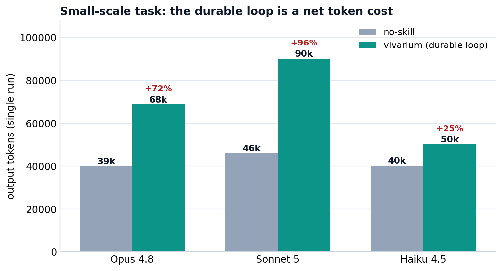
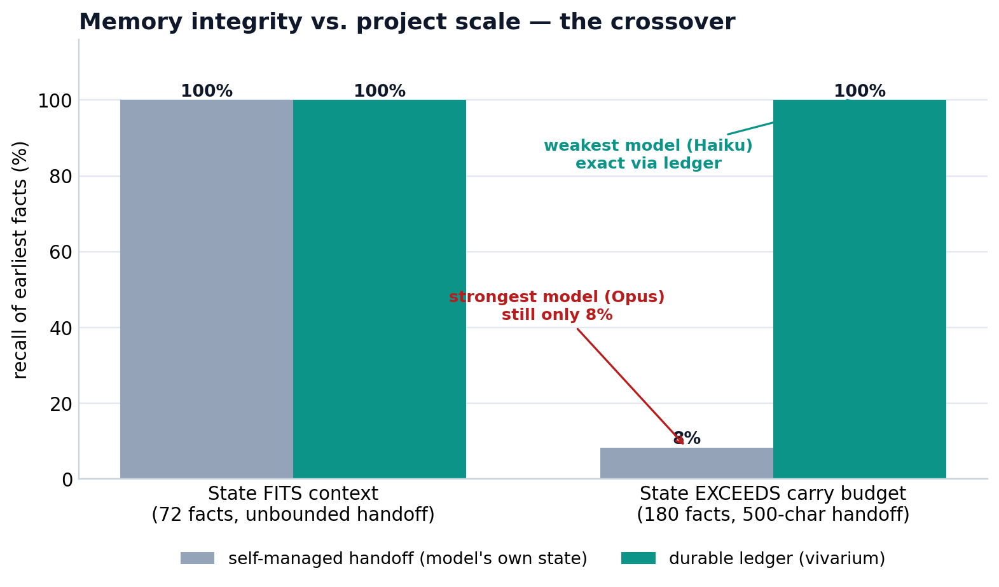

# 权威裁决 · vivarium 持久循环（durable loop）的能力排名与重点

> 本报告是围绕 vivarium 2.0 持久执行内核的一轮系统测试的权威汇总：四类实验、逐条对抗验证，全部使用当场从本地数据新鲜计算的客观真值，不复用任何既往结论。执行/评分模型为 claude-opus-4-8[1m] / sonnet-5 / haiku-4.5；单机单跑，属方向性证据。

## 摘要（一句话重点）

**vivarium 的核心价值、也是它唯一无法被更强模型替代的能力，是"项目状态的持久性与崩溃安全"——当项目状态超出可携带的上下文时，事件账本让最弱的模型都能 100% 保真地恢复真相，而这是一条经对抗验证的代码级硬保证，不是靠模型能力刷出来的分数。**

对外定位不应是"让模型更聪明"（溯源增益温和，强模型本就近满分），而应是"**让长时程、状态溢出上下文的项目永不丢真相、崩溃可精确恢复**"。

## 一、测试矩阵

| 实验 | 变量 | 度量 | 证据等级 |
|---|---|---|---|
| **2×3 多工具基准** | no-skill vs vivarium × Opus/Sonnet/Haiku | 正确性、记忆漂移、学术完整性、产物规范性、token | LLM 基准 |
| **规模化漂移 · 装得下** | 自管 handoff vs 账本（72 事实，无界） | 最早事实召回率 | 受控实验 |
| **规模化漂移 · 溢出** | 自管 handoff vs 账本（180 事实，500 字符预算） | 最早事实召回率 | 受控实验 |
| **硬保证 · 崩溃恢复 (P1)** | 事件账本 vs 可变清单，注入崩溃 | 恢复保真/幂等/不变式 | 代码级对抗验证 |
| **硬保证 · 提交闸门 (P2)** | 6+ 个伪造/借用/篡改攻击向量 | 是否 fail-closed | 代码级对抗验证 |
| **硬保证 · 确定性 (P3)** | 同阶段重跑 | 输出与密封摘要是否复现 | 代码级对抗验证 |

## 二、结果

### 2.1 小规模 2×3：durable loop 是净成本（不是它的战场）

正确性与记忆漂移在全部 6 个单元格 = **1.0 天花板**（任务装得进上下文）；差异只在溯源与 token：

| 指标 | Opus no-skill / viv | Sonnet no-skill / viv | Haiku no-skill / viv |
|---|---|---|---|
| correctness | 1.0 / 1.0 | 1.0 / 1.0 | 1.0 / 1.0 |
| memory_drift | 1.0 / 1.0 | 1.0 / 1.0 | 1.0 / 1.0 |
| academic_completeness | 0.90 / **1.00** | 0.90 / **0.97** | 0.55 / **0.70** |
| output_hygiene | **1.00** / 0.90 | **1.00** / 0.95 | 0.95 / 0.95 |
| stages_completed | 6/6 / 6/6 | 6/6 / 6/6 | 6/6 / **5/6** |
| 输出 token | **39.8k** / 68.7k | **46.0k** / 90.0k | **40.2k** / 50.2k |

- vivarium 每个层级都更贵（+72% / +96% / +25%）。
- 唯一可辨正面是**学术完整性**，且**对最弱的 Haiku 增益最大**（0.55→0.70）——技能把"工具+版本+精确命令"溯源内建进流程。
- 强层级 `output_hygiene` 反而略低（持久 store 工件）。
- **Haiku-vivarium 唯一回退**（5/6 阶段，唯一对 groEL 树过度声称）——复杂机制压垮最弱模型。

### 2.2 规模化抗漂移：核心交叉点

| 场景 | 自管 handoff | 持久账本 |
|---|---|---|
| **装得下**（72 事实，无界 handoff，6 跳） | Opus 12/12、Haiku 12/12 = **100%** | Haiku 12/12 = **100%** |
| **溢出**（180 事实，500 字符携带预算） | 强模型 Opus 回忆自建 = **1/12 (8.3%)**；回忆 Haiku 自建 = **0/12** | 弱模型 Haiku 读账本 = **12/12 (100%)** |

**决定性结论**：一旦项目状态超出可携带上下文，自管理状态崩溃，**更强的回忆模型也救不回预算已丢弃的东西**——损失在项目侧，不在模型侧；账本对最弱模型都保持 100%。丢失的事实被答成 "unknown"（是**丢失、不是幻觉**）。

**边界（诚实）**：状态装得下时，两者都是 100%——**没有溢出就没有漂移，也就没有账本增益**。账本的价值只在状态溢出上下文时兑现。

### 2.3 硬保证（代码级对抗验证）

一手复核：全套 **202 测试通过**。三条保证各自被攻击性复跑内核代码后裁决：

| 保证 | 裁决 | 强度 | 决定性事实 |
|---|---|---|---|
| **提交闸门 (P2)** | **CONFIRMED** | **5/5** | 有效 CONTROL 步骤能提交（闸门有区分力）；6 个命名攻击 + 预算篡改 + 跨 claim 借证 + 错 quorum + 伪造 acceptance + fail 级封印，**全部 fail-closed，走私进 STAGE_COMMITTED = 0**。两处"疑似洞"经查为测试脚手架假象。 |
| **崩溃恢复 (P1)** | **OVERCLAIMED** | 4/5 | 账本层满分：3 记录账本**全部 1834 个切割偏移**逐字节精确重建已提交前缀；50 次恢复字节不变；差分——朴素 `run_manifest.json` 在 5/5 切点全部 JSONDecodeError 丢全部状态。**但项目层有真洞**（见 §3b）。 |
| **确定性 (P3)** | 缺陷 CONFIRMED | 5/5* | 同一 deterministic 步骤两跑：科学**输出**逐字节相同；但**密封执行摘要全部不同**，根因 OS pid 经 3 条通道污染密封 cut（见 §3c）。 |

\* P3 的 5/5 指"缺陷确凿、边界清楚"这一裁决可信，**不是**"确定性达标"。

## 三、能力排名与诚实反价值

**排名**（证据等级 × 强度 × 不可被模型能力替代）：

1. **崩溃恢复 / 追加式哈希链账本（P1）** —— 代码级硬保证，账本层满分、项目层一处真缺陷 → 4/5。不可替代性最高。
2. **提交闸门（P2）** —— 代码级硬保证，5/5 无幸存反例。不可替代性高。
3. **规模化抗漂移** —— 受控实验，5/5，把 P1/P2 的硬保证翻译成用户可见收益（8.3% vs 100%）。
4. **溯源 / 学术完整性** —— LLM 基准增益，温和、非模型不可替代，3/5（主要托底弱模型）。
5. **跨运行确定性（P3）** —— 有真缺陷，须软化声明。

**诚实反价值（哪里不值得用）**：

- **(a) 小规模、装得进上下文的任务**：token 全面更贵，无正确性/漂移收益，强层级产物规范性略低，弱模型（Haiku）会回退。**状态装得进上下文时别用 vivarium。**
- **(b) 确定性声明须软化（P3）**：**不能声称** deterministic 步骤的密封执行摘要可跨运行复现。**今天能诚实声称的**：同一账本的执行完全确定；科学输出与已提交对象身份可跨运行复现；但密封执行溯源摘要因绑定每运行进程身份 (pid) 而**不可**跨运行复现。
- **(c) 提交闸门范围**：`_validate_outputs` 只保证 exit 0 + ≥1 非空文件，**不保证载荷内容科学正确**——"能提交" ≠ "科学正确"。

## 四、发现的两处真缺陷与修复方案

### (b) P1 项目层："同一事务既提交又中止"

当 `ledgers/work.jsonl` 被撕裂的末行恰是一条**已持久提交的 `STAGE_COMMITTED`** 记录时，`project.recover()` 既隔离它、又（非原子地）把同一事务驱动到 `STAGE_COMMIT_ABORTED`；修好那个字节后，同一 `commit_tx_id` 同时留下 COMMITTED 与 ABORTED，违反"永不同时"。根因：(1) `project.py:1539` 意图恢复循环跑在撕裂尾检测（`_prefixes` @1567）**之前**；(2) `_outcome` @883 读 `work.recover().events`，静默丢弃被隔离的已提交记录，把已提交事务误读为未提交。**修复**：recover() 在恢复 COMMIT_INTENT 前先检测 work 账本撕裂尾；`_outcome` 对被隔离尾**失败即关闭**而非当"不存在"；撕裂已提交尾时的"先持久 abort 后 raise"改为原子。补测试：提交后撕裂 work 账本尾字节。

### (c) P3：pid 污染密封摘要

pid 经 3 条通道进入密封 cut：① `execution.py:966` `process_or_job_ref = f"{boot_id}:{pid}:{process_start_identity}"`；② `local_harness.py:251-258` `sentinel_digest` 哈希了含 pid 的 `process_start_identity`；③ `execution.py:979-985` `local_executor_identity_digest` 哈希 `{boot_id, process_start_identity}`。**修复**（最小，仅改哈希输入，pid 保留在持久 receipt 供运行时 reaping）：三处去 pid。预测 **202 测试零真实破坏**（所有 fixture 都是手搓合成 cut）；修后新增一条跨运行密封摘要相等的回归测试，即可把确定性声明从"软化"升级为"deterministic 步骤密封摘要可跨运行逐字节复现"。

## 五、重点与投资优先级

**主打**：崩溃安全的持久项目状态，作为弱模型的托底能力——唯一同时满足"代码级硬保证（P1+P2）× 有干净的用户可见实验证据（bounded scale-drift）× 不可被模型能力替代"的能力。

**投资优先级**：
1. **修 P1 项目层缺陷（最高）**——它是护城河的裂缝，直接损伤主打卖点的正确性。
2. **修 P3 pid 污染（低成本高回报）**——3 处哈希输入改动，近乎免费地升级确定性叙事。
3. **不要**为小规模任务优化 token——那是账本设计上不该赢的战场；在文档里明确划界，用诚实边界换核心场景可信度。

## 复现

- 数据：`tests/data/genomes`（4 个真实 Shewanella 基因组）、`tests/data/marker_groEL.faa`。
- 真值：`benchmark/make_authoritative_figures.py` 内联真实数字；漂移事实由逐窗口 GC% 现场计算。
- 硬保证：`PYTHONPATH=. python3 -m unittest discover -s tests/v2`（202 通过）；对抗复跑脚本见各实验记录。
- 图：`python3 benchmark/make_authoritative_figures.py` → `docs/figures/benchmark_scale_crossover.*`、`benchmark_2x3_tokens.*`。
