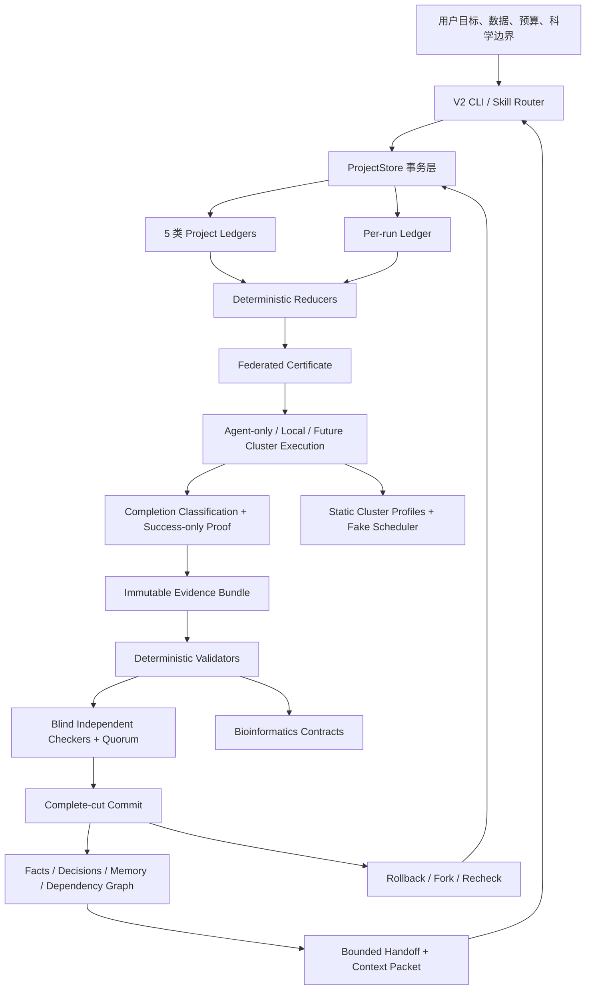
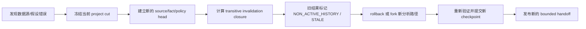

# Vivarium Loop Engineer V2.0 总体目标、系统架构与 14 项实施任务详细说明

> 文档状态：实施中（Working Draft）  
> 最后更新：2026-07-19  
> 当前开发分支：`codex/vivarium-loop-engineer-v2`  
> 目标读者：Vivarium 开发者、生物信息学研究人员、Claude Code/Codex 用户、benchmark 审核者  
> 文档作用：解释 V2.0 为什么存在、它如何工作、14 个 Task 分别产出什么，以及什么时候才能称为“完成的 V2.0”。

---

## 1. 一页结论

Vivarium V2.0 不是对 V1 的删除、覆盖或简单改名，也不是另外创建一套与旧代码无关的生信脚本。V2.0 是在保留 GitHub V1 执行能力和用户接口的前提下，新增一个独立、可选启用的 **Loop Engineer 控制平面**。

V2.0 要把现有的“Agent 根据 `SKILL.md` 和 handoff 文件执行生信任务”升级成以下可验证闭环：

1. 用户给出生信目标、数据范围、资源预算和科学边界。
2. 系统冻结样本身份、输入数据、参考版本、数据库版本、分析假设和 acceptance contract。
3. Maker 在私有 attempt 中规划或执行候选分析，不能直接写项目的 canonical 真相。
4. 执行器记录输入、命令、环境、进程/作业身份、输出和终态证据。
5. 确定性生信 validators 检查文件、样本、坐标、序列、统计家族、数据库身份和跨阶段一致性。
6. 独立 Checker 只读取封存证据、validator seal、rubric 和 acceptance contract，不继承 Maker 的对话、自评或隐藏推理。
7. 只有证据、硬校验、Checker quorum、隔离等级、预算和 CAS 全部通过，结果才能事务化提交为 checkpoint。
8. 发现旧数据源、旧假设或旧结论错误时，不改写历史；系统封存旧 head，使用 rollback/fork 创建新的活动路径。
9. 每轮结束后可以提取 episode 和程序性经验，但未经独立检查和回归验证的“经验”不能成为新的规范记忆。
10. 下一轮 Agent 只获得有界上下文，而不是一个无限增长、容易漂移的 handoff 全文。

因此，V2.0 的核心价值不是“让 Agent 多跑几次”，而是：

> 让每一次运行都有明确输入、唯一状态、封存证据、独立审核、可追溯提交、可恢复失败、可封存旧错误，并只吸收经过验证的经验。

---

## 2. V1 与 V2.0 的关系

### 2.1 V1 继续存在

- V1 是已发布的生信 skill/脚本层，具有现有的 ANI/AAI、直系同源、共线性、系统发育、QC/注释和图表能力。
- V2.0 不删除 V1 API，不默认改写 V1 run，不将旧 `run_manifest.json` 直接冒充为已验证 V2 状态。
- V2.0 采用显式 opt-in 入口；不启用 V2 时，旧命令和旧项目应保持原有行为。
- 从 V1 导入 V2 时，原目录必须 byte-identical；导入只新建 V2 ledger 和 provenance。
- V1 中模糊的 `done` 只能导入为历史证据，不能自动变成 V2 `COMMITTED`。

### 2.2 V2.0 是控制平面，不是重写所有生信工具

V2.0 负责：

- 任务身份、状态、证据和依赖的规范化。
- Maker/Checker/Validator 的能力边界和审核门。
- 事务提交、崩溃恢复、rollback/fork、旧结论封存。
- 本地执行和以后集群执行的可审计监督。
- 生信合同、数据库身份、统计完整性和科学结论边界。
- 有界 context/handoff 和经回归验证的程序性记忆。

V2.0 不负责重新实现 FastANI、MAFFT、IQ-TREE、OrthoFinder、samtools 或其他生信工具的核心算法。这些工具仍然是执行层；V2.0 负责证明“跑的是什么、用的是哪些输入、返回了什么、结果是否可以被信任和提交”。

### 2.3 独立性边界

- Vivarium 是独立 skill，不引用、不导入、不复制、不在 runtime 依赖 `GPTomics/bioSkills`。
- 可以学习外部项目的信息架构、合同化思路、模块化方式和测试组织，但必须由 Vivarium 独立重新设计和实现。
- Task 11 会对 runtime 树做 clean-room 扫描，确保不存在隐性外部依赖。

---

## 3. V2.0 要解决的具体问题

### 3.1 状态和上下文漂移

单一 handoff 或可覆盖 manifest 同时承担“计划、当前状态、历史、结论、记忆”时，文件会越来越长，不同 Agent 可能读取不同片段，旧值可能在递归摘要中重新变成“当前真相”。V2.0 将权威历史、当前投影、任务上下文和可学习经验拆分。

### 3.2 旧数据源、假设或结论错了以后无法干净纠正

V2.0 不允许把旧值从历史中删掉，也不允许用一个新 handoff 覆盖掉旧错误就宣称问题消失。新 fact/source/policy 必须创建新 head，旧 head 变成可审计但默认不可检索的 `NON_ACTIVE_HISTORY`；依赖旧 head 的结果自动 stale。

### 3.3 Maker 自己宣布成功

模型的文本“完成了”、一个 sentinel、一个退出码或一张图不是完整证据。V2.0 把候选生产、确定性校验、独立审查和事务提交拆开；Maker 无权直接把候选结果变成活动结论。

### 3.4 失败后重跑可能重复产生副作用

本地进程、集群作业或远程 API 在“请求已发出但 receipt 未持久化”的窗口崩溃时，盲目重试可以启动两个进程或提交两个作业。V2.0 使用 durable intent、process/client receipt、attach-only recovery、确定性 operation key 和最多一次调用语义。

### 3.5 生信错误常常不是程序崩溃

典型生信错误包括样本名对错、FASTA ID 规范化碰撞、坐标差 1 bp、混用遗传密码、只输出 top-10 p-value、树和比对 taxa 不一致、压缩流截断、数据库路径相同但内容已改变，以及计算证据被表述成实验机制。V2.0 将这些约束放入确定性 validator，而不只写在提示词中。

### 3.6 qsub/csub 不是一个统一调度器

`qsub` 可能是 SGE/Open Grid Engine、PBS/Torque 或 PBS Pro；`csub` 也有多种不兼容实现。V2.0 Phase A 仅做静态 fingerprint、profile lint、脚本渲染和 fake scheduler。在没有真实站点证据和测试时，真实 submit/cancel/hold/release 必须 fail closed。

### 3.7 没有公平 benchmark 就不能宣称优势

V2.0 的 README 不能因为架构看起来严谨就声称“更准确”或“更安全”。Task 12 必须在相同模型/工具/预算下比较 no-skill、冻结 V1 和冻结 V2；Task 13 的 V1.1 优化还必须使用事先封存的 held-out case family。

---

## 4. 总体目标、非目标和不可破坏的约束

### 4.1 总体目标

V2.0 完成时必须同时具备：

1. **独立启用**：V1 默认行为不变，V2 显式 opt-in。
2. **不可静默改写的历史**：所有 canonical 状态由 append-only ledger 导出。
3. **唯一当前真相**：任意时点只有一组活动 fact/policy/work/memory/branch head。
4. **确定性恢复**：删除 projection 后，只从 ledger 重放得到 byte-identical state root。
5. **事务提交**：不存在“一半已提交、一半未提交”的可观测状态。
6. **可回退但不删历史**：rollback 创建新 head 并使旧结果 stale；fork 保留分叉血统。
7. **Maker/Checker 真正分离**：不是用两次 prompt 模拟独立，而是不同 assignment、namespace、capability receipt 和只读证据 packet。
8. **完成证据不可伪造**：proof、validator、review、quorum 都必须解析到当前 attempt 的 durable object。
9. **生信硬门**：输入、坐标、序列、统计家族、数据库身份和结论边界都有机器可检查合同。
10. **上下文有界**：handoff 是可重建 projection，不是真相数据库；必保记录不可被字节限制截断。
11. **学习有门槛**：自动记录 raw episode 可以，自动提升 procedure 不可以；后者需要 regression + Checker PASS。
12. **双端可用**：Claude Code 和 Codex 对同一 skill 核心和 CLI 有明确、独立验证的安装/发现方式。

### 4.2 非目标

Phase A/V2.0 不承诺：

- 不自动安装 pip/conda/brew 包或生信软件。
- 不在没有站点证据时真实执行 qsub/csub/qdel/cancel/hold/release/smoke job。
- 不把一次 benchmark 或小样本结果写成普遍性能优势。
- 不将计算预测越界表述为已实验验证的生物学机制。
- 不把原始测序数据、大型数据库或真实集群凭据提交到 GitHub。
- 不删除、覆盖或在原地解压用户项目的源数据。
- 不用一个越来越长的 handoff 文件取代 canonical state。

### 4.3 全局不可破坏约束

- 所有权威对象使用限制 canonical JSON/JCS 和 domain-separated SHA-256。
- ledger 追加必须在临界区内完成 file fsync，首次创建还要 parent-directory fsync。
- 未知 event、多义 selector、缺字段、多字段、非法 enum 和错误 CAS 必须整条失败。
- 所有权威必须绑定 run/stage/attempt；retry 后不得复用旧 attempt 的 proof/review/quorum。
- projection、SQLite、graph cache、handoff 和 README 都不是授权来源。
- 任何新数据、新证据或新假设改变 stage identity 时，不能给旧 attempt 事后补字段；必须新建 attempt 或 fork。
- 自动执行只能在用户事先给定的能力、资源、副作用和科学边界内进行。

---

## 5. 系统架构



### 5.1 五类 project canonical ledger

| Ledger | 权威内容 | 典型对象 |
|---|---|---|
| `truth` | 数据源与事实 head | source、fact、sample mapping、reference identity |
| `decision` | 决策与锁定政策 | method decision、threshold policy、cluster profile policy |
| `work` | 已提交工作、checkpoint、rollback、recheck | committed stage、branch head、artifact activation |
| `memory` | episode、procedure、withdrawal/supersede | 已验证程序性经验和其依赖 |
| `run-registry` | run 的规范登记 | run ledger URI、side-effect scope、reducer policy |

每个 run 另有自己的 append-only ledger，保存 attempt、执行意图、证据、classification、proof、validator/review/quorum 权威和未提交历史。

### 5.2 核心实体

| 实体 | 含义 |
|---|---|
| Project | 共享 truth/decision/work/memory/run-registry 的最高层范围 |
| Run | 一个明确目标、一组输入和一组资源/副作用边界 |
| Branch | 某个 checkpoint 血统上的活动工作路径 |
| Stage | DAG 中可验证、可提交的最小科学/工程单元 |
| Attempt | 对同一 stage 的一次具体尝试；失败后保留，不覆盖 |
| Execution Intent | 一次本地/代理/以后集群执行的具体身份 |
| Evidence Cut | 某个 attempt 在某个 durable sequence 的终态证据切片 |
| CompletionClassification | 对 success/resource failure/permanent failure/preempt/cancel/unknown 的唯一分类 |
| CompletionProof | 只存在于 success 分支，绑定完整权威和 evidence cut |
| EvidenceBundle | 只读 payload、execution logs、Maker report 和 manifest 的内容寻址封存 |
| ValidatorSeal | 确定性 validator 对指定 evidence pair 的封存报告 |
| CheckerReview | 某个独立 assignment/namespace 对指定 claim/evidence/validator/rubric 的绑定审查 |
| GateDecision | 将 hard validator、Checker quorum、isolation grade 归约为 may_commit |
| HandoffSnapshot | 从单一可重放 cut 渲染的有界上下文投影 |

### 5.3 一次正常 loop 的完整生命周期

1. `v2 init` 创建 project 和五个 genesis ledger。
2. `run register` 将 run ledger 和 side-effect namespace 写入 run registry。
3. 冻结 stage spec、input manifest、active facts/policies/memory dependency closure。
4. 创建 branch/stage/attempt/execution intent。
5. Maker 仅在私有 workspace 中工作。
6. agent-only 或 local broker 持久化 intent，执行或 attach，生成 raw evidence。
7. classifier 冻结 evidence cut，生成唯一 classification；只有 success 可生成 CompletionProof。
8. Snapshotter 在所有 writer 撤销、子进程清空后，封存候选 payload/log/report。
9. Validator 只读 evidence bundle，生成 durable ValidatorSeal。
10. 独立 Checker 从 blind packet 审查，生成 sealed reviews。
11. Gate 验证 hard pass、quorum、namespace independence、capability revocation、hard isolation。
12. `prepare_commit` 冻结 artifact、branch/work CAS、依赖、policy、proof、validator、review、quorum、budget。
13. `complete_commit` 以唯一 project work event 推进 branch/work head 和 `project_revision`。
14. projection/handoff 从 canonical cut 重建；它们不会反过来授权提交。
15. 新的 post-commit observation 到达时，先 inbox 并立即禁止 retrieval，再打开 recheck。
16. recheck 成功可刷新 proof；失败使根和传递 descendants stale；旧历史仍保留。

---

## 6. 14 个 Task 的依赖和当前状态

| Task | 名称 | 阶段 | 当前状态（2026-07-19） | 依赖 |
|---:|---|---|---|---|
| 1 | V2 边界与 V1 冻结 | 核心底座 | 完成并推送 | 无 |
| 2 | Canonical events 与 durable ledgers | 核心底座 | 完成并推送 | 1 |
| 3 | Reducer stack 与 federated certificates | 核心底座 | 完成并推送 | 2 |
| 4 | Project transactions/recovery/rollback/fork | 核心底座 | 完成并推送 | 2–3 |
| 5 | Agent-only/local 受控执行 | 执行层 | 完成并推送 | 3–4 |
| 6 | Immutable evidence 与 Maker/Checker 分离 | 证据/审查层 | 已提交 `5d12e1c`；独立审计 + M-13/M-15 已修；M-14 与提交路径接入(C-1)待办 | 4–5 |
| 7 | Facts/memory sealing/bounded handoff | 知识层 | 未开始 | 3–6 |
| 8 | 生信合同与确定性 validators | 生信层 | 未开始 | 6–7 |
| 9 | Cluster static profiles 与 fake scheduler | 集群 Phase A | 未开始 | 2–5 |
| 10 | V2 CLI、V1 导入与 skill 路由 | 产品集成 | 未开始 | 2–9 |
| 11 | Phase A 总验收与发布证据 | 发布门 | 未开始 | 1–10 |
| 12 | no-skill/V1/V2 真实数据盲测 | 评测 | 数据清单已盘点；正式运行未开始 | 11 |
| 13 | 基于开发失败优化 V1.1 并 held-out 验证 | 回溯优化 | 未开始 | 12 |
| 14 | Claude Code/Codex 双端 GitHub 界面 | 发布/维护 | 未开始 | 12–13 |

### 6.1 执行顺序

`1 → 2 → 3 → 4 → 5 → 6 → 7 → 8 → 9 → 10 → 11 → 12 → 13 → 14`

其中 Task 8 和 Task 9 在底层合同稳定后可部分并行，但 Task 10 统一 CLI 之前必须收敛。Task 12 不得在 Task 11 通过前运行，否则 benchmark 中的 V2 基线不是冻结发布候选。Task 13 不得在开发/held-out 拆分冻结前改 V1。Task 14 不得在有审核后 benchmark 结果之前写宣传性结论。

---

## 7. Task 1：冻结 V1 行为并建立 V2 包边界

### 7.1 目的

给 V2 创建一个独立的模块、版本和 CLI 路由，同时把现有 V1 行为冻结成回归基线。这是后续任何改动可退回的根边界。

### 7.2 解决的问题

- 避免 V2 开发把 V1 用户的旧项目或旧 CLI 静默改坏。
- 避免“写了新代码，但无法说清是否还在用旧代码”。
- 确保 V2 错误和 exit code 稳定，可被 Claude Code、Codex 和回归测试一致解释。

### 7.3 主要实现

- 创建 `skills/vivarium/vivarium_v2/` 独立 Python package。
- 定义 `2.0.0a1` 预发布版本边界。
- 为 V2 建立显式 CLI prefix/dispatch，旧命令继续路由到 V1。
- 定义稳定错误类型：完整性错误、政策错误、状态冲突等。
- 表征旧 CLI、legacy init/force 和 manifest 备份顺序。
- V2 包导入不允许产生外部副作用。

### 7.4 产物

- V2 package 边界、版本常量、错误层、CLI 入口和 legacy compatibility 测试。
- 后续所有 Task 只在 V2 package 内扩展，除非明确处理迁移或文档。

### 7.5 验收标准

- 旧 CLI 输入/输出和文件更新顺序不变。
- V2 只在显式路由下启用。
- V2 对非法命令返回稳定、可测试的非零 exit code。
- 没有对旧 run 做隐式迁移或覆盖。

### 7.6 当前状态

- 已完成并推送。
- 主要 commit：`57e8ec4 refactor: add vivarium v2 package boundary`。

---

## 8. Task 2：Canonical events 与 durable ledgers

### 8.1 目的

创建 V2 的事件源真相层：所有权威事件都有唯一序号、前驱 hash、canonical payload、domain-separated digest 和 durable append 语义。

### 8.2 解决的问题

- 直接覆盖 JSON/Markdown 无法证明中间发生了什么。
- 并发 writer 可能丢失更新或产生交叉链。
- 在 append 后、fsync 前崩溃可以留下 torn tail。
- 普通 JSON 的字段顺序、Unicode、整数/浮点和额外字段可能使不同实现得到不同 hash。

### 8.3 主要实现

- 限制型 RFC 8785/JCS canonical JSON：拒绝 NaN/Infinity、隐式 default、额外字段和非法数值。
- domain-separated hash：不同对象类型使用不同 domain，避免相同原始字节被当成不同权威。
- 固定 Event envelope：`ledger_id`、`event_seq`、`prev_event_hash`、`event_type`、`payload`、`event_hash`。
- G1/G2 genesis 和 root 规则，保证空 ledger 和非空 ledger 定义唯一。
- `Ledger.append` 在 exclusive file lock 内恢复/验证当前 tail，检查 seq/prev hash，追加、flush、fsync。
- 首次创建 ledger 时，parent directory fsync 也必须留在同一 writer 临界区内。
- torn final record 可被识别、内容寻址隔离，不得静默忽略或继续 append。
- durable replace 使用 temp、file fsync、atomic rename、directory fsync。

### 8.4 产物

- `canonical.py`、`events.py`、`ledger.py` 及单元/并发/崩溃测试。
- 后续 reducer、ProjectStore、execution、evidence 共享的统一内容寻址基础。

### 8.5 验收标准

- 相同对象在重复编码、不同进程和重放时得到相同字节与 hash。
- 两个 writer 不能生成重复 seq 或分叉 tail。
- 崩溃不能把不完整事件当成已提交事件。
- 任何链中间损坏、ledger ID 错误、seq 错误或 prev hash 错误都 hard fail。

### 8.6 当前状态

- 已完成并推送。
- commits：`9ec4f88 feat: add canonical event ledgers`、`6f5b12c fix: hold ledger lock through directory sync`。

---

## 9. Task 3：Reducer stack 与 federated certificates

### 9.1 目的

从 canonical ledgers 确定性地导出 run 状态、project cut、project validity、run validity 和最终 federated state；任何授权判断不得依赖 handoff、SQLite 或内存中的“大概状态”。

### 9.2 主要实现

- 以 strict JSON/YAML subset 定义封闭 state machine，将 analysis、obligation、external-client 状态分离。
- typed selector 决定 transition，不接受 event 中自由字符串 guard。
- 未列出的 state/event/selector tuple 必须失败，候选不唯一也必须失败。
- `reduce_run`：重放 run ledger，保存所有 attempt 历史，唯一 active attempt，绑定证据/分类/proof/validator/review/quorum head。
- 五类 project reducer：重放 truth/decision/work/memory/run-registry。
- `ProjectSemanticCut`：绑定五 ledger tails、project revision、活动对象、dependency graph、validity root。
- 每一个 semantic revision 都有可确定性重建的 `ProjectRevisionSnapshot`；完整 snapshot chain 被绑定进最终 cut root。
- `project_validity_reducer`：根据 head 变更、invalidation roots 和 canonical dependency edges 重算可达性。
- `run_validity_reducer`：将 active attempt 的冻结 direct dependencies/传递 closure 与经认证 project revision 进行 join。
- `federate(local, cut, validity, run_slice)` 将四个必需输入归并为唯一 certificate，并输出 effective analysis、default retrieval 和 federated root。
- composite event 对 analysis/obligation/client 的多对象 CAS 必须全部成功或全部不变。
- retry/correction 创建新 attempt identity，保留旧 terminal attempt，并保留或明确改变经认证的 dependency scope。
- post-commit recheck 按当时 graph 冻结 affected scope；owner 与 descendant 使用不同状态，未来 graph 不能重解释历史 event。

### 9.3 为什么这一层重要

Task 3 是防止“记忆漂移变成状态漂移”的核心。即使 Agent 的短期 context 丢失，只要 ledger 完整，系统必须能回答：

- 当前活动 attempt 是哪一个。
- 哪些事实、政策、记忆和 artifact 是 active head。
- 某个 proof/review/quorum 是否真的属于当前 attempt。
- 某个上游事实修正会使哪些下游结果 stale。
- 某个 result 是否可默认检索、可写入 handoff、可作为下游输入。

### 9.4 验收标准

- 全部 concrete state transitions 通过 reducer 实际执行，不只比较 schema 表。
- 伪造证据 digest、伪造历史 baseline、跨 attempt 复用 proof、缺失二跳 closure、篡改中间 revision snapshot 全部被拒绝。
- pre-freeze 历史不误使当前 attempt stale；post-freeze 变更会正确 stale。
- projection 删除后重放得到相同 federated root。

### 9.5 当前状态

- 已完成并推送。
- 主要 commits：`c78d6a0`、`287b120`、`83345a6`、`790f245`、`4d51f02`、`6117c0c`。
- 最终限定审查：0 Critical / 0 Important / 0 Minor。

---

## 10. Task 4：Project transactions、recovery、rollback 与 fork

### 10.1 目的

将 Task 2–3 的 ledger/reducer 变成可实际操作的 project store，保证初始化、run 登记、提交、中止、恢复、post-commit recheck、rollback 和 fork 都只产生可重放的 canonical 结果。

### 10.2 主要公开接口

- `ProjectStore.init`
- `register_run`
- `prepare_commit`
- `complete_commit`
- `abort_commit`
- `inbox_observation`
- `open_recheck`
- `recover`
- `rollback`
- `fork`
- `capture`

### 10.3 主要实现

- 初始化五个 project ledgers、locks、quarantine、artifacts 和 projections。
- 初始化拒绝已存在或部分存在的项目，不做隐式覆盖。
- genesis events 不消耗 `project_revision`；五 ledger 的 semantic events 共享一个全局单调 revision。
- run ledger 先 durable genesis，然后 run registry 登记；中断登记可重试/恢复而不重复。
- prepare 与 complete-cut 分离：prepare 不改变 active branch/work，只冻结候选提交权威。
- complete 必须从当前 active attempt 的 durable heads 解析 proof、validator、review、quorum、budget、policy 和 dependency closure，不接受请求中自报的布尔值或默认 digest。
- 全局 lock order 防止死锁；branch head/generation、work root、knowledge vector 和 authority 全部 CAS。
- 崩溃点覆盖 artifact write/fsync、intent、prepare fsync、complete-cut fsync、projection replacement。
- 只有 intent 而无 prepare 时，恢复器幂等地继续或 durable abort；不得永久搁浅。
- 每个 commit transaction 最多出现一个 `STAGE_COMMITTED` 或一个 `STAGE_COMMIT_ABORTED`，不能同时出现。
- post-commit observation 在进入 ledger 前先验证唯一性、身份和 target 仍 active；相同 ID 跨 run 使用完整 run/observation/target/digest identity 隔离。
- oversize observation 产生 canonical escalation，不是只在 wrapper 返回一个“过大”字符串。
- rollback 从 checkpoint ancestry 自行重算完整 invalidated lineage，不信任 caller 提供的子集。
- fork 在选定 checkpoint 截断继承 ancestry，不继承父分支在该 checkpoint 之后的未来状态。
- rollback/fork 仅追加 event 和新 head，不删除任何 ledger 或 artifact。

### 10.4 生信场景意义

- 可以把“数据源错了”与“分析方法想错了”作为新 branch/fact head 处理，而不是覆盖旧报告。
- 可以从较早 checkpoint 创建新参考基因组路径，同时保留旧路径供审计。
- 突然断电、Agent 中断、文件系统错误不应把一个未验证生信产物变成 active result。

### 10.5 验收标准

- 所有崩溃窗口经 100 次 recover 后得到单一 federated root。
- 伪造或缺失 proof/validator/review/quorum 不能提交。
- 晚到的旧 branch commit 因 generation/head CAS 被拒绝。
- rollback 的所有受影响 run 都不再 default-retrievable。
- fork 不可访问所选 checkpoint 之后的父分支私有历史。
- duplicate/mismatched observation 拒绝前不得污染 ledger。

### 10.6 当前状态

- 已完成并推送。
- commits：`eeff74a`、`403f5bd`、`49f3f34`。
- 根级验证：Task 4 19/19，当时全部 V2 114/114。

---

## 11. Task 5：受控 agent-only 与 local execution

### 11.1 目的

让“Agent 完成”和“本地进程运行完成”都变成可审计、可恢复、最多启动一次的执行流，并且将“观测到终止”与“有资格生成 success proof”分开。

### 11.2 主要数据结构

- `ExecutionIntent`：run/stage/attempt、mode、argv、cwd/environment digest、execution request key。
- `ProcessReceipt`：boot ID、PID、process group、process start identity、stdout/stderr digest。
- `ExecutionEvidenceCut`：按 execution intent 和 sequence 冻结的 terminal/raw evidence。
- `CompletionClassification`：`success | failure_retryable | failure_resource | failure_permanent | preempted | cancelled | unknown_finality`。
- `CompletionProof`：仅 success 可构造，绑定 classification/claim/evidence cut/authority/identity/quiescence。
- `LocalExecutionBroker`：`run_or_recover` 和 `recover`。

### 11.3 Agent-only 模式

Agent-only 表示该 attempt 只允许 Agent 在已给上下文中生成候选文本/规划/代码，不允许 process、network、broker 或 scheduler 能力。Success 需要：

- Maker 达到封闭 terminal status。
- child count 为 0。
- assignment、harness completion receipt、capability revocation receipt、sealed output bundle、quiescence manifest 都是可从 durable canonical bytes 重算的对象。
- capability vocabulary 是封闭的；`process_spawn`、`network_access` 等变体不能绕过黑名单。
- 权威 digest 必须是小写 SHA-256 hex，并且在内容存储中存在；只有字符串外形不够。
- 任何外部能力请求/观测、未撤销能力、未封存输出或未清空 children 都只能得到失败 classification，不能生成 proof。

### 11.4 Local 模式

- broker 在启动 wrapper/main 前先将 execution intent durable 化。
- wrapper 在 exec 前产生 ProcessReceipt，收据在继续启动前 file/directory fsync。
- 恢复时必须同时匹配 boot ID、PID、start identity 和 process group；不匹配时进入 uncertain，不启动第二个 main。
- ProcessReceipt 的 boot/start 不能为空，PID/PGID 必须为正整数，stdout/stderr 必须是合法 durable digest。
- broker 必须收割 descendants，然后再次检查 containment 确实为空。
- quiescence receipt 必须持久化且绑定 intent、process receipt 和 output digests；不允许 broker 无条件合成 `process_exited/outputs_quiescent`。
- 六个关键崩溃窗口：intent fsync 前、intent 后/wrapper 前、receipt 后/attach 前、child spawn 后、wrapper exit 后/quiescence 前、classification 后/proof 前。任意窗口恢复 100 次，main start count 仍 `<=1`。

### 11.5 Completion classifier 规则

- supervisor/process 非零 exit、signal、OOM、preemption、cancellation 或 unknown finality 不能被 sentinel 覆盖为 success。
- failure/unknown 必须能用 typed absence evidence 表达未产生的 sentinel/receipt/accounting，不需伪造 success 对象。
- classification 和 proof body 在 event 前先写入内容寻址 store。
- Task 5 在 success proof durable 后仍停留 `COLLECTING`；它不伪造 Task 6 的 EvidenceBundle。只有 Task 6 封存 bundle 后，`COMPLETION_SUCCESS_PROVEN` 才能进入 `VALIDATING`。

### 11.6 验收标准

- 六个崩溃窗口不会二次启动 main。
- 跨 attempt intent/proof 复用被拒绝。
- 伪造 digest、篡改 durable object、非法 receipt 和残留 child 无法生成 proof。
- failure/unknown 分支永远不生成 CompletionProof。
- Task 5 不生成 EvidenceBundle/Validator 事件，不越过 Task 6 边界。

### 11.7 当前状态

- 已完成并推送。
- commits：`fd7eba3 feat: add durable execution evidence`、`67a8e04 fix: verify execution completion authority`。
- 最终限定审查：0 Critical / 0 Important / 0 Minor。
- 根级验证：Task 5 11/11，当时全部 V2 125/125。

---

## 12. Task 6：不可变证据与 Maker/Checker 分离

### 12.1 目的

Task 6 解决“产出候选结果的人不能同时决定该结果是否可信”这一核心治理问题。Maker、Validator 和 Checker 必须是不同权限主体；提交门读取的是封存对象和能力回执，而不是角色名称或自然语言自述。

### 12.2 角色和能力边界

| 角色 | 可以做什么 | 明确不能做什么 |
|---|---|---|
| Maker | 在私有 attempt namespace 内生成候选文件、日志和说明 | 写 canonical ledger、指定权威 evidence root、批准自己的结果 |
| Snapshotter | 以 no-follow 规则读取候选目录并生成不可变 manifest | 跟随符号链接、接受多硬链接文件、修改候选内容 |
| Validator | 对封存 evidence pair 运行确定性硬校验并产生 `ValidatorSeal` | 使用仍可写的候选目录、让软失败变成 PASS |
| Checker | 在独立 namespace 中读取 blind packet 并输出结构化审查 | 读取 Maker 对话/自评、写候选目录、共享同一 assignment 冒充 quorum |
| Gate | 机械组合 validator、review、quorum、capability 和 isolation 结果 | 依据“Agent 说完成了”或多数模糊意见直接提交 |

### 12.3 主要数据结构

- `EvidenceBundle`：绑定 payload manifest、log manifest、attempt、snapshot policy 和 seal 状态。
- `ValidatorSeal`：绑定具体 bundle、validator 版本、规则集和硬校验结果。
- `CheckerAssignment`：定义 Checker 的任务、rubric、acceptance contract、namespace 和允许读取的对象。
- `CheckerReview`：包含 assignment、namespace、verdict、severity 集合和 `binding_digest`。
- `CapabilityReceipt`：记录允许的读写根、process/network 能力、撤销状态和 receipt digest。
- `QuorumPolicy`：定义所需独立 review 数量和共同绑定摘要。
- `GateDecision`：汇总 `hard_validators_pass`、`checker_quorum_pass`、`isolation_grade` 和 `may_commit`。

### 12.4 No-follow 封存规则

候选目录封存必须：

1. 以目录文件描述符遍历，所有访问都禁止跟随 symlink。
2. 拒绝 symlink、hardlink、FIFO、device、socket、路径逃逸和规范化后的重复路径。
3. 只接收普通文件，并要求 `nlink == 1`。
4. 对 payload 和 log 分别建立稳定排序 manifest。
5. 对每个对象和目录执行 file/directory fsync，再发布 seal。
6. seal 前撤销 Maker writer capability；seal 后任何内容变化都产生不同 root。
7. 权威 root 由 Snapshotter 从实际字节计算，Maker 不能把自己声明的 root 当作事实。

这些规则防止 Maker 用链接替换、命名竞态、外部文件引用或 seal 后修改来改变 Checker 实际看到的内容。

### 12.5 Blind Checker packet 与 quorum

Checker 只收到：mission、rubric、acceptance contract、封存的 evidence pair 和 validator seal。默认不包含 Maker 聊天记录、隐藏推理、自评分数或“我已经修好”的叙述。

- L1：至少一个 hard-isolated、绑定正确且无 Critical/Major 的独立 review。
- L2：至少两个不同 assignment ID、不同受证明 namespace 的有效 review。
- 同一 namespace 的两个 review 只算一个独立来源。
- 任一少数派 Critical/Major 必须升级处理，不能被简单多数覆盖。
- stale binding、未撤销 capability、重复 namespace、证据/规则不匹配或 `soft_isolation` 均使 `may_commit=false`。

### 12.6 验收标准

- symlink/hardlink/FIFO/path escape 攻击在 commit 前失败。
- Maker 写 canonical ledger、Checker 写 candidate、live Validator seal 都被拒绝。
- 一个 namespace 不能伪装成两个 Checker。
- stale evidence/rubric binding 不能进入 quorum。
- `soft_isolation` 永远不能自动提交。
- Gate 决策完全由 durable typed objects 重算，不能靠聊天上下文补充。

### 12.7 当前状态：已提交并经独立审计与加固（implemented + audited）

- Task 6 的 `evidence.py`、`roles.py`、三组测试与 `tests/v2/support.py` 修改**已作为 commit `5d12e1c` 入库**（不再是未提交草稿）。
- 已通过一轮 **52-agent 独立对抗审计**（`docs/superpowers/reviews/2026-07-19-vivarium-v2-tasks-1-6-independent-audit.md`）：no-follow 封存、Maker/Checker 隔离、quorum 门均由证伪测试覆盖；审计在 Task 6 模块发现 3 个 major——M-13（evidence bundle 未绑 provenance）、M-14（namespace attestation 可重算伪造）、M-15（封存器越界到整个 store root）。
- 本轮已修 **M-13**（provenance 绑定进 bundle body，commit `5a4a27a`）与 **M-15**（封存范围限到 `runs/<run>/attempts/<stage>/<attempt>/` 子树，commit `120f7e4`），并经精简复验确认。**M-14** 属"当前缺真实 Orchestrator 签名基础设施"的架构性残留（同 C-1 一类），记录为已知项，待 orchestrator 接线时处理。
- 全套测试 150/150 全绿。按 §27.3 词汇，Task 6 的封存/隔离模块为 `verified`（M-14 架构残留除外）。
- ⚠️ 注意：Task 6 的 `decide_gate`/证据封存**尚未接入 Task 4 的提交路径**（见 C-1）；提交门当前仍自证，是全局最高优先级的待办。

---

## 13. Task 7：事实纠正、记忆封存与有界 handoff

### 13.1 目的

Task 7 专门处理记忆漂移和无限增长 handoff。核心原则是：**ledger 才是权威历史，活动 head 才是默认真相，handoff 只是可丢弃、可重建、有字节预算的上下文投影。**

### 13.2 事实纠正模型

`change_fact_head` 不覆盖旧值，而是在同一个原子事件中记录：

- fact stable ID 和旧/new head；
- project revision；
- canonical dependency edges；
- 纠正时扫描的完整 cut；
- 由旧 fact 引起的 invalidation roots；
- 纠正理由和新 source identity。

默认检索条件固定为：

```text
active && is_head && source_valid && dependency_current && !sealed
```

旧事实、依赖旧事实的 procedure、attempt 和结论不会被删除；审计模式可读，但必须标记为 `NON_ACTIVE_HISTORY`。这样既防止旧错误重新进入当前上下文，也保留“过去为什么会得到这个结论”的完整证据链。

### 13.3 经验学习模型

V2 将“学习”分成两层：

1. **Raw episode**：某轮发生了什么、输入输出是什么、哪里失败。可以自动 append，但不直接指导未来任务。
2. **Procedural memory**：可复用的方法、检查或恢复策略。只能通过 `promote_procedure` 进入 active memory。

程序性经验提升至少要求：

- 明确的 source episode 集合；
- 固定适用 scope，不能泛化成“所有生信分析”；
- 确定性 regression PASS；
- 独立 Checker PASS；
- 与 active fact/policy head 不冲突；
- 生成新的 immutable memory head。

科学命题本身不能偷偷存在 procedure 文本中；它必须经过 fact 体系。Semantic memory 只索引活动 fact ID/digest，而不复制一个可能过期的事实句子。

### 13.4 有界 HandoffSnapshot

`build_handoff_snapshot` 捕获单一、可重放 project cut，包括所有已注册 runs、活动 fact/policy/memory head、open obligations、资源债务、回退状态和必要证据引用。

- 默认渲染字节预算：16,384 bytes。
- 排序键固定为 `(priority, entity_type, canonical_key, stable_id)`。
- mandatory records 永不因预算被截断。
- 超出预算的非必要内容写为 `OVERFLOW count=<n> index=<digest-ref>`。
- `HANDOFF_PUBLISHED` 只记录 snapshot/content/renderer/publisher receipt，不改变语义 root。
- `current.md` 可以原子替换或删除；只要 ledger 存在，就能重建。
- 捕获期间若发生 fact correction、memory withdrawal、run append、commit 或 rollback，publisher 必须赢得完整 CAS，否则丢弃并重新捕获，不能拼接两个时点。

### 13.5 验收标准

- fact A 从 1 改为 2 后，默认检索重复 1,000 次都不返回 A=1 或依赖它的 procedure。
- audit 模式仍能看到旧对象、旧 head 和 seal 原因。
- 修改无关 fact B 不会使只依赖 A 的 attempt stale。
- 未通过 regression/Checker 的 procedure 不能被提升。
- 所有 handoff race 结果都可从单一 cut 重放。
- handoff 在预算内且包含全部注册 run 的最低必要证书。

### 13.6 当前状态

待实施；依赖 Task 6 的 sealed evidence 和 role gate。Task 6 暂停期间，本任务也不进入编码。

---

## 14. Task 8：生物信息学合同、确定性 validators 与科学结论边界

### 14.1 目的

Task 8 将最常见、最危险的生信隐性假设从 prompt 文字转化为机器可检查合同。该任务不声称一次覆盖“所有生信错误”，而是建立可扩展的 typed validator 框架，并先覆盖 Vivarium 当前比较基因组学和序列分析工作流的高风险接缝。

### 14.2 核心 typed contracts

- `CoordinateFrame(reference_digest, contig_id, origin, interval, strand, circular)`：坐标必须绑定参考字节、contig、0/1-based origin、闭开区间规则、链和环状信息。
- `HypothesisFamily(family_id, member_manifest_root, stable_id_schema_digest, expected_member_count, prefilter_covariate_root)`：统计校正必须知道完整检验家族和预注册过滤规则。
- `DatabaseIdentity(asset_id, release, content_manifest_root, identity_strength, weak_reason, cache_eligible)`：数据库身份由 release 和实际内容 manifest 共同决定。

其他工作流实体还应包含样本清单、read pair、reference/annotation pair、alignment/tree taxa、索引伴随文件、工具与参数 identity、输入输出 seam contract 和 claim class。

### 14.3 首批必须覆盖的失败样例

1. 重复 sample ID、大小写或路径归一化后碰撞。
2. FASTA header 清洗后 stable ID 碰撞。
3. CRLF/LF 或压缩/非压缩差异导致的内容身份误判。
4. 同一分析混用不同遗传密码，特别是 `TGA=Trp` 场景。
5. 多 contig 坐标遗漏 contig identity。
6. 0-based/1-based 或闭区间/半开区间差 1 bp。
7. ANI 矩阵缺失样本对或非对称。
8. alignment taxa 与 tree tip 集合不一致。
9. gzip/tar 流截断但部分文件看似可读。
10. 100 个假设只保留 top-10 p-value 后错误重算 FDR。
11. weak database identity 被用于 cache hit。
12. 仅有计算预测却写成已证实分子机制。

### 14.4 Validator 分层

| 层级 | 代表检查 | 失败处理 |
|---|---|---|
| 输入结构 | sample bijection、alphabet、文件 magic、压缩流完整性、索引配对 | hard fail |
| 标识与数量 | stable-ID collision、记录数、pair 数、expected member count | hard fail |
| 坐标与序列 | coordinate round-trip、strand、translation round-trip、genetic code | hard fail |
| 工作流接缝 | 上游 sample/reference/annotation identity 与下游输入完全一致 | hard fail |
| 统计 | 每个家族成员都有 tested/预注册过滤/failed 记录，从 raw p 重算 BH | hard fail |
| 数据库 | 每个 shard/index 都进入 manifest；weak identity 禁用 cache 和高等级自动提交 | 降级或 hard fail |
| 科学表述 | computational prediction、association、candidate 与 experimental confirmation 分级 | 阻断过强 claim |

### 14.5 统计完整性

每个 hypothesis family member 必须且只能处于：`tested`、`filtered_by_preregistered_rule` 或 `failed`。系统从原始 p-value 和预注册 eligible set 自己重算 BH/FDR；截断的 top hits、只含 adjusted p 的表或临时筛选后的集合不能成为权威统计输入。

### 14.6 数据库和缓存身份

Strong identity 要求数据库所有实际使用的 shard、index、metadata 和 release 进入 content manifest。仅凭路径、文件名或“latest”是 weak identity。Weak identity 时：

- `cache_eligible=false`；
- cache lookup 次数必须为 0；
- 不能自动进入 L2/L3 高置信提交；
- 报告必须显示 `weak_reason`。

### 14.7 验收标准

- 每个失败 fixture 产生稳定的 hard-fail signature。
- 重新命名但内容不同的数据不会错误复用 cache。
- 坐标和翻译 round-trip 对多 contig/负链/环状参考一致。
- 全家族 BH 与外部可信 oracle 一致，top-10 截断输入被拒绝。
- 计算预测不会通过模板或 Checker 漏洞升级成实验结论。

### 14.8 当前状态

待实施；依赖 Task 6 的证据封存接口和 Task 7 的事实/claim lifecycle。

---

## 15. Task 9：qsub/csub 静态适配、数组任务与 fake scheduler

### 15.1 目的和边界

Task 9 为集群“一键提交”建立可测试的前置层，但 Phase A **不执行真实提交**。用户已说明当前集群资料有限，因此先解决可验证的 profile、lint、render、array manifest 和 fake transport；真实站点操作留到 Phase B。

### 15.2 调度器族必须分开

- SGE/Open Grid Engine `qsub`。
- PBS/Torque `qsub`。
- PBS Pro `qsub`。
- 站点特定 `csub`。

即使命令名相同，directive、array index、资源参数、job ID、状态码和 accounting 也可能不同。系统不能通过“本机存在一个叫 qsub 的可执行文件”自动猜测并启用 live submission。

### 15.3 静态 fingerprint 与 profile

- fingerprint 只读取 no-follow regular executable 的内容 hash、stat metadata、允许的 companion metadata 和 profile bytes。
- 自动检测期间禁止执行 `qsub --version`、`qsub -help`、`csub` 或任何未知二进制。
- 恶意 fixture 即使名为 `qsub` 也必须实现零执行。
- profile 明确 scheduler family、site name、directive 模板、资源字段、array 语义、job ID parser 和状态映射。
- 未知或冲突 fingerprint 返回 typed ambiguity，不自动选择 profile。

### 15.4 确定性渲染和注入防护

SGE/PBS/PBSPro/csub 分别渲染；所有值先过类型验证和 quoting 规则，禁止用户值形成额外 directive 或 shell command。渲染结果绑定 profile digest、execution intent、resource contract、environment digest 和 operation key。

### 15.5 Fake scheduler

Fake scheduler 只修改临时状态对象，不调用外部调度器。它要覆盖：

- queued/running/completed/failed；
- `HELD`、SGE `Eqw`、OOM、timeout；
- submit receipt 丢失、accounting 延迟、取消竞态；
- 每个 operation 的 wire-attempt counter；
- recover 100 次仍最多一次 wire attempt。

所有公开 `submit_live/cancel_live/hold_live/release_live` 在 Phase A 必须稳定抛出 `LiveClusterDisabled`。

### 15.6 Array 与 gather 完整性

数组任务必须拥有不可变 array manifest、array binding、每个 task 的独立 attempt/evidence root 和 gather root。只重试失败 task：

- 为失败 task 新建 parent/attempt；
- 已成功 task 的 attempt/root 不变化；
- gather 只有在预期 task 集合、每个 task 最终 root 和 policy 全部匹配时才能提交；
- 缺 task、重复 task、跨 array receipt 或 stale attempt 都 hard fail。

### 15.7 验收标准

- 恶意 qsub/csub fixture 的执行计数始终为 0。
- profile fingerprint/render 在相同输入下 byte-identical。
- 注入字符串不能生成额外 directive 或命令。
- fake receipt-loss 恢复 100 次仍只有一次 wire attempt。
- retry 只改变失败 array task，成功 task root 保持不变。
- 所有 real scheduler mutation API 均 fail closed。

### 15.8 当前状态

待实施且优先级低于核心状态、证据、记忆和生信 validators。Phase A 仅交付静态能力；真实集群“一键提交”明确不在 V2.0 当前完成定义中。

---

## 16. Task 10：V2 CLI、V1 迁移与用户可见集成

### 16.1 目的

在不破坏 V1 的前提下，让用户能够显式创建、检查、恢复和回退 V2 项目。Task 10 不是只增加命令别名，而是把 Task 1–9 的状态合同变成稳定、可脚本化、失败可解释的产品入口。

### 16.2 CLI 表面

计划中的命令至少包括：

```text
vivarium v2 init
vivarium v2 status
vivarium v2 recover
vivarium v2 rollback
vivarium v2 fork
vivarium v2 handoff
vivarium v2 validate
vivarium v2 cluster detect
vivarium v2 cluster lint
vivarium v2 cluster render
```

- machine-readable JSON 只写 stdout。
- 人类诊断、warning 和建议写 stderr。
- exit code 按稳定类别区分 usage、contract、integrity、conflict、recovery debt、live cluster disabled 和 internal error。
- 任何 run 操作先验证它是否已在当前 project 注册，不能对任意路径“顺便接管”。
- V2 命令必须显式带 `v2` 前缀；旧 V1 命令继续走原入口。

### 16.3 端到端流程

至少覆盖以下 E2E：

1. init project，注册 run，记录 plan/attempt。
2. 执行候选、封存 evidence、validator/Checker gate。
3. 完整 complete-cut 提交并输出 status/handoff。
4. 中断后 recover，不重复执行外部副作用。
5. 删除所有 projection 后从 ledger 重建。
6. rollback 旧错误，确认依赖结果 stale。
7. 从较早 checkpoint fork 新 branch，父分支不被修改。
8. cluster detect/lint/render 全程不产生真实 scheduler invocation。

### 16.4 Legacy import

- V1 源项目只读，导入前后源文件 byte-identical。
- 导入生成新的 V2 provenance、ledger 和 source digest，不改写旧 manifest。
- `done`、退出码 0、已有图表等模糊状态只成为 observation；没有 V2 proof/seal/review/cut 时不能成为 `COMMITTED`。
- 无法确定的数据源、工具版本或参数记录为 typed uncertainty，不猜测补全。
- 导入失败应可重复运行，不产生重复注册或半个 project。

### 16.5 Skill 文档集成

总入口 `SKILL.md` 和双语 README 要说明 Maker → evidence → validator → Checker → complete-cut 的顺序，并明确不自动安装依赖、不自动启用网络、不自动提交集群。根据 `skill-creator` 的 progressive disclosure 原则，核心 `SKILL.md` 应保持短且可触发；本文件、schema、集群 profile 和 benchmark 方法作为按需 references/docs，而不是全部塞进每轮上下文。

### 16.6 验收标准

- stdout JSON 可被标准库解析，stderr 不污染 JSON。
- 所有 exit code 和 error code 有回归测试。
- V1 未启用 V2 时行为 byte-for-byte/contract-equivalent。
- legacy import 不修改源项目，也不把模糊完成状态提升为 commit。
- E2E recover/rollback/fork 与底层 reducer root 一致。
- real scheduler invocation count 为 0。

### 16.7 当前状态

待实施；必须等待 Task 6–9 的公共接口稳定，否则 CLI 会固化错误合同。

---

## 17. Task 11：Phase A 总发布门与独立对抗审查

### 17.1 目的

Task 11 是 benchmark 前的冻结门。只有全部实现、故障注入、clean-room 扫描、双次确定性回归和独立审查通过，才允许把某个 commit 称为 `vivarium_v2_frozen`。过程上“写完了”不等于发布门通过。

### 17.2 Clean-room 独立性

运行时代码、测试、安装器和 plugin metadata 必须扫描 `bioskills|GPTomics` 等外部项目引用。允许开发者学习公开设计思路，但 Vivarium V2 的运行不依赖、导入或复制 GPTomics/bioSkills。Clean-room 测试要在只含本仓库和声明依赖的临时环境中运行。

### 17.3 Consolidated fault matrix

故障矩阵至少统一覆盖：

- torn event tail、CRC/hash/chain 错误、锁和目录 fsync 窗口；
- prepare/commit/abort 每一个崩溃窗口及 abort reason；
- fact correction、memory withdrawal、recheck diamond；
- inbox/open/accepted/close obligation 状态；
- Maker/Checker capability 撤销和 namespace 伪造；
- weak database identity、统计家族截断和 claim overreach；
- cluster live denial、fake scheduler receipt loss、array retry；
- rollback 后迟到旧 commit、fork 后越界访问。

fixture 必须是 checked-in strict JSON；执行只能使用 fake clock、fake process harness、fake scheduler 和临时项目，避免测试本身产生真实外部副作用。

### 17.4 发布前机械验证

1. 从两个全新的 temporary project 连续运行完整 V2 suite。
2. 两轮得到相同 golden roots、event multisets 和 fake invocation counters。
3. `python3 -m compileall` 通过。
4. clean-room dependency scan 无命中。
5. `git diff --check` 无 whitespace error。
6. verification record 写出 Python/platform、精确命令、test count、G1/G2 hash、array/gather roots、fault count 和 real scheduler invocation `0`。
7. plugin 使用仓库既有 semver 规则发布 prerelease，CHANGELOG 明确 opt-in、legacy-compatible、real-cluster-disabled。

### 17.5 对抗审查

独立 reviewer 按设计和 acceptance contract 查：

- 是否存在绕过 closed machine 的路径；
- proof/review 是否只检查字符串外形而不解析 durable object；
- rollback/fork/recover 是否漏掉 race；
- Maker/Checker 是否只是名义分开；
- 生信 validators 和统计规则是否可被空集合/截断输入绕过；
- 文档是否夸大集群或 benchmark 能力。

任一 Critical/Major 必须重新打开对应 Task，修复并重新跑受影响测试；不能用“已花很多时间”或多数意见关闭。

### 17.6 冻结输出

- 一个精确 commit digest 的 V2 Phase A release candidate。
- 完整 verification Markdown 和 machine-readable fault results。
- semver prerelease 和 CHANGELOG 条目。
- 明确的 Phase B exclusions。
- 可供 Task 12 三臂 benchmark 使用的 `vivarium_v2_frozen` 环境。

### 17.7 当前状态

待实施。Task 6 暂停意味着 Task 11 不可能开始；在 Task 11 通过前，不运行正式 benchmark，也不在 GitHub 宣称 V2 已验证优于 V1/no-skill。

---

## 18. Task 12：L3/L5 多项目盲法 benchmark

### 18.1 目的

在相同模型、工具表面、预算和任务合同下，对比：

1. `no_skill`：普通 Agent，不加载 Vivarium 指令、状态、handoff 或产物。
2. `vivarium_v1_frozen`：固定在优化前 Git commit 的 GitHub V1.0。
3. `vivarium_v2_frozen`：固定在 Task 11 通过的 V2 release candidate。

失败和超时仍计入分母。Task 12 的目标是测量差异，不是证明预设结论。

### 18.2 数据源和只读原则

源项目保持只读：

- `/Users/gaojian/Desktop/Shewanella_V2_Analysis`
- `/Users/gaojian/Desktop/SY280_Cas9_structure`
- `/Users/gaojian/Desktop/抗菌肽模型`

清单阶段只允许 `stat` 和有界读取，将候选分为：

- `metadata_only`
- `small_content_allowed`
- `large_raw_extract_later`

原始 archive 不在 inventory 阶段解压；不能把 raw reads、数据库大文件或解压目录提交进 Git。

### 18.3 L3/L5 不可混淆映射

以下映射是 benchmark 的硬事实，必须出现在 manifest、oracle、报告和测试中：

| 生物样本 | 源目录/归档标识 | 约束 |
|---|---|---|
| L3 | `DC682-001P0001` / `001` | 必须独立提取、独立 manifest、独立 case |
| L5 | `DC682-002P0001` / `002` | 必须独立提取、独立 manifest、独立 case |
| L3+L5 | 引用上述两个 immutable roots | 只由 manifest 组合，禁止复制后重新命名混合 |

这三个内容级 case 分别评分；不能只跑 combined case，也不能把 `001`/`002` 写反。

### 18.4 安全解压流程

仅在 Task 11 通过且空间足够后进行：

1. 计算并冻结 archive digest。
2. 解压前列出全部成员；拒绝绝对路径、`..`、逃逸 link、device/FIFO/socket 和重复规范化路径。
3. 设置 member count、expanded size 和单文件 size 上限。
4. 检查可用磁盘至少覆盖声明膨胀量和工作输出。
5. 分别提取到 ignored scratch：
   - `benchmark_runs/shewanella_extracted/L3/<archive_digest>/`
   - `benchmark_runs/shewanella_extracted/L5/<archive_digest>/`
6. 为两棵树各自生成 content manifest，并改为只读。
7. combined case 只引用这两个 root，不重新解压和不修改源项目。

### 18.5 盲法与等价性

- 三个 arm 接收相同任务、fixture manifest、runtime/model class、外部工具、时间/资源预算、随机种子和输出合同。
- 唯一控制变量是无 Vivarium、冻结 V1 或冻结 V2。
- 每个 run 使用 fresh isolated workdir，随机化 arm 顺序并使用 opaque ID。
- prompt 不显示 arm label、gold oracle、其他 arm 输出或后续 V1 fix。
- 现有 L3/L5 derived results 对执行 arm 隐藏，只能由确定性或 blind evaluator 读取。
- Vivarium 自带 Checker 不能成为唯一 benchmark evaluator。

### 18.6 Case family

元数据/上下文 cases：样本对应、provenance、错误数据源纠正、旧值封存、context compaction、中断恢复、append-only rollback、混合 identifier/coordinate、缺失 metadata、故意误导的 stale note。

内容级 cases：

- L3 单独的 format/QC、sample-to-read consistency 和 bounded preprocessing。
- L5 单独的同类检查。
- L3+L5 的 cross-sample separation、样本不可互换和联合报告。
- SY280 Cas9 的 genetic code、contig/coordinate、PAM/tracrRNA 未决边界和计算结论措辞。
- Class IIa/AMP 的数据完整性、候选/确认边界和证据不足时的真实停止。

### 18.7 指标和统计

- 机器事实正确率与 artifact contract 完整率。
- evidence/provenance 完整性。
- 生物学 overclaim 控制。
- 旧事实/上下文 drift resistance。
- recover、rollback 和 reproducibility。
- wall time、token、tool invocation 和 failure/timeout。

预算允许时每个 arm/case 至少两个独立重复；样本不足时必须标为 exploratory。统计使用 paired binary differences、effect size、bootstrap confidence interval 或标准库 exact sign test。不能用小样本写“统计显著优于”。

### 18.8 双语报告

产生内容和结果表完全一致的中文/英文 Markdown。每份必须有：

- `Keywords`
- `Project Status`
- `Long-term Maintenance`
- frozen protocol 和 source-data safety statement
- fixture/arm-equivalence 表
- per-case raw outcomes
- deterministic/blind review rubric
- correctness/evidence/drift/rollback/recovery/bioinformatics/cost 结果
- failure taxonomy、敏感性分析、局限和 clean-room statement
- `demonstrated benefit`、`no detectable difference`、`regressed`、`untested` 的明确分栏
- 每个 aggregate 到 machine-readable artifact 的链接

### 18.9 对抗审查与验收

新 reviewer 检查 oracle leakage、cherry-picking、budget 不等、非独立评分、排除失败、样本量不支持的结论和 L3/L5 标签错误。Critical/Important 发现会重新打开 protocol/report。

### 18.10 当前状态

待实施。已存在只读数据 inventory 草案；正式解压、三臂执行和报告必须等 Task 11 冻结后开始。

---

## 19. Task 13：基于开发集失败优化 V1，并用 held-out 验证

### 19.1 目的

Task 13 回答“V1.0 是否都不用了”这一问题：不会。冻结 V1 既是 baseline，也是可继续修复的已发布执行层。V2 不替代所有 V1 代码；benchmark 发现的真实 V1 缺陷应以最小、向后兼容方式修复为 V1.1 类版本。

### 19.2 防止 benchmark 泄漏

- 在看修复结果前，按 case family 冻结 development/held-out split 和 digest。
- 近重复的 L3/L5 派生 case 不得跨 split。
- 选择修复时不能查看 held-out arm 输出。
- 每个 development failure 必须转成可复现、先失败的 V1 regression test。
- 不能因为 V2 架构更完整就整套 backport V2，也不能按 held-out 答案硬编码。

### 19.3 允许的 V1 修改

- routing、provenance、输入校验、manifest 更新、error handling、sub-skill guidance 的已证明缺陷。
- 正确的 V1 scripts 原样复用。
- 保留 GitHub 1.0 CLI 和 sub-skill 兼容。
- 不删除 V1 API、不静默迁移到 V2、不借用 V2 hidden state。

### 19.4 验证顺序

1. development failure → failing test。
2. 最小修复。
3. 新 regression 全通过。
4. Task 1 冻结的原 V1 characterization suite 全通过。
5. `vivarium_v1_optimized` 只在 held-out split 上运行一次。
6. 报告同时保留原始 V1 和优化 V1，不覆盖 baseline。

### 19.5 报告和审查

报告说明每项修复对应哪个失败、pre/post effect、回归、失败和不确定性。独立 reviewer 检查 leakage、cherry-picking、task-specific hard-coding、V2 artifact reuse、backward incompatibility 和 unsupported generalization。若 held-out 泄漏，必须建立新的 held-out family，不能在原答案上反复调参。

### 19.6 当前状态

待 Task 12 baseline 完成。当前不得提前修改 V1 来迎合尚未冻结的 benchmark。

---

## 20. Task 14：面向 Claude Code 与 Codex 的 GitHub 发布界面

### 20.1 目的

把经过 Task 11–13 审计的能力、限制和 benchmark 结果组织成双语、双端、可验证的仓库首页。GitHub 页面必须证据驱动，不以架构图代替实测结果。

### 20.2 双端安装与官方规则

实施当天重新查阅 Claude Code 与 Codex 官方文档，记录验证日期和直接链接；不能凭旧记忆写安装说明。Claude plugin/marketplace metadata 与 Codex skill discovery 是不同入口，但它们共享 Vivarium skill 核心、脚本和 V1/V2 合同。

Installer 必须：

- 支持显式 Claude Code 和 Codex 目标目录；
- 支持 dry-run 和 fresh temporary root 测试；
- 已存在安装时拒绝静默覆盖；
- 不修改 shell rc；
- 不自动安装 pip/conda/brew 依赖；
- 提供 update、soft-removal/uninstall 和 V1 fallback 指令。

### 20.3 README 信息架构

中英文页面同步包含：

1. 要解决的问题和已验证结果。
2. Claude Code Quick Start。
3. Codex Quick Start。
4. Mermaid 架构图。
5. V1 compatible execution layer 与 V2 control plane 的边界。
6. Maker/Checker、rollback/fork、memory drift、bio validators 和 cluster-static 能力。
7. 一个可复现的最小 workflow。
8. benchmark 摘要和详细报告链接。
9. `Keywords`、`Project Status`、`Long-term Maintenance`。
10. known limitations、Phase B、迁移和故障排查。

### 20.4 Benchmark 展示规则

摘要表从 Task 12/13 machine-readable results 生成，显示 no-skill、冻结 V1、冻结 V2 和优化 V1。必须同时显示样本数、不确定性、失败/超时、成本、held-out 状态和报告链接。结论分为：

- `demonstrated`
- `no detectable difference`
- `regressed`
- `not tested`

禁止仅因“append-only、Maker/Checker 看起来更严谨”就写成“结果更准/更安全”。

### 20.5 Repository contract tests

- plugin/version/CHANGELOG 一致性。
- 中文英文必需章节一致。
- 所有本地链接有效。
- 每个 benchmark claim 可追到冻结表格或 artifact。
- install dry-run 目标正确且不覆盖已有文件。
- executable permission 正确。
- clean-room 独立性扫描通过。
- 临时 Claude Code/Codex root 中都能发现 skill。
- V1 legacy 命令和 V2 opt-in smoke test 都通过。

### 20.6 发布前独立审核

分别审核科学 claim、benchmark/statistics、Claude Code 安装和 Codex 安装。Critical/Important 会阻断发布。审核必须明确寻找 cherry-picking、unsupported cluster claim、V1/V2 混淆、broken command/link 和只支持一个 runner 的假设。

### 20.7 当前状态

待 Task 12/13 形成真实报告后实施。现在可以规划页面结构，但不能提前填入优势数字或宣称长期稳定性已被证明。

---

## 21. 跨任务数据、上下文与记忆管理

### 21.1 四层信息模型

| 层 | 内容 | 是否权威 | 生命周期 |
|---|---|---:|---|
| Ledger/CAS | event、fact/policy/work/memory head、evidence、review、receipt | 是 | append-only，不覆盖 |
| Projection | status、current handoff、索引、dashboard | 否，可重建 | 可原子替换、可删除重建 |
| Attempt context | 当前 mission、cut、预算、输入合同、必要历史摘要 | 只对当前 attempt 有效 | attempt 结束即封存 |
| Learning candidates | episode、procedure candidate、失败模式 | 未提升前不是权威 | 通过 regression+Checker 后生成新 memory head |

把这四层混在一个 `HANDOFF.md` 中，是记忆漂移的主要来源。V2 的 Agent 不读取“整个项目的所有历史”，而是从活动 heads 和 dependency closure 编译一个与当前任务直接相关的 context packet。

### 21.2 Context compiler 规则

- 先选择当前 project branch、revision 和 run/attempt。
- 解析任务依赖的 active fact/policy/memory heads。
- 加入 unresolved obligation、resource debt、最近一次失败和 acceptance contract。
- 对历史只保留 digest reference 和必要原因，不复制长日志。
- 明确列出 excluded/stale/non-active IDs，防止 Agent 从旧文本恢复错误事实。
- 按 token/byte budget 排序；mandatory safety/science constraints 永不截断。
- packet 自带 `context_root`，输出必须绑定该 root；项目变化后旧 packet 自动 stale。

### 21.3 错误数据源或错误想法的封存流程



旧数据、旧判断和旧输出完整保留，但默认检索、报告生成和后续依赖解析都只能使用新 head。这样既能审计，也不会出现“摘要又把旧值当成当前值”的 memory drift。

### 21.4 自我吸取经验的边界

可以自动吸取的是可重复验证的程序性经验，例如：

- 某类 FASTA header 清洗会造成 stable-ID collision，应先做 collision check。
- SGE `Eqw` 需要先读取 scheduler accounting，而不是盲目重交。
- 某恢复窗口必须 attach-only，不能重新启动进程。

不能自动提升的是：

- 某个候选基因“一定有功能”。
- 某条 PAM/tracrRNA 假设已经被证实。
- 因为一次成功就把参数推广到所有物种/数据类型。

这些科学命题必须作为 evidence-bound fact/hypothesis 处理，而不是 procedure memory。

---

## 22. 角色、权限和审计责任矩阵

| 主体 | 候选目录写 | Canonical ledger 写 | 运行 process | 调度器 live mutation | 审查 | 提交决定 |
|---|---:|---:|---:|---:|---:|---:|
| User/Project authority | 授权范围内 | 通过事务 API | 可授权 | Phase A 不可用 | 可查看/否决 | 最终 policy owner |
| Planner | 否 | 仅产生候选 plan | 否 | 否 | 否 | 否 |
| Maker | 私有 namespace | 否 | 仅按 capability receipt | Phase A 否 | 自检不计 quorum | 否 |
| Local broker | 受控输出 | 只写执行事件 | 是，at-most-once | 否 | 否 | 否 |
| Cluster adapter | 渲染目录 | 只写静态/fake 事件 | 不执行未知 binary | Phase A 否 | 否 | 否 |
| Snapshotter | 只读候选 | 写 seal 引用 | 否 | 否 | 否 | 否 |
| Validator | 只读 sealed evidence | 写 ValidatorSeal | 仅声明的 validator | 否 | 硬校验 | 否 |
| Checker | 只读 blind packet | 写 CheckerReview | 按独立 receipt | 否 | 是 | 否 |
| Gate/ProjectStore | 否 | 通过 CAS/complete-cut | 否 | 否 | 机械组合 | 满足全部门后提交 |
| Memory Curator | 否 | append episode/candidate | 否 | 否 | promotion 需独立审查 | 无权改 fact |

“不同 subagent”只是必要条件之一，不是充分条件；真正分离还要求 assignment、namespace、capability、输入 packet 和输出 binding 都不同且可证明。

---

## 23. V2.0 Definition of Done

只有以下条件全部满足，V2.0 Phase A 才能标为完成：

1. Task 1–10 代码、回归和文档全部完成；Task 6 不能保持暂停。
2. V1 characterization 全绿，默认入口未改变。
3. V2 完整 suite 从两个 clean temp project 连跑两次，roots/counters 一致。
4. 所有 fault-matrix 场景通过，且真实 scheduler invocation 为 0。
5. Maker/Checker hard isolation、quorum、minority Critical escalation 通过对抗测试。
6. fact correction 后旧值和依赖旧值的 memory/result 不再默认可检索。
7. bounded handoff 可从 ledger byte-identical 重建。
8. 生信 fixture 的 ID、坐标、遗传密码、压缩流、统计家族、数据库 identity 和 claim gate 通过。
9. recover/rollback/fork 没有 duplicate execution、half commit 或 late stale commit。
10. clean-room independence 扫描与 distribution tests 通过。
11. Task 11 独立审查无未解决 Critical/Major。
12. Task 12 完成 no-skill/V1/V2 三臂 benchmark，并完整报告失败和限制。
13. Task 13 的 V1 优化只使用 development failures，held-out 无泄漏。
14. Task 14 的 Claude Code/Codex 安装和发现均在临时根实测通过。
15. 中英文 benchmark/README 的版本、数字、状态和限制一致。

当前 **不满足** Definition of Done：Task 6 已提交并经独立审计/加固，但**提交门尚未接入独立验证（C-1）**，且 Task 7–14 待实施。因此现在可称为“V2 内核 + 证据/隔离模块已实现并审计到 Task 6，但提交路径尚未闭环”，不能称为“V2.0 已发布完成”。

---

## 24. Phase B：明确排除的真实集群能力

Phase A 不实现：

- 真实 `qsub/csub` submit；
- cancel、hold、release；
- 远程 SSH/transport；
- 真实 scheduler receipt/accounting parser 的站点认证；
- 自动激活检测到的 profile；
- 真实 array smoke test；
- 站点 quota、fair-share、queue policy 和 module/conda 环境推断。

Phase B 开始前必须获得至少一个真实站点的只读证据：scheduler family、命令/帮助输出、最小脚本、job ID、状态和 accounting 示例、array 规则、资源 directive、失败状态，以及管理员允许的 smoke-test 边界。每个站点 profile 单独资格认证，不能把一个 SGE 或 PBS 集群的成功推广到所有 `qsub`。

在此之前，“一键提交”的产品表述只能是“生成并校验确定性提交脚本，支持 fake scheduler 演练；真实提交默认禁用”。

---

## 25. 关键风险登记

| 风险 | 典型后果 | 当前控制 | 未关闭条件 |
|---|---|---|---|
| Canonical JSON 跨版本差异 | 同一对象 hash 不同 | 受限 JCS、golden vectors | 非有限数/Unicode 边界仍需持续测 |
| fsync/locking 平台差异 | 崩溃后丢 event 或重复 | file+dir fsync、lock 内首建 | 网络文件系统需单独资格认证 |
| Maker/Checker 名义分离 | 自审结果误提交 | capability+namespace+blind packet | hard isolation 未完成前不可自动 commit |
| Handoff 膨胀 | 上下文截断和旧值复活 | 16 KiB snapshot+overflow index | renderer/schema 演进需兼容测试 |
| 错误 source/fact 未完全失效 | 旧结论继续传播 | dependency closure+rollback | 跨项目引用需要额外 policy |
| 程序记忆过度泛化 | 一次经验污染后续分析 | scope+regression+Checker | benchmark case 不足时保持 candidate |
| 生信 ID/坐标错误 | 样本串换或序列错位 | typed contract+round-trip | 新数据类型需新增 validator |
| 统计家族截断 | FDR 失真 | full family ledger+raw p 重算 | 外部工具只输出 top hits 时 fail closed |
| 数据库身份弱 | 旧 cache 伪命中 | manifest identity+cache disabled | 大库高效 manifest 仍需工程优化 |
| 未知 qsub/csub | 错误提交/重复作业 | static-only+live disabled | 真实站点证据和 Phase B 测试缺失 |
| Benchmark 泄漏 | 结果虚高 | opaque arms+frozen oracles+blind audit | 小样本只能 exploratory |
| L3/L5 混淆 | 结论归错样本 | 001=L3、002=L5 硬测试 | manifest/oracle/report 全链均要断言 |
| V1 回归 | 现有用户工作流受损 | characterization+minimal fix | 原 API/CLI 未全覆盖 |
| 双端文档漂移 | 一个 runner 安装失效 | bilingual/repository contract | 官方规则变化需定期复核 |

---

## 26. 预期代码和文档产物

### 26.1 V2 runtime

- `skills/vivarium/vivarium_v2/`：canonical、ledger、reducers、project、execution、evidence、roles、knowledge、handoff、bio、cluster 等模块。
- `skills/vivarium/scripts/orchestrate.py`：保留 V1 路由并增加显式 V2 CLI。
- `tests/v2/`：状态、故障、角色、生信、集群、CLI 和 protocol 测试。

### 26.2 Benchmark

- `benchmarks/v2/multi_project/benchmark_manifest.json`
- `benchmarks/v2/multi_project/oracles.json`
- `benchmarks/v2/multi_project/run_benchmark.py`
- `tests/v2/test_benchmark_protocol.py`
- 中英文详细评估 Markdown。
- ignored `benchmark_runs/` 下的 raw run artifacts 和安全提取内容；不提交源数据。

### 26.3 发布界面

- `README.md` / `README.en.md`
- `docs/CLAUDE_CODE.md`
- `docs/CODEX.md`
- `docs/ARCHITECTURE.md`
- `docs/BENCHMARKS.zh-CN.md` / `docs/BENCHMARKS.en.md`
- `tests/repository/test_distribution_contract.py`

### 26.4 本文档的定位

本文件是项目级 master task specification，不应整体塞入运行时 `SKILL.md`。运行时 skill 只保留触发条件、核心工作流和到相关 reference 的路由；这是为了防止 skill 本身成为新的上下文膨胀源。

---

## 27. 版本、Project Status 与 Long-term Maintenance

### 27.1 Project Status

| 项目 | 当前状态（2026-07-19） |
|---|---|
| Git branch | `codex/vivarium-loop-engineer-v2` |
| V1 | 保留、默认兼容基线 |
| V2 Task 1–5 | 已提交；经 52-agent 独立审计发现并修复 4 个 critical(C-1 待办) + 多个 major；全套回归 150/150 |
| V2 Task 6 | 已提交 `5d12e1c`；独立审计 + M-13/M-15 已修；M-14 与提交路径接入(C-1)待办 |
| V2 Task 7–11 | 待实施 |
| 正式 benchmark | 待 Task 11 后执行 |
| V1 benchmark-driven optimization | 待 Task 12 baseline 后执行 |
| GitHub 双端界面 | 待真实 benchmark 结果后发布 |
| 真实 qsub/csub | Phase B，未支持 |

### 27.2 Long-term Maintenance

本项目按长期演进而不是一次性交付管理：

- 使用 semantic versioning 和 CHANGELOG 记录行为、schema 和兼容性变化。
- ledger/event/schema 变化必须有版本和 migration/replay 测试。
- 每次 release 重跑 V1 compatibility、V2 fault matrix、bio contracts 和 distribution tests。
- benchmark case/oracle 变更先冻结 digest，报告保留旧版本，不覆盖历史数字。
- Claude Code/Codex 官方安装规则在发布时重新核验，并记录日期。
- 新 scheduler site profile 单独资格认证，不能凭家族名称自动扩大 support matrix。
- 新生信工作流先增加 typed contract、negative fixtures 和 claim boundary，再加入自动提交。
- 不承诺没有证据支持的发布日期或永久兼容；breaking change 必须进入新的 major 版本并提供迁移说明。

### 27.3 更新状态规则

每个 Task 的状态只允许：`planned`、`in progress`、`paused`、`implemented-unreviewed`、`verified`、`released`。测试局部通过但未完成独立审查时，只能是 `implemented-unreviewed`；代码已存在但用户要求暂停时是 `paused`；只有 release gate 通过才是 `released`。

---

## 28. 任务级交付检查表

| Task | 代码 | 单元/故障测试 | 独立审查 | 文档 | 进入下一步的门 |
|---:|---|---|---|---|---|
| 1 | V2 边界/V1 wrapper | legacy characterization | 已完成 | 包边界 | V1 默认不变 |
| 2 | canonical/ledger | torn tail/durability | 已完成 | hash/event contract | G1/G2 稳定 |
| 3 | reducers/federation | replay/CAS/closure | 已完成 | state machine | final root 可重算 |
| 4 | ProjectStore | transaction/recover/rollback/fork | 已完成 | project lifecycle | 无 half commit |
| 5 | execution | agent/local crash windows | 已完成 | completion contract | at-most-once |
| 6 | evidence/roles | sealing/isolation/quorum | 未完成 | role contract | hard-isolated gate |
| 7 | knowledge/handoff | drift/race/overflow | 未开始 | memory lifecycle | bounded context |
| 8 | bio contracts | negative fixtures | 未开始 | bio validator catalog | hard-fail signatures |
| 9 | cluster static/fake | injection/receipt/array | 未开始 | site profile format | live remains disabled |
| 10 | CLI/import | E2E/migration | 未开始 | user workflow | opt-in usable |
| 11 | release gate | full suite twice/fault matrix | 未开始 | verification record | frozen V2 commit |
| 12 | benchmark | protocol/leakage | 未开始 | EN/ZH reports | audited baseline |
| 13 | V1 hardening | dev regression/held-out | 未开始 | pre/post report | no leakage/backcompat |
| 14 | distribution | repository/dual-runner | 未开始 | README/docs | audited release UI |

---

## 29. 术语表

- **Attempt**：一个 run/stage 的一次不可变候选执行实例。
- **CAS**：compare-and-swap；只在预期 head/revision 未变化时写入。
- **Canonical ledger**：只追加、可验证 hash chain 的权威事件序列。
- **Complete-cut**：run 与 project 的所有提交前提在同一可重放 cut 中同时满足。
- **Evidence pair**：payload manifest 与 log manifest 的封存组合。
- **Fact head**：某个 stable fact 当前唯一活动版本。
- **Federated root**：由多个 project ledger 和 run slice 组成的确定性全局状态摘要。
- **HandoffSnapshot**：有界、可重放、非权威的当前上下文投影。
- **Hard isolation**：能力、namespace 和输入输出均可证明分离的 Checker 环境。
- **Maker**：生成候选产物的主体，无 canonical 提交权。
- **Checker**：独立检查封存证据的主体，不继承 Maker 叙事。
- **NON_ACTIVE_HISTORY**：保留审计但默认不可进入当前检索/决策的旧对象。
- **Operation key**：外部副作用的确定性身份，用于 at-most-once 和恢复。
- **Projection**：可由 ledger 重建的 status/handoff/index 文件。
- **Quorum**：满足独立 assignment/namespace/binding 的有效 Checker 集合。
- **Rollback**：创建新活动 head 并使旧依赖结果 stale，不删除旧历史。
- **Fork**：从历史 checkpoint 创建有独立未来的 branch。
- **Strong database identity**：release 与实际使用内容 manifest 都固定的数据身份。
- **Typed absence evidence**：明确证明某个应有对象不存在，避免用伪造 success 对象填空。

---

## 30. Keywords

Vivarium；Loop Engineer；bioinformatics workflow；comparative genomics；append-only ledger；content-addressed storage；deterministic replay；transactional commit；rollback；fork；Maker-Checker separation；independent validation；evidence sealing；context management；memory drift；fact correction；bounded handoff；self-learning gate；sample identity；coordinate frame；genetic code；hypothesis family；FDR；database provenance；qsub；csub；SGE；PBS；PBS Pro；fake scheduler；array jobs；Claude Code；Codex；blinded benchmark；L3；L5；long-term maintenance。

---

## 31. 最终实施顺序

当前正确顺序是：

1. 保持 Task 1–5 作为已验证基座。
2. Task 6 已提交（`5d12e1c`）并经独立审计与加固（M-13/M-15 已修，M-14 待架构接线）。
3. 先完成并审查本 master document。
4. 用户恢复开发后，从 Task 6 的现有草稿重新做完整测试和独立审查，不跳过 Task 6 直接写 Task 7。
5. 完成 Task 7–10。
6. Task 11 冻结 Phase A。
7. 安全提取并分别测试 L3=`001`、L5=`002` 和 L3+L5；运行 Task 12 三臂 benchmark。
8. 用 development failures 最小优化 V1，在 held-out 上一次性验证 Task 13。
9. 最后用实测数字和审计结论完成 Task 14 GitHub 双端发布界面。

这一顺序保证：核心控制平面先通过审查，原始数据后安全解压；benchmark 先冻结、V1 后优化；GitHub 优势描述最后才写，从而避免实现、评测和宣传互相污染。
