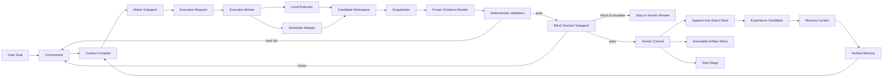

# Vivarium Loop Engineer V2.1 设计规范

> 日期：2026-07-18
> 状态：Design-reviewed — 双终审 `0 Critical / 0 Major`；Phase A 已获授权进入实现计划，Phase B live cluster 延后
> 适用仓库：`vivarium`
> 目标版本：V2.x，不承诺兼容当前实验性 manifest 写入接口

## 1. 决策摘要

Vivarium V2.1 不再只是“规划 DAG 并维护一个可变 manifest”的协调器，而是一个面向生物信息学工作流的、可恢复的事务型 Loop Engineer。

核心执行链固定为：

```text
Orchestrator
  -> Maker Subagent
  -> Deterministic Validators
  -> Blind Checker Subagent
  -> Atomic Commit
  -> Experience Candidate
  -> Memory Curator
```

本设计确立以下不可协商的约束：

1. Maker 与 Checker 必须是上下文、工具权限和输出目录隔离的独立 Subagent。
2. Maker 不能提交正式结果、修改验收规则或写入长期记忆。
3. Checker 不能修改候选结果，也不能仅凭 Maker 的自述判定通过。
4. 结构、哈希、格式、样本集合和数值边界等可程序化条件必须先由确定性 validator 验证。
5. 只有 Orchestrator 可以改变规范状态、提交 artifact、回退指针和晋升经验。
6. 已提交 artifact 和事件不可原地修改；回退是恢复旧指针，修订是从旧检查点创建新分支。
7. 每次循环只能产生候选经验；未经证据验证、回放测试和作用域限定的经验不能进入 active memory。
8. 系统自动学习的是执行与恢复策略，不是科学真理、科学阈值或数据集结论。
9. 任何 critical/major 对抗审核问题未关闭前，本设计不得进入实现阶段。
10. 集群提交必须通过确定性 Scheduler Adapter；Maker 不得自己拼接并直接执行 `qsub/csub/sbatch`。
11. `qsub`、`csub` 等命令名不能唯一标识调度器，必须使用显式 profile 与能力指纹确认其真实语义。

## 2. 背景与现有系统差距

当前 `skills/vivarium/scripts/orchestrate.py` 提供 DAG 初始化、状态查看和 manifest 更新，但尚未执行分析，也不具备可靠循环所需的状态语义。

当前实现的主要差距如下：

| 领域 | 当前行为 | V2.1 要求 |
|---|---|---|
| 状态真相 | 原地改写 `run_manifest.json` | append-only events + immutable artifacts；manifest 仅为投影 |
| 覆盖保护 | `--force` 复制 `.bak` 后覆盖 | 禁止覆盖 committed run；从检查点 fork 新分支 |
| 执行角色 | Agent 依次读取子 skill | Maker、Validator、Checker、Curator 权限隔离 |
| 失败恢复 | `planned/done/scaffolded/failed` | attempt、retry、branch、compensation、rollback 明确定义 |
| 完成判定 | 调用者可直接标记 `done` | 硬校验通过 + Checker 通过 + 原子提交 |
| 上下文 | 没有正式协议 | 按角色编译的最小上下文包 |
| 学习 | 无 | 候选经验、验证、回放、晋升、失效、隔离 |
| 生信 QC | 主要依赖文字约定 | stage contract + machine-readable QC + evidence bundle |

V2.1 不应继续扩展现有 `update --status done` 语义。该接口允许绕过验收，后续只能作为迁移入口，并且必须由兼容层转化为受审计事件。

## 3. 目标与非目标

### 3.1 目标

- 在进程崩溃、机器中断、暂时性工具故障后确定性恢复。
- 对输入、参数、工具、数据库和产物建立可追溯证据链。
- 将生成和验收分离，降低同一模型自证正确导致的相关性错误。
- 对生信阶段提供可执行的结构验证、QC 门和科学边界检查。
- 让每次运行产生可复用但受控的经验，同时防止错误、过时信息和提示注入进入长期记忆。
- 保持本地优先，不自动安装包，不要求首版部署外部工作流服务。

### 3.2 非目标

- 不让系统自主修改科学阈值、统计显著性标准或研究结论。
- 不把 LLM Checker 当作确定性校验器或最终科学权威。
- 不保存或暴露模型隐藏推理过程；只保存任务需要的结构化决定、证据和摘要。
- 不在 V2.1 首版实现跨集群分布式事务、全自动资源购买或长期无人监管的外部副作用。
- 不以“自动多重 Agent 投票”代替领域专家对高风险科学解释的判断。

## 4. 系统架构



### 4.1 组件职责

#### Orchestrator

- 解析用户目标并生成版本化 stage graph。
- 冻结 run specification、阶段合同、预算和权限。
- 分配 attempt ID、Subagent、工具和上下文预算。
- 处理重试、分支、停止、升级、补偿和提交。
- 唯一有权写入规范事件、更新 run head 和晋升长期经验。
- 不直接替代 Maker 生成分析结果，也不替代 Checker 审核自己的决定。

#### Context Compiler

- 为不同角色构造最小、高信号、可追溯的上下文包。
- 只注入当前阶段必需的政策、输入、合同、状态和已验证经验。
- 对大文件只提供摘要、索引和 artifact 引用；Subagent 按需读取原始证据。
- 记录每次检索了什么、为什么检索、是否实际有用。

#### Maker Subagent

- 在冻结合同和预算内生成候选 artifact。
- 请求执行该阶段白名单内的工具；本地或集群执行由 Execution Broker 完成。
- 记录可执行命令、环境、日志、参数、输出哈希、假设和限制。
- 只能写入本 attempt 的 candidate 与 maker report 区域；`execution_logs/` 由 harness/Broker 独占写入。

#### Deterministic Validators

- 检查所有可以程序化判断的条件。
- 将结果写成机器可读 report，并附复现命令。
- hard fail 不得被 LLM Checker 覆盖。

#### Execution Broker 与 Scheduler Adapter

- 接收结构化 `ExecutionRequest`，而不是未约束的 shell 命令。
- 根据冻结的 execution profile 选择 local、SGE、PBS、PBS Pro、AIP `csub`、Slurm、LSF 或 generic adapter。
- 在提交前验证资源、路径、环境、队列、项目、数组、依赖和外部副作用授权。
- 生成并保存脚本、脚本 digest、提交 argv 和 scheduler receipt。
- 独占写 authoritative stdout/stderr、wrapper/harness/scheduler/accounting receipts 与 execution-log manifest；Maker 只能在 report 中声明观察值，不能改写这些原始记录。
- 统一监控调度器状态、accounting、任务 sentinel 和输出 artifact。
- 不参与科学结果判断；scheduler 返回成功也不等于 stage 通过。

#### Checker Subagent

- 独立检查候选结果是否满足原始合同、QC 和科学证据边界。
- 只读取 Maker 停止后由 Orchestrator 冻结的 content-addressed、read-only Evidence Bundle；不得读取仍可变化的 candidate workspace。
- 输出结构化 review，不直接提交或返工 artifact。

#### Memory Curator

- 从已提交事件提取候选经验。
- 执行去重、冲突检测、证据评级、回放验证和作用域限制。
- 只能在满足晋升规则后激活 procedural/semantic memory。
- 对失效、环境不匹配或疑似污染的记录执行 quarantine，而不是删除历史。

## 5. 角色隔离与交接合同

### 5.1 Maker 权限

允许：

- 读当前 stage contract、输入 artifact、允许的参考资料和 active memory 子集。
- 创建结构化 `ExecutionRequest` 并请求执行该阶段白名单内的工具。
- 写 `attempts/<stage>/<attempt>/candidate/`、Maker 自己的非权威 notes 和 `maker_report.json`；不能写 harness/Broker 的 `execution_logs/`。

禁止：

- 写 `artifacts/`、`checkpoints/`、`memory/active/` 或 canonical state。
- 修改输入文件、validator、rubric、预算和 stage specification。
- 直接执行 `qsub`、`csub`、`sbatch`、`bsub` 或其取消命令。
- 将失败解释为成功、隐藏退出码或省略失败日志。
- 读取先前 Checker 的自然语言结论后重新包装同一输出；返修只能接收 finding 和合同，不接收 Checker 的隐藏推理。

### 5.2 Checker 权限

允许：

- 读原始目标、冻结合同、输入引用、候选 artifact、validator report、日志和必要规范。
- 在高风险阶段请求第二个独立 Checker 或人工升级。
- 写 `reviews/<stage>/<attempt>/<checker_id>.json`。

禁止：

- 修改 candidate、运行分析工具生成替代结果或直接提交 artifact。
- 读取 Maker 的完整聊天记录、自我评分、辩解或期望结论。
- 改写验收标准以使当前结果通过。
- 仅因为多个 Agent 赞同而覆盖 hard fail 或 critical minority dissent。

### 5.3 Maker Report 与冻结 Evidence Bundle

Maker 在停止前只提供 `maker_report.json`；它不能预先声明尚未由 Snapshotter 计算的 payload root 或 evidence bundle digest：

```json
{
  "run_id": "...",
  "stage_id": "...",
  "attempt_id": "...",
  "maker_assignment_digest": "sha256:...",
  "maker_harness_identity_digest": "sha256:...",
  "stage_spec_digest": "sha256:...",
  "code_digest": "sha256:...",
  "environment_digest": "sha256:...",
  "platform_locale_digest": "sha256:...",
  "execution_request_digests": [],
  "key_material_digests": [],
  "inputs": [{"uri": "...", "sha256": "..."}],
  "declared_candidate_outputs": [{"relative_path": "...", "claimed_sha256": "...", "media_type": "..."}],
  "commands": [{"argv": ["..."], "exit_code": 0, "stdout": "...", "stderr": "..."}],
  "tools": [{"name": "...", "version": "...", "digest": "..."}],
  "databases": [{"name": "...", "release": "...", "digest": "..."}],
  "parameters": {},
  "metrics": {},
  "assumptions": [],
  "limitations": []
}
```

Maker 的 output hash 只是待核验 claim。Maker 停止并失去写权限后，Snapshotter 独立遍历 payload，生成不包含自身的 canonical `bundle_payload_manifest.json`（排序 relative path、type、mode、size、content digest），并定义 `payload_root_digest = SHA256("vivarium-payload/v1" + canonical_manifest_bytes)`。manifest/receipt 自身不作为 manifest entry，因此不存在 root 自引用。

Maker Report 中的 command/exit/stdout/stderr 同样只是待核验声明。每个 agent-only harness、local wrapper 或 cluster adapter 必须把原始 stdout/stderr、结构化 exit/signal、wrapper/sentinel、scheduler status/accounting/diagnostic receipts 写到 Maker 无权写的 `execution_logs/`。execution terminal 后，Orchestrator 等待 harness/Broker log writer 及 children退出，撤销其写 capability并持久化 receipt；Snapshotter 再以 no-follow/openat、逐文件 fsync、content-addressed rename和父目录 fsync 封存 fixed-schema `execution_log_manifest`，得到 `execution_log_root_digest`、`execution_log_manifest_digest` 与 `execution_receipt_set_digest`。缺日志、截断标记不闭合、Maker 声明与原始 receipt冲突或 writer仍存活都 hard fail；不得用 Maker report补齐 authoritative log。

Snapshotter 再构造 canonical evidence envelope body，绑定 payload、Maker provenance 和 Snapshotter 身份：

```json
{
  "payload_root_digest": "sha256:...",
  "bundle_payload_manifest_digest": "sha256:...",
  "execution_log_root_digest": "sha256:...",
  "execution_log_manifest_digest": "sha256:...",
  "execution_receipt_set_digest": "sha256:...",
  "execution_log_writer_revocation_receipt_digest": "sha256:...",
  "maker_report_digest": "sha256:...",
  "maker_assignment_digest": "sha256:...",
  "maker_harness_identity_digest": "sha256:...",
  "code_digest": "sha256:...",
  "environment_digest": "sha256:...",
  "platform_locale_digest": "sha256:...",
  "execution_request_set_digest": "sha256:...",
  "key_material_set_digest": "sha256:...",
  "snapshotter_version_digest": "sha256:...",
  "snapshotter_config_digest": "sha256:...",
  "payload_manifest_schema_digest": "sha256:...",
  "canonicalization_implementation_digest": "sha256:...",
  "evidence_envelope_schema_digest": "sha256:...",
  "stage_spec_digest": "sha256:...",
  "acceptance_contract_digest": "sha256:...",
  "producer_dependency_vector_digest": "sha256:...",
  "producer_dependency_closure_digest": "sha256:...",
  "locked_policy_digest": "sha256:..."
}
```

`evidence_bundle_digest = SHA256("vivarium-evidence/v2" + canonical_envelope_body)`。不可变 `sealed_bundle_receipt.json` 保存 envelope body 与这个 digest；digest 字段自身不参与计算。Maker Report 中的 assignment/harness/code/environment/request/KeyMaterial/log summary 只是待核验声明；Snapshotter 从 Orchestrator assignment、Broker ledger、实际 harness/environment receipt 与 sealed execution-log manifest重算并写入 envelope，集合按 digest 排序且空集也有规范 digest，任何不一致 hard fail。相同 payload 但 Maker assignment/report、code/environment/locale、execution request/KeyMaterial、execution log/receipt、Snapshotter code/config、manifest/envelope schema、canonicalizer、acceptance contract、stage、依赖或 policy 不同，必须得到不同 evidence digest。Validator、Checker、commit 和 cache identity 都同时引用 `evidence_bundle_digest`、`payload_root_digest` 与其中封存的 execution-log roots；前者是审核/提交身份，payload root 只用于 payload 去重。Validator/Checker 读取 stderr、scheduler diagnosis 或 QC warning 时只能引用 sealed log/receipt spans，不能读取 Maker report 的转述或可变 `logs/` projection。不得只记录拼接后的 shell 字符串；执行层应优先保存 argv 数组，降低转义歧义和命令注入风险。确需 shell 的阶段必须显式标记并经过独立转义检查。

### 5.4 Checker 输出合同

```json
{
  "checker_id": "...",
  "checker_assignment_id": "orchestrator-assigned-uuid",
  "checker_instance_id": "orchestrator-observed-instance-id",
  "checker_capability_receipt_digest": "sha256:...",
  "checker_isolation_attestation_digest": "sha256:...",
  "checker_launch_digest": "sha256:...",
  "checker_context_packet_digest": "sha256:...",
  "rubric_digest": "sha256:...",
  "decision": "PASS",
  "rubric_checks": [{"rule_id": "...", "status": "PASS | FAIL | NOT_APPLICABLE", "evidence_spans": [{"artifact_digest": "sha256:...", "byte_start": 0, "byte_end": 10, "span_digest": "sha256:..."}]}],
  "findings": [],
  "residual_risks": [],
  "reviewed_artifact_digests": ["sha256:..."],
  "reviewed_evidence_bundle_digest": "sha256:...",
  "reviewed_payload_root_digest": "sha256:...",
  "reviewed_validator_report_digest": "sha256:...",
  "reviewed_completion_claim_digest": "sha256:..."
}
```

`checker_assignment_id`、instance/namespace identity、capability receipt、launch attestation、Context Packet 与 rubric digest 都由 Orchestrator/harness 分配并写入 durable `CHECKER_ASSIGNED` event，Checker 无权自选或覆盖。该 assignment 同时冻结 stage/attempt、风险级别、evidence pair、validator report、completion claim、允许的只读路径、禁止的网络/IPC/process-control capability 和一次性 review output path。harness 注入这些字段并在接收输出时逐字验证；Checker 自报的新 ID 不具有任何 quorum 身份。

Checker 结束后，Orchestrator 等待其 OS process/所有 brokered children 退出，撤销 capability namespace，再由独立 Review Snapshotter 以 §7.4 相同的 no-follow、copy、fsync、content-addressed sealing 协议冻结 canonical review body。`sealed_review_digest = SHA256("vivarium-checker-review/v1" + JCS(review_body))`，receipt 本身的 digest 字段不进入 body；review body 必须绑定 assignment、launch/isolation/capability/context/rubric、evidence pair、validator report 和 completion claim。`CHECKER_REVIEW_SEALED` event 持久化后，quorum 与 commit 只读取 sealed digest；可变 Checker workspace、未撤销 capability 或未封存 JSON 永不计票。

`decision` 只能是：

- `PASS`：所有 hard gate 通过，没有 critical/major finding。
- `REVISE`：可在冻结 specification 内返修。
- `BLOCK`：输入、工具或前置证据使当前阶段不能继续。
- `ESCALATE`：需要额外 Checker、领域专家或用户决策。

每个 mandatory rubric rule 都必须有且只有一个 `rubric_checks` entry；PASS 需要对应 immutable artifact/log/validator 的 digest-addressed byte/record span，或由 deterministic validator确认的 typed `NOT_APPLICABLE`。span digest、边界与 artifact digest 由 Review Snapshotter 重算，Checker 不能引用自由文本位置或凭总体印象 PASS。缺覆盖、span 越界/错 digest、证据来自 trusted-control 以外的可变文本或 finding 与 decision 矛盾时，review schema fail且不计 quorum。

### 5.5 Checker 数量

| 风险级别 | 示例 | 最低门槛 |
|---|---|---|
| L1 | 文件转换、简单统计、表格整形 | deterministic validators + 1 Checker |
| L2 | 注释、ANI/AAI、orthology、core set | deterministic validators + 2 个不同 `checker_assignment_id`、不同 attested capability namespace 的 sealed review；分别使用方法/QC与完整性 rubric |
| L3 | dN/dS、树的生物学解释、独有基因机制结论 | 2 个独立 Checker；任何 critical 异议触发第三方或人工升级 |

Checker 应先独立锁定结果，再由 Orchestrator 合并 finding；不能先互相讨论后再投票。同一 Subagent 连续运行两个 rubric、同一 capability namespace 换两个自报 ID、复用 assignment 或复制 review bytes 都不构成两个 quorum 身份。quorum reducer 校验 assignment 唯一、namespace attestation 唯一、sealed digest 有效且所有 binding 完全一致。

## 6. 状态机与循环终止

### 6.1 Stage 状态

```text
PLANNED
  -> MAKING
     -> COLLECTING  # execution_mode=agent_only
     -> EXECUTION_PENDING
        -> RUNNING_LOCAL ---------------------> COLLECTING
        -> SUBMITTING -> QUEUED -> RUNNING_REMOTE -> COLLECTING
  -> VALIDATING
  -> CHECK_PENDING
  -> CHECKING
  -> COMMITTING
  -> COMMITTED
```

异常状态：

```text
MAKING or VALIDATING -> RETRYABLE_FAILURE -> new attempt
SUBMITTING            -> SUBMIT_REJECTED   -> repair profile or BLOCKED
QUEUED                -> SCHEDULER_BLOCKED -> diagnose, wait, or ESCALATE
external duplicate    -> analysis `ESCALATED` + obligation `DUPLICATE_EXTERNAL_SIDE_EFFECT` in one event
RUNNING_REMOTE        -> PREEMPTED         -> bounded retry
RUNNING_REMOTE        -> RESOURCE_FAILURE  -> bounded resource escalation or BLOCKED
VALIDATING            -> SPEC_FAILURE      -> fork branch or BLOCKED
CHECKING              -> REVISE_REQUESTED  -> new attempt
CHECKING              -> BLOCKED
CHECKING              -> ESCALATED
COMMITTING            -> RECOVERY_REQUIRED
```

实现中的 `state_machine.yaml` 是唯一机器源并由代码生成 reducer 与展开后的文档；它包含三个不共享 enum namespace 的 reducer：`analysis_state`、`obligation_state` 与每个 mutation operation 独立的 `external_client_state`。生成产物禁止 `any/same/prior/*` 等 prose alias。下表是 `analysis_state` 的可读投影，其中出现的集合名必须引用 YAML 中的 closed concrete enum set并在生成时展开为逐项 transition；CI 比较展开表，未列出的转换一律拒绝。失败/返修状态是当前 attempt 的 terminal state，`ATTEMPT_RETRY_CREATED` 只能在预算和 retry policy 允许时创建一个新的 `PLANNED` attempt，不能把旧 attempt 原地改回运行态。

| From | Event/guard | To |
|---|---|---|
| `PLANNED` | contract frozen | `MAKING` |
| `PLANNED` | contract/input/authorization unavailable | `BLOCKED` |
| `MAKING` | candidate requires brokered execution | `EXECUTION_PENDING` |
| `MAKING` | frozen contract has `execution_mode=agent_only` and Maker harness terminal evidence is durable | `COLLECTING` |
| `MAKING` | retryable Maker/tool failure | `RETRYABLE_FAILURE` |
| `MAKING` | non-retryable input/policy failure | `BLOCKED` |
| `EXECUTION_PENDING` | backend=local, local intent durable | `LOCAL_STARTING` |
| `EXECUTION_PENDING` | backend=cluster, intent durable | `SUBMITTING` |
| `EXECUTION_PENDING` | authorization/profile/resource contract fails | `BLOCKED` |
| `LOCAL_STARTING` | wrapper receipt durable and identity verified | `RUNNING_LOCAL` |
| `LOCAL_STARTING` | recovery attaches matching live wrapper/process | `RUNNING_LOCAL` |
| `LOCAL_STARTING` | durable receipt proves process ended | `COLLECTING` |
| `LOCAL_STARTING` | lease occupied but receipt not yet durable | `LOCAL_STARTING` wait, no new spawn |
| `LOCAL_STARTING` | no durable receipt, exclusive lease free | `LOCAL_STARTING` with same execution key |
| `LOCAL_STARTING` | identity/lease conflict | `ESCALATED` |
| `SUBMITTING` | receipt durable | `QUEUED` |
| `SUBMITTING` | call outcome unknown | `SUBMISSION_UNCERTAIN` |
| `SUBMITTING` | scheduler proves rejection before acceptance | `SUBMIT_REJECTED` |
| `SUBMISSION_UNCERTAIN` | reconcile finds exactly one queued job | `QUEUED` |
| `SUBMISSION_UNCERTAIN` | reconcile finds exactly one running job | `RUNNING_REMOTE` |
| `SUBMISSION_UNCERTAIN` | reconcile writes a unique receipt and the same evidence cut reports native `HELD/Eqw/E/SUSPENDED` | `SCHEDULER_BLOCKED` |
| `SUBMISSION_UNCERTAIN` | reconcile finds exactly one job with authoritative terminal evidence | `COLLECTING` |
| `SUBMISSION_UNCERTAIN` | composite `DUPLICATE_EXTERNAL_SIDE_EFFECT_DETECTED` proves more than one accepted job | `ESCALATED` while obligation reducer enters `DUPLICATE_EXTERNAL_SIDE_EFFECT` |
| `SUBMISSION_UNCERTAIN` | unique job known, live state absent, accounting finality unavailable | `UNKNOWN_TERMINAL` |
| `SUBMISSION_UNCERTAIN` | adapter produces final strong proof of zero acceptance | `SUBMISSION_NOT_ACCEPTED_CONFIRMED` |
| `SUBMISSION_UNCERTAIN` | ambiguous/timeout requiring human | `ESCALATED` |
| `QUEUED` | scheduler held/pending error | `SCHEDULER_BLOCKED` |
| `QUEUED` | scheduler running | `RUNNING_REMOTE` |
| `QUEUED` | terminal evidence cut frozen | `COLLECTING` |
| `QUEUED` | job disappears and accounting finality unavailable | `UNKNOWN_TERMINAL` |
| `SCHEDULER_BLOCKED` | hold/error cleared | `QUEUED` |
| `SCHEDULER_BLOCKED` | terminal evidence cut frozen | `COLLECTING` |
| `SCHEDULER_BLOCKED` | policy timeout/human required | `ESCALATED` |
| `RUNNING_LOCAL/RUNNING_REMOTE` | terminal evidence cut frozen | `COLLECTING` |
| `RUNNING_REMOTE` | job disappears and accounting finality unavailable | `UNKNOWN_TERMINAL` |
| `COLLECTING` | `COMPLETION_SUCCESS_PROVEN` atomically references durable success Classification + durable policy-allowed CompletionProof + frozen bundle | `VALIDATING` |
| `COLLECTING` | `COMPLETION_CLASSIFIED(outcome=failure_retryable)` | `RETRYABLE_FAILURE` |
| `COLLECTING` | `COMPLETION_CLASSIFIED(outcome=failure_resource)` | `RESOURCE_FAILURE` |
| `COLLECTING` | `COMPLETION_CLASSIFIED(outcome=failure_permanent)` | `BLOCKED` |
| `COLLECTING` | `COMPLETION_CLASSIFIED(outcome=preempted)` | `PREEMPTED` |
| `COLLECTING` | `COMPLETION_CLASSIFIED(outcome=cancelled)` | `CANCELLED` |
| `COLLECTING` | `COMPLETION_CLASSIFIED(outcome=unknown_finality)` | `UNKNOWN_TERMINAL` |
| `UNKNOWN_TERMINAL` | authoritative terminal evidence arrives | `COLLECTING` |
| `UNKNOWN_TERMINAL` | exact L1 sentinel-fallback guard passes and event durable | `COLLECTING` |
| `UNKNOWN_TERMINAL` | policy timeout/human required | `ESCALATED` |
| `VALIDATING` | all hard gates pass | `CHECK_PENDING` |
| `VALIDATING` | repairable output/validator failure | `REVISE_REQUESTED` |
| `VALIDATING` | contract/input scientifically invalid | `SPEC_FAILURE` |
| `CHECK_PENDING` | isolated checker allocated | `CHECKING` |
| `CHECK_PENDING` | checker unavailable after budget/deadline | `ESCALATED` |
| `CHECKING` | quorum PASS, no major/critical | `COMMITTING` |
| `CHECKING` | repairable findings | `REVISE_REQUESTED` |
| `CHECKING` | unrecoverable evidence failure | `BLOCKED` |
| `CHECKING` | expert/user judgment required | `ESCALATED` |
| `COMMITTING` | commit tx durable | `COMMITTED` |
| `COMMITTING` | crash/uncertain tail | `RECOVERY_REQUIRED` |
| `COMMITTING` | branch head/generation changed before commit point | `STALE_BRANCH` |
| `COMMITTING` | knowledge dependency changed before commit point | `STALE_CONTEXT` |
| `COMMITTING` | `STAGE_COMMIT_ABORTED(abort_reason, analysis_target)` durable且project complete-cut不存在 | `COMMIT_ABORT_REASON_TARGET[abort_reason]` |
| `RECOVERY_REQUIRED` | tx found durable and valid | `COMMITTED` |
| `RECOVERY_REQUIRED` | `RECOVERY_ABORTED(recovery_target_state)` after tx absent/torn and quarantined | payload target, restricted to closed enum `{CHECKING, COMMITTING}` and equal to durable prepare’s recorded origin |
| `RECOVERY_REQUIRED` | durable prepare重验失败后`STAGE_COMMIT_ABORTED(abort_reason, analysis_target)`且project complete-cut不存在 | `COMMIT_ABORT_REASON_TARGET[abort_reason]` |
| `COMMITTED` | `COMPLETION_RECHECK_OPENED` complete-cut durable | `COMPLETION_RECHECK_PENDING` |
| `COMPLETION_RECHECK_PENDING` | new cut remains success with allowed grade | `COMMITTED` via `COMPLETION_PROOF_REFRESHED` complete-cut |
| `COMPLETION_RECHECK_PENDING` | new cut is failure/unknown or grade disallowed | `STALE_COMPLETION` via `COMPLETION_PROOF_REVOKED` complete-cut |
| `COMPLETION_RECHECK_PENDING` | evidence/classification cannot finish safely | remain pending and `ESCALATED` operational flag; no active retrieval |
| any committed descendant of a stage entering `COMPLETION_RECHECK_PENDING` | same OPENED complete-cut adds `recheck_tx_id` to its blocker set, including descendants already pending | `PENDING_COMPLETION_DEPENDENCY` |
| `PENDING_COMPLETION_DEPENDENCY` | REFRESH removes its own blocker and `blocking_recheck_tx_ids` becomes empty | restore the object’s first-suspension baseline availability state |
| `PENDING_COMPLETION_DEPENDENCY` | upstream proof is REVOKED | `STALE_COMPLETION` |
| `ESCALATED` | composite `DUPLICATE_ARBITRATED` with validated `analysis_resume_state` | exact target in closed enum `{QUEUED,RUNNING_REMOTE,SCHEDULER_BLOCKED,COLLECTING}` while obligation resumes its matching state |
| any pre-commit active state | branch head/generation changed | `STALE_BRANCH` |
| any pre-commit active state | knowledge dependency changed | `STALE_CONTEXT` |
| `STALE_BRANCH` | correction branch created | `PLANNED` on new branch |
| `STALE_CONTEXT` | correction branch created | `PLANNED` on new branch |
| `STALE_COMPLETION` | correction branch created | `PLANNED` on new branch |
| `RETRYABLE_FAILURE/PREEMPTED/RESOURCE_FAILURE/REVISE_REQUESTED/SUBMIT_REJECTED` | retry policy + budget allow | new `PLANNED` attempt |
| `SUBMISSION_NOT_ACCEPTED_CONFIRMED` | new user/policy authorization + budget allow | new `PLANNED` attempt with new intent |
| `RETRYABLE_FAILURE/PREEMPTED/RESOURCE_FAILURE/REVISE_REQUESTED/SUBMIT_REJECTED/SUBMISSION_NOT_ACCEPTED_CONFIRMED` | no valid automatic repair remains | `BLOCKED` |
| `RETRYABLE_FAILURE/PREEMPTED/RESOURCE_FAILURE/REVISE_REQUESTED/SUBMIT_REJECTED/SUBMISSION_NOT_ACCEPTED_CONFIRMED` | policy requires human/user judgment | `ESCALATED` |

上述 slash-separated source cell 不是运行时 wildcard；`state_machine.yaml` 必须把它展开为每个 concrete source 一行。另定义 `PRECOMMIT_BRANCH_GUARDED_STATES={PLANNED,MAKING,EXECUTION_PENDING,LOCAL_STARTING,RUNNING_LOCAL,SUBMITTING,SUBMISSION_UNCERTAIN,QUEUED,SCHEDULER_BLOCKED,RUNNING_REMOTE,UNKNOWN_TERMINAL,COLLECTING,VALIDATING,CHECK_PENDING,CHECKING,COMMITTING,RECOVERY_REQUIRED}`；表中的 `any pre-commit active state` 只代表此 closed set 的生成时 cross-product。external-operation uncertain/duplicate 属于 obligation reducer，其 closed source set 为 `{SUBMISSION_UNCERTAIN,CANCELLATION_UNCERTAIN,OPERATION_UNCERTAIN}`，不得混入 analysis stage enum。CI 对生成后的 concrete `(reducer,from,event,guard,to)` tuples 做排序快照，tuple 中出现 alias 或目标不在对应 closed enum 时 hard fail。

该analysis table描述§7.1的effective federated state，而不是单一ledger reducer：到`COMMITTING/RECOVERY_REQUIRED`的run-local event由run ledger拥有；`STAGE_COMMITTED`、completion recheck、rollback/fork带来的active availability由project work ledger拥有并overlay。生成器必须为每个tuple另外标注`owner_ledger=run|project`；project-owned transition缺run-event/hash binding或被错误追加到run ledger时schema fail。

`STAGE_COMMIT_ABORTED`是run-ledger-owned fixed-schema composite event，不是只翻转一个preparation flag。它必须在同一record中携带`commit_tx_id`、durable prepare event/hash、`abort_reason`、`analysis_from`、`analysis_target`、使重验失败的sealed evidence/reference digest，以及`preparation_delta: ACTIVE -> INACTIVE`。`COMMIT_ABORT_REASON_TARGET`是版本化封闭映射：

```text
BRANCH_HEAD_OR_GENERATION_MISMATCH -> STALE_BRANCH
KNOWLEDGE_DEPENDENCY_OR_POLICY_STALE -> STALE_CONTEXT
STAGE_SPEC_OR_ACCEPTANCE_CONTRACT_STALE -> STALE_CONTEXT
EVIDENCE_BUNDLE_INTEGRITY_FAILURE -> BLOCKED
EVIDENCE_CONTRACT_BINDING_STALE -> STALE_CONTEXT
VALIDATOR_REPORT_INVALID -> VALIDATING
CHECKER_REVIEW_OR_QUORUM_INVALID -> CHECK_PENDING
COMPLETION_FAILURE_RETRYABLE -> RETRYABLE_FAILURE
COMPLETION_FAILURE_RESOURCE -> RESOURCE_FAILURE
COMPLETION_FAILURE_PERMANENT -> BLOCKED
COMPLETION_PREEMPTED -> PREEMPTED
COMPLETION_CANCELLED -> CANCELLED
COMPLETION_UNKNOWN_FINALITY -> UNKNOWN_TERMINAL
BUDGET_EXHAUSTED -> BLOCKED
HUMAN_JUDGMENT_REQUIRED -> ESCALATED
```

completion类abort必须引用在该event前已durable、与latest evidence cut绑定的typed `CompletionClassification`。`EVIDENCE_BUNDLE_INTEGRITY_FAILURE`表示CAS bytes缺失/损坏、manifest/envelope/receipt自洽性失败，必须quarantine并BLOCK旧attempt；它绝不能回到VALIDATING，因为Validator无权重新Snapshot或修复evidence。`EVIDENCE_CONTRACT_BINDING_STALE`只用于bytes完整但spec/policy/contract依赖已改变的情况并转STALE_CONTEXT。只有evidence pair仍完整有效而sealed validator report本身缺失/损坏/版本失配时，`VALIDATOR_REPORT_INVALID`才回到VALIDATING生成新report；Checker类回到CHECK_PENDING。所有旧report/review/quorum失效。schema要求`analysis_from`恰为当前`COMMITTING/RECOVERY_REQUIRED`、target恰等于映射、同一tx没有project`STAGE_COMMITTED`，且同一`commit_tx_id`最多一条ABORTED。只有该完整event durable后preparation才inactive；不存在独立`inactive=true`投影可把analysis遗留在COMMITTING。若project complete-cut已存在，任何ABORTED都invalid；若ABORTED先存在，后续同tx complete-cut也invalid。状态机编译器将上述两个动态target row按封闭映射展开为concrete tuples，生成快照中不得保留map alias。

`obligation_state` 使用独立 namespace 和完整 closed table；同名字面量绝不等于 analysis state：

每个 obligation 有唯一 `obligation_id = submission:<submission_key> | local:<local_execution_key> | operation:<operation_key>` 和 `obligation_kind`；submit/local的长期job/process debt与后续cancel/hold/release operation debt不是同一对象。

| Obligation From | Typed event/guard | Obligation To |
|---|---|---|
| `NONE` | `LOCAL_EXECUTION_INTENT` durable | `LOCAL_STARTING` |
| `LOCAL_STARTING` | local wrapper receipt/identity durable | `LOCAL_LIVE` |
| `LOCAL_STARTING/LOCAL_LIVE` | identity, lease or containment uncertain | `LOCAL_EXECUTION_UNCERTAIN` |
| `LOCAL_LIVE` | authoritative terminal/reap observed, accounting/containment closing | `ACCOUNTING_PENDING` |
| `LOCAL_EXECUTION_UNCERTAIN` | authoritative terminal or verified kill/reap + empty containment | `RESOLVED` |
| `NONE` | cluster `SUBMIT_CALL_STARTED` durable | `SUBMISSION_UNCERTAIN` |
| `SUBMISSION_UNCERTAIN` | unique accepted job receipt with queued/running/held/suspended state | `JOB_LIVE` |
| `SUBMISSION_UNCERTAIN` | unique terminal job receipt, final accounting pending | `ACCOUNTING_PENDING` |
| `SUBMISSION_UNCERTAIN` | strong zero acceptance plus external-client extinct proof | `SUBMISSION_NOT_ACCEPTED_CONFIRMED` |
| `SUBMISSION_UNCERTAIN` | `DUPLICATE_EXTERNAL_SIDE_EFFECT_DETECTED` with multiple accepted targets | `DUPLICATE_EXTERNAL_SIDE_EFFECT` |
| `NONE` | keyed cancel operation `CALL_STARTED` durable | `CANCELLATION_UNCERTAIN` |
| `NONE` | keyed hold/release/other mutation `CALL_STARTED` durable | `OPERATION_UNCERTAIN` |
| `JOB_LIVE` | terminal native evidence, accounting not final | `ACCOUNTING_PENDING` |
| `CANCELLATION_UNCERTAIN` | authoritative effect or strong non-effect proof and client debt closed | `RESOLVED`; composite separately updates parent submission obligation if job became terminal |
| `OPERATION_UNCERTAIN` | unique applied or strong non-effect proof and client debt closed | `RESOLVED`; parent submission obligation remains/updates by observed native state |
| `CANCELLATION_UNCERTAIN/OPERATION_UNCERTAIN` | multiple affected targets for one intent | `DUPLICATE_EXTERNAL_SIDE_EFFECT` |
| `ACCOUNTING_PENDING` | authoritative terminal/accounting + all local/client containment debts closed | `RESOLVED` |
| `SUBMISSION_NOT_ACCEPTED_CONFIRMED` | archived; new authorization creates a different obligation object | `SUBMISSION_NOT_ACCEPTED_CONFIRMED` |
| `DUPLICATE_EXTERNAL_SIDE_EFFECT` | `DUPLICATE_ARBITRATED`, canonical live target selected and every extra-target compensation debt closed | `JOB_LIVE` |
| `DUPLICATE_EXTERNAL_SIDE_EFFECT` | same, canonical target already terminal but accounting pending | `ACCOUNTING_PENDING` |
| `DUPLICATE_EXTERNAL_SIDE_EFFECT` | same, all targets terminal/accounted and debts closed | `RESOLVED` |

`external_client_state` 也有逐项 closed table：

| Client From | Typed event/guard | Client To |
|---|---|---|
| `NONE` | external `CALL_STARTED` durable, before spawn | `STARTING` |
| `STARTING` | wrapper lease + `EXTERNAL_CLIENT_RECEIPT` durable, transport still fenced | `LIVE_FENCED` |
| `STARTING` | no process/receipt and supervisor proves no spawn occurred | `TERMINAL_DRAINED` |
| `LIVE_FENCED` | `WIRE_ATTEMPT_STARTED` durable and one-shot gateway opens | `WIRE_IN_FLIGHT` |
| `LIVE_FENCED` | client exits/reaped without wire, containment/socket/buffer empty | `TERMINAL_DRAINED` |
| `WIRE_IN_FLIGHT` | response/EOF recorded, client+children reaped, containment/socket/buffer empty | `TERMINAL_DRAINED` |
| `STARTING/LIVE_FENCED/WIRE_IN_FLIGHT` | identity/lease/containment/transport uncertain | `CLIENT_UNCERTAIN` |
| `CLIENT_UNCERTAIN` | verified kill/reap + empty containment + socket/buffer drain + gateway final receipt | `TERMINAL_DRAINED` |

slash source必须在生成时展开。`TERMINAL_DRAINED` 是 terminal；不存在返回 LIVE 或第二次 WIRE 的转换。该 reducer不表达远程job是否接受，obligation reducer也不表达本地client是否仍能发包。

会同时影响多个reducer或多个keyed obligations/clients的事件必须是run ledger的一个composite fixed-schema record，包含单个 `analysis_delta` 以及按 `(namespace,object_id)` 排序、ID唯一的 `obligation_deltas[]`、`client_deltas[]`；每个delta都有expected/new state和head digest。数组中所有CAS要么全部应用、要么ledger/state root均不变。例如：

- `DUPLICATE_EXTERNAL_SIDE_EFFECT_DETECTED`：`analysis.SUBMISSION_UNCERTAIN -> analysis.ESCALATED`，submission obligation `SUBMISSION_UNCERTAIN -> DUPLICATE_EXTERNAL_SIDE_EFFECT`，相关client保持其当前terminal/uncertain状态。
- unique HELD/Eqw reconcile：`analysis.SUBMISSION_UNCERTAIN -> analysis.SCHEDULER_BLOCKED`，`obligation.SUBMISSION_UNCERTAIN -> obligation.JOB_LIVE`。
- unique terminal reconcile：`analysis.SUBMISSION_UNCERTAIN -> analysis.COLLECTING`，`obligation.SUBMISSION_UNCERTAIN -> obligation.ACCOUNTING_PENDING|RESOLVED`，由同一 accounting cut决定。
- `DUPLICATE_ARBITRATED`：只接受与 authoritative native state一致的 closed `analysis_resume_state`，并与上表 obligation target及全部 compensation/client debts一起 CAS；不能只解除 analysis或只清 obligation。
- cancel accepted并使job terminal：cancel operation obligation `CANCELLATION_UNCERTAIN -> RESOLVED`，parent submission obligation `JOB_LIVE -> ACCOUNTING_PENDING`，analysis native state同步变化；三个delta位于同一record。

表中的 raw observation 不是 transition guard。所有 local/cluster/agent-only terminal evidence 先进入一个冻结的 evidence cut，再由版本化 completion classifier 产生且只产生一个 typed `CompletionClassification` outcome：`success | failure_retryable | failure_resource | failure_permanent | preempted | cancelled | unknown_finality`。schema 使用封闭枚举和互斥 `oneOf`；一个 event 不得同时携带两个 outcome。参考 reducer 按 `(from_state, typed_event, outcome)` 查找，命中数必须恰为 1，否则整条 event hard fail 且 ledger/state root 不变。特别地，failure/unknown 只有 classification、不得构造 success-only CompletionProof，永远不满足 `COLLECTING -> VALIDATING`。

`analysis.SUBMISSION_UNCERTAIN` 只有 reconcile 到唯一 job 才能先以 typed `SUBMISSION_RECONCILED` 补写 receipt，再根据同一冻结 evidence cut 的 authoritative native state进入 `QUEUED/RUNNING_REMOTE/SCHEDULER_BLOCKED/COLLECTING`，同时按 obligation table原子更新 obligation。`HELD/Eqw/E/SUSPENDED` 映射到 analysis `SCHEDULER_BLOCKED` + obligation `JOB_LIVE`，并保留具体 native state；快任务已 success/failed/cancelled/timeout/OOM 时补写 terminal evidence后进入 analysis `COLLECTING`，由 completion classifier决定后续失败或验证。找到多个 job时必须写 composite `DUPLICATE_EXTERNAL_SIDE_EFFECT_DETECTED`，analysis进入 `ESCALATED`，obligation进入 `DUPLICATE_EXTERNAL_SIDE_EFFECT` 并冻结共享 scope；无法对账则两个 reducer保持 uncertain或升级，不能自动回到 `SUBMITTING`。只有 adapter给出定义 finality的强 zero-acceptance proof且 `external_client_state=TERMINAL_DRAINED`，才能追加 composite `SUBMISSION_NON_ACCEPTANCE_CONFIRMED` 并进入相应 analysis/obligation状态；即使如此也不复用旧 intent，后续提交必须由新授权创建新 attempt与新 intent。

`UNKNOWN_TERMINAL` 只在唯一 job 已知、queue/live state 消失、所有可用 history/accounting probes 已执行且 finality timeout 到达后可进入；不能用一次空 `qstat` 直接触发。该状态随后只能等待 authoritative evidence、满足精确 L1 fallback guard或升级。

### 6.2 完成条件

阶段只有同时满足以下条件才能进入 `COMMITTED`：

1. attempt 绑定的 stage specification digest 未变化。
2. 输入 artifact 哈希与运行开始时一致。
3. 所有 required output 存在、非空、可解析并通过 schema。
4. 所有 hard validator 通过。
5. machine-readable QC 已记录，缺失值语义明确。
6. 有 immutable `CompletionProof`，其 claim=success、grade/authority 符合风险政策，并按 execution kind 绑定 agent harness completion/capability revocation、local process supervision 或 scheduler/accounting 的 evidence cut，以及适用的 sentinel、exit、output quiescence 和 completion classifier digest。
7. 达到该风险级别要求的 Checker quorum；review 绑定当前 `completion_claim_digest`。
8. 没有未关闭的 critical/major finding。
9. Snapshotter 已将输出复制为内容寻址只读 payload，计算 manifest/root 和统一 `evidence_bundle_digest`，并且 Validator、Checker 与 commit 引用完全相同的 evidence digest 与 `payload_root_digest`。
10. 最终 canonical CompletionProof body 已先写入内容寻址 store 并完成 file/directory fsync，project `STAGE_COMMITTED` complete-cut 再把其可重算 digest、grade 与 execution evidence cut 完整持久化并 fsync；branch head/manifest/SQLite 只是可从事件重建的投影，不存在另一个独立提交点。

### 6.3 循环预算与停止规则

- 每阶段默认最多 2 次自动返修；阶段合同可设置更低值，不能由 Maker 提高。
- 同一 finding signature 连续出现两次，停止自动返修并升级。
- 输出 digest 未变化但 Maker 声称已修复，立即停止并记录 no-progress。
- 所有 attempt、retry、branch 和 Checker 调用共同消耗 run 总预算。
- 预算包括 wall time、CPU/GPU、存储、外部调用、Agent turns 和人工升级次数。
- 超出预算时保存可恢复状态，禁止通过创建新 run 偷偷重置预算；显式用户新任务除外。

## 7. 事件源、不可变 Artifact 与回退

### 7.1 三层真相

```text
run_spec.json                              immutable run contract
run/events.jsonl                          append-only attempt/execution/preparation evidence
project_state/ledger/work_events.jsonl    canonical branch-head + work-state activation ledger
run_manifest.json + heads/work.json       rebuildable current projections
```

当前设计文档中“manifest 是单一真相源”的旧规则废止。V2.1 中：

- run event、五类project semantic ledgers与committed artifact共同构成规范证据；单独读取run或work ledger不得推断完整active state，必须使用`run prefix + ProjectSemanticCut`联邦证书。
- V2 run 必须属于一个 project state；单 run 场景自动创建只含该 run 的 project state。run ledger 记录 attempt/execution 和 `STAGE_COMMIT_PREPARED`，project `work_events.jsonl` 的 complete-cut event 才同时激活 branch head 与 work state。
- `run_manifest.json` 与 `heads/work.json` 用于人和工具快速读取，但可以从规范事件重建。
- 投影损坏不得影响历史恢复。
- V2.1 只允许一个规范 Orchestrator writer 修改项目和 run ledger；并行计算可以多 worker，但提交必须串行化。metadata 必须位于支持可靠 advisory lock、atomic rename 和 directory fsync 的本地 POSIX 文件系统；能力检测失败时 fail closed，不能在不可靠 NFS 锁上宣称原子提交。

逻辑`analysis_state`是跨ledger的federated view，不允许伪装成run-ledger-only state。所有权和合并顺序固定为：

1. `run_local_reducer/v1`只重放registered run ledger的checksum-valid prefix，拥有attempt从`PLANNED`到`COMMITTING/RECOVERY_REQUIRED`的本地进度、execution/evidence/classification、keyed obligations、external-client states、postcommit intake blockers和`STAGE_COMMIT_PREPARED/ABORTED`；它不产生`COMMITTED/COMPLETION_RECHECK_PENDING/PENDING_COMPLETION_DEPENDENCY/STALE_COMPLETION` active availability，但未消费intake blocker会对federated availability施加fail-closed guard。
2. `truth_reducer/v1`、`decision_reducer/v1`、`project_work_reducer/v1`、`memory_reducer/v1`和`run_registry_reducer/v1`各自只重放对应project ledger prefix并输出规范root。work reducer拥有branch/work head、`STAGE_COMMITTED`及所有OPENED/REFRESHED/REVOKED/rollback/fork complete-cuts；每个跨ledger event必须引用对应run ledger ID、run event ID/hash和prepare/evidence cut，引用不可达时整个project event无效。
3. `project_validity_reducer/v1`把同一个原子捕获的五ledger prefix作为一个`ProjectSemanticCut`，从所有active-object event中的`canonical_dependency_edges`、head/status、policy和invalidation roots重算project-level active/sealed/stale closure并输出`project_validity_root`。它不声称只凭project ledgers推导尚未commit的run attempt依赖，也不得读取graph/SQLite/handoff投影。
4. `run_validity_reducer/v1`的完整输入是`ProjectSemanticCut + project_validity_output + checksum-valid run prefix + run_local_reducer_output`。它从run-local output读取每个attempt冻结的knowledge dependency vector/closure、policy/contract binding和historical prepare，再与project validity/invalidation closure做精确join；先确定由这些dependencies可达的排序project head/status/invalidation子集并计算`relevant_project_validity_input_root`，再输出绑定`run_id/run_event_seq/run_event_hash/dependency-vector heads/relevant subset`的`run_validity_slice_root`。因此依赖fact A/memory P的未提交attempt可在run tail不变时进入`STALE_CONTEXT`，只改变无关B/Q时完整project certificate root改变但该run relevant-input/slice保持不变；run prefix缺dependency vector/closure时只能fail closed，不能把它当作无依赖。
5. `federated_run_reducer/v1`先取得run-local output，再按project work `event_seq`升序应用绑定该run的valid work events，最后应用`run_validity_reducer`的slice：没有project overlay时effective analysis取run-local state；`STAGE_COMMITTED`把对应attempt overlay为COMMITTED；recheck更新availability/blocker；validity slice再把受纠错/撤销影响的attempt/object置为`STALE_CONTEXT/STALE_DEPENDENCY`并从active retrieval排除。validity overlay只能收紧有效性，不能把run/work reducer的失败、pending或stale状态恢复为active。它不向任一ledger回写。
6. 每个federated certificate同时冻结run prefix和完整`ProjectSemanticCut`；相同run prefix、project cut、project/run-validity/federated reducer与merge-policy digest必须得到byte-identical root。run tail不变而work commit/recheck或truth/decision/memory/registry validity cut前进时，run-local root保持不变、run-validity与federated certificate必须按新cut重算；不存在只给run tail或只给work tail却声称完整active/COMMITTED state的certificate。

所有ledger统一使用固定envelope `vivarium.event/v1`。domain separator和JCS bytes均为UTF-8，`||`表示字节连接，`0x00`是单个NUL分隔字节而不是两个文本字符。规范算法为：

```text
payload_hash = "sha256:" + HEX(SHA256(
  UTF8("vivarium-event-payload/v1") || 0x00 || JCS(payload)
))

event_core = {
  schema_version, ledger_id, event_seq, event_id, event_type, tx_id,
  prev_event_hash, recorded_at, effective_at, payload_hash, payload
}
event_hash = "sha256:" + HEX(SHA256(
  UTF8("vivarium-event-hash/v1") || 0x00 || JCS(event_core)
))

record_without_checksum = event_core union {event_hash}
record_checksum = "sha256:" + HEX(SHA256(
  UTF8("vivarium-event-record/v1") || 0x00 || JCS(record_without_checksum)
))
stored_record = JCS(record_without_checksum union {record_checksum}) || 0x0A
```

`event_hash`和`record_checksum`都是存储字段；前者由event core导出并被下一条的`prev_event_hash`引用，后者覆盖除自身外的完整canonical record且包含已验证的`event_hash`。LF不参与任何hash，但它是完整record的唯一framing；CRLF、额外空白、非JCS key/order/number编码、缺LF或LF前截断全部不是canonical record。`event_seq`是`0..2^53-1`的JSON integer；`recorded_at/effective_at`必须是恰20个ASCII bytes的UTC秒格式`YYYY-MM-DDTHH:MM:SSZ`，禁止offset、fraction或本地时区别名。payload数值遵循RFC 8785可表示域，禁止NaN/Infinity；需要保持生信精确小数、区间或超出safe-integer的量由typed schema使用规范decimal string。每个ledger的genesis `event_seq=0`且`prev_event_hash="sha256:" + 64个"0"`；之后sequence严格加一。恢复器逐行要求stored bytes恰等于重算的JCS record加LF，并依次验证payload hash、event hash、record checksum、sequence和prev hash。只允许隔离最后一个缺LF或校验失败的torn record；中间损坏fail closed，禁止自动截断继续运行。

以下两个golden vectors是跨实现门禁，字段和值必须按上式解释；任何一个hash不同都不得读写V2 ledger：

| Vector | exact core/payload差异 | `payload_hash` | `event_hash` | `record_checksum` |
|---|---|---|---|---|
| G1 | `ledger_id=project-work,event_seq=0,event_id=evt-0000,event_type=WORK_LEDGER_GENESIS,tx_id=tx-0000,prev_event_hash=sha256:`后接64个`0`,`recorded_at=effective_at=2026-07-18T00:00:00Z`; payload=`{"activated_objects":[],"canonical_dependency_edges":[],"initial_state_root":"sha256:1111111111111111111111111111111111111111111111111111111111111111"}` | `sha256:00c6aae330bb591495f6a07e1beb11acd28dc05947746e8cb17f948a0acf5cd5` | `sha256:6565f908781a7c60faf4a0e9d2ecf1d14d23e717d5484482d6c4be25c84286d9` | `sha256:1bc5c8af19320b330995dab649e8d3b668cd3394bbf4ccdb02ef507876f53e70` |
| G2 | `ledger_id=project-truth,event_seq=0,event_id=evt-truth-0000,event_type=TRUTH_LEDGER_GENESIS,tx_id=tx-truth-0000,prev_event_hash=sha256:`后接64个`0`,`recorded_at=effective_at=2026-07-18T01:02:03Z`; payload=`{"activated_objects":[],"canonical_dependency_edges":[],"initial_state_root":"sha256:2222222222222222222222222222222222222222222222222222222222222222"}` | `sha256:c914049f521ee0456b48ee8d9d6c19b1e5dcb5e2d689cf74cfa6c9c61f31737b` | `sha256:6165124d51df520259aef0ba47459ea97a5633c0e539165ddd61387959734ef0` | `sha256:68b6f64e88d53fa1d22794a6520850acddf89e2ba5cc48a2b4058fdbcdefcc84` |

两条vector的`schema_version`均为`vivarium.event/v1`；未列的core字段不存在，不能增加默认字段。torn golden vector `T1`取G2完整stored record但移除最后`0x0A`，预期G2整条quarantine且合法prefix停在前一event；在G2 JSON最后一个`}`前截断一byte结果相同。若G2位于ledger中间而后面还有任何byte，则整个ledger integrity fail，不得只丢G2后继续。

### 7.2 Run 目录

```text
vivarium_run_<id>/
├── run_format.json              # {"format":"vivarium.run/v2", ...}
├── run_spec.json
├── events.jsonl
├── run_manifest.json
├── attempts/
│   └── <stage_id>/<attempt_id>/
│       ├── candidate/
│       ├── maker_notes/             # non-authoritative Maker notes
│       ├── execution_logs/          # harness/Broker-only writer; sealed into Evidence Bundle
│       ├── maker_report.json
│       └── validator_report.json
├── reviews/
├── checkpoints/
├── summaries/
├── quarantine/
└── locks/

.vivarium/
├── artifacts/sha256/<prefix>/<digest>
├── index.sqlite
└── memory/
```

SQLite 用作索引、查询和锁协调，不是唯一真相。若 SQLite 丢失，应能从 `events.jsonl` 与 artifact metadata 重建。

### 7.3 内容键与缓存

```text
acceptance_contract_digest = SHA256(
  input/output schema digests
  + workflow contract-pack digest
  + native domain-module manifest/compiler schema digests
  + Snapshotter code/config digest
  + payload-manifest/execution-log-manifest/evidence-envelope schema and canonicalization digests
  + deterministic validator code/config digests
  + completion-classifier/state-mapping/sentinel/agent-harness-proof schema digests
  + executor profile completion-policy and fallback smoke-evidence digests
  + QC policy digest
  + Checker rubric/quorum/assignment/isolation/sealed-review schema digests
  + claim policy/rendering policy digests
)
```

```text
stage_key = SHA256(
  canonical_stage_spec
  + code_digest
  + environment_digest
  + tool_and_database_identity_digests
  + ordered_input_digests
  + statistical_hypothesis_family_manifest_root_or_empty
  + locked_policy_digest
  + acceptance_contract_digest
  + knowledge_dependency_vector_digest
  + dependency_closure_digest
)
```

- 路径和文件名不是缓存身份。
- stage specification 必须使用确定性序列化。
- 输入顺序有语义时保留顺序，无语义时按规范排序。
- 非统计stage的`statistical_hypothesis_family_manifest_root_or_empty`必须使用版本化canonical empty-root，不能省略字段；统计stage必须使用运行前已durable的真实family manifest root。
- 每个数据库/reference/model asset都必须生成下述规范`DatabaseIdentity` object并把其object digest放入stage key。只有`identity_strength=strong`且内容manifest完整验证时`cache_eligible=true`；弱identity即使release/path相同也一律禁止跨attempt/run cache lookup与高风险自动提交，不能用降grade代替cache隔离。
- Producer 在 cache metadata 中保存生成该 evidence bundle 的完整 dependency vector object/digest、closure digest、全部`DatabaseIdentity` object/digest、locked policy digest、`acceptance_contract_digest` 和 stage key。cache lookup在检查key前先遍历transitive asset identities；任一`cache_eligible=false`或weak identity都直接返回禁止复用，而不是比较release/path后命中。其余缓存命中必须在 project-knowledge read lock 内用当前 active heads/source status 重算 vector/closure，并与 producer metadata 精确匹配，同时验证 evidence/payload 完整性和环境兼容性；仅 `project_revision` 的无关变化不影响命中，任何实际依赖、strong database manifest、policy、Snapshotter/canonicalization/envelope schema、completion classifier/sentinel proof、validator、QC、rubric/quorum、contract pack 或 claim policy 变化都强制 cache miss。
- Cache 只复用 immutable payload/evidence 作为当前 attempt 的候选输入，不复用旧 validator PASS、Checker review 或 quorum。即使 acceptance digest 相同，当前 attempt 仍运行当前确定性 validators 和所需 Checker；它们的 report/review digest 重新进入 commit。
- Maker/工具若在运行中请求 Context Packet 之外的新事实、来源或政策，当前 stage key 立即失效；Orchestrator 冻结扩展后的 dependency vector 并创建新 attempt，不能给旧 bundle 事后补依赖。

### 7.4 候选冻结与原子提交

#### 候选冻结

1. Maker 在私有 attempt workspace 写输出并完成 `maker_report.json`。
2. Orchestrator 停止 Maker Subagent，撤销其 workspace capability，并等待所有 brokered process/harness/adapter/log writer及其 children退出；Maker capability receipt 与 execution-log writer revocation receipt 都必须 durable。
3. Snapshotter 对 candidate payload 与 Broker-owned execution logs 分别使用 no-follow/openat 风格遍历：拒绝 symlink、hardlink、device、FIFO、socket、路径逃逸、可变外部挂载和未声明文件。
4. 将候选 payload、`maker_report.json` 与 Broker-owned `execution_logs/` 分别复制到 staging store，逐文件 fsync，生成 §5.3 定义的排序 payload manifest/root、execution-log manifest/root/receipt-set 与统一 evidence envelope/digest；两类 manifest 都不列出自身，receipt digest 不包含自己的 digest 字段。随后原子 rename 到内容寻址只读 payload/evidence store，并 fsync 父目录。payload 或 log writer 任一 capability 尚未撤销、log 截断/receipt 不闭合或 Maker report 与原始执行记录冲突时 freeze hard fail。
5. Validator 只能以只读 capability 读取该 `evidence_bundle_digest + payload_root_digest` 对，并把候选 report 写入独立私有目录。完成后 Orchestrator 必须等待 validator 及全部 children 退出、撤销其读写/进程 capability并持久化 revocation receipt；独立 Snapshotter 再将 fixed-schema report body、validator code/config digest、输入 evidence pair、执行环境和 revocation receipt content-address、完成 file/directory fsync，最后追加并 fsync `VALIDATOR_REPORT_SEALED`。活着的 validator、仍可写的 report、未封存 report 或 digest 不匹配只能使 `VALIDATING` 保持未通过。
6. 所有 Checker 和最终 commit 只读 sealed `validator_report_digest` 及同一个 `evidence_bundle_digest + payload_root_digest` 对；execution-log roots 已是 evidence envelope 的必需字段。Checker assignment/context 必须在 `VALIDATOR_REPORT_SEALED` 后生成并绑定该 digest。任何 payload、authoritative log/receipt、Maker report、Snapshotter/provenance、依赖、policy、validator code/config/report 字节变化都会形成新 evidence 或 sealed report identity，旧 review 不能复用。attempt 目录下的 `validator_report.json` 或 execution-log projection只是可变投影，不能作为 Checker 或 commit 的授权输入。

Prompt 约束不算权限隔离。Agent harness 必须给 Maker、Checker 和 Orchestrator 独立 workspace/capability，禁止直接网络、IPC 和非白名单工具。若当前运行器无法实施硬权限，风险等级标记为 `soft_isolation`；L1/L2/L3 全部禁止自动进入 `COMMITTING/COMMITTED`，只能产出明确标记的 untrusted draft、冻结证据并升级人工审核。人工阅读不把同 UID 的软隔离伪装成自动 gate；若要恢复自动提交，canonical ledger/CAS/sealing 必须由 Maker/Checker 无法写入的独立 UID/daemon 持有，并由不可伪造的单向 capability broker通过 conformance test。

#### Stage commit transaction

每个 branch head 是不可变 `state_snapshot_id`，内容为已提交 stage map、活动 DAG frontier、checkpoint ancestry 和 Merkle root。所有状态迁移使用 CAS：

```text
commit_tx_id
expected_branch_head
expected_generation
new_state_snapshot_id
stage_key
acceptance_contract_digest
evidence_bundle_digest
payload_root_digest
completion_claim_digest
completion_proof_digest
completion_grade
execution_evidence_cut_digest
validator_report_digest
review_digests
context_project_revision
knowledge_dependency_vector_digest
expected_dependency_closure_digest
canonical_dependency_edges
commit_project_revision
commit_dependency_graph_seq
```

提交步骤：

1. 生成唯一 `commit_tx_id`；重复执行同一 tx 必须返回原结果，不产生第二次提交。
2. 按全系统唯一顺序获取所需锁：`project-knowledge -> fact-key(sorted, optional) -> branch(sorted, optional) -> execution-intent(sorted, optional) -> event-log(sorted by canonical ledger ID)`。纯读取/缓存验证可使用 project-knowledge read lock；Stage complete-cut、事实/来源纠错和所有 project activation event 使用 write lock。任何事务不得逆序升级或在持有 event-log lock 后再获取前置锁。
3. 验证 branch head/generation、stage specification、acceptance contract、输入、冻结的知识依赖 vector/closure、frozen evidence bundle、`VALIDATOR_REPORT_SEALED` 对象、sealed Checker reviews 绑定的 assignment/isolation/context/rubric/evidence/validator/completion claim、quorum 和预算仍与 expected 值一致；任何活跃 Validator/Checker capability、可变 report/review 或 attempt projection 都不计入。`project_revision` 可因无关事实变化而增加，但必须在 knowledge read lock 内重算实际依赖 closure；只有 vector/closure digest 相同才可继续，并把当前 revision/graph seq 写入 commit event，禁止在锁外“刷新 watermark”后复用旧 PASS。
4. 将尚未存在的 artifact 写入同文件系统 temp，fsync 文件与目录，rename 到内容寻址路径，再 fsync artifact store 目录。
5. 在 run `events.jsonl` 追加并 fsync `STAGE_COMMIT_PREPARED`，包含 expected/new head、old/new work root、完整排序 `canonical_dependency_edges`、producer dependency vector/closure、`acceptance_contract_digest`、locked policy digest、当前 validator/sealed-review digests及 Checker assignment/attestation set、completion claim 和 evidence pair。prepare 只证明候选提交材料完整，不改变 active head/work。
6. 在 project complete-cut 之前，Execution Broker 在 execution-intent lock 内执行有界 final completion refresh，追加 raw local-process 或 scheduler/status/accounting evidence，并用冻结 classifier 生成最终 success-only `CompletionProof`。若 completion classification 从 success 变为 failure/unknown、grade 不再满足 policy 或与 Checker review 绑定的 claim 不同，abort prepare；如果只增加证据而 success claim/grade 不变，可继续。Broker 必须先把 fixed-schema canonical proof body 写入内容寻址 store，完成 object file 与父目录 fsync，并从 durable bytes 重算 `completion_proof_digest`；complete-cut 不得只引用内存中的 digest。随后仍持有全部 commit locks，在 project `work_events.jsonl` 追加单个 `STAGE_COMMITTED` complete-cut event；它取得下一个`project_revision`，引用 prepare event ID/hash，并在同一 record 中携带 expected/new branch/work、canonical dependency edges、已 durable 的最终 completion proof object/grade/evidence-cut digest。该 project event 是 branch head、work state、artifact activation和依赖边登记的唯一规范提交点；不允许另写“补 work/补边/补 completion proof”事务。
7. 使用 temp + file fsync + atomic rename + directory fsync 更新 branch-head/work projections；manifest 和 SQLite 随后异步重建。释放锁。任何 recovery 重放都按 `commit_tx_id` 幂等应用；同一 expected head 的第二个不同 tx 因 CAS 失败而不能成为活动提交。

若 artifact 已写但 prepare 未持久化，它只是未引用对象。若 prepare durable 但 project complete-cut 不存在，branch/work 均不推进；恢复器重新获取全部锁，重验 expected head/work、知识依赖、acceptance/policy digest、evidence、最新 CompletionProof、当前 validator/review quorum 和预算，所有 CAS 仍成立才幂等补写同一 tx 的 complete-cut。任何重验失败都必须先取得能够证明具体原因的durable sealed evidence/classification，再按§6.1封闭映射追加并fsync同一tx唯一`STAGE_COMMIT_ABORTED` composite event；它原子关闭preparation并把analysis转到映射target，不能只写inactive flag或自由文本reason。若 complete-cut durable 但 projection 未更新，恢复器从 project work ledger 重建。任一 ledger 尾部 torn 均隔离坏尾；只有 checksum-valid project `STAGE_COMMITTED` 才能激活结果。对同一 branch 的并行计算允许，但规范 commit 由单 writer 串行；无冲突结果可在读取新 head 后重新执行 CAS，不得直接覆盖。

agent/local/scheduler completion evidence 在 commit 后仍可能到达，但不得先写不可枚举的孤儿CAS object、再尽力撤销。对任何 active CompletionProof 的新 observation，唯一 writer 必须执行版本化 recheck transaction：

1. 被动response到达后，Orchestrator先按全局顺序取得project-knowledge write、branch、execution-intent及project/run event-log locks并CAS当前commit/proof/branch/work；在释放任何锁或确认接收前，直接向registered run ledger追加并fsync fixed-schema `POSTCOMMIT_OBSERVATION_INBOXED`。该单一framed event内联有界的canonical raw response bytes及source/authority、`observation_id`、target commit/proof、run/attempt、预分配`recheck_tx_id`、old evidence cut和content digest；不得只引用未登记generic CAS object。超过版本化byte limit时仍写durable `oversize=true + observed_digest/size + typed truncation evidence`并立即fail-closed升级，不能静默丢弃。主动probe则以同样方式先durable `POSTCOMMIT_PROBE_REQUESTED` nonce event。任一INBOXED/REQUESTED都会在run-local output加入不可忽略的`postcommit_intake_blocker`；federated reducer在存在未被project OPENED消费的blocker时强制`default_retrievable=false`且禁止handoff active success、stage commit和新external operation，即使work cut仍显示旧COMMITTED。
2. 仍持有全部锁时，从规范`canonical_dependency_edges`同步计算受影响stage/artifact/claim完整传递descendants，包含已经因另一recheck pending的对象，并追加/fsync `COMPLETION_RECHECK_OPENED` complete-cut。它必须引用精确INBOXED/REQUESTED run event ID/hash与`recheck_tx_id`，记录expected proof/evidence cut、old cut sequence、recovery deadline、排序suspension roots/closure，并对每个descendant持久化`blocking_recheck_tx_ids` set；同一inbox event最多由一条OPENED消费。对象第一次被暂停时冻结`baseline_availability_state`；后续并发OPEN只向blocker set加tx。root进入`COMPLETION_RECHECK_PENDING`，descendants原子进入或保持`PENDING_COMPLETION_DEPENDENCY`。OPENED durable后，run-local intake blocker被其project overlay标记为consumed，但recheck blocker继续阻止active retrieval。
3. 只有OPENED durable后，Orchestrator才能把INBOXED body幂等提升为绑定该tx的`POSTCOMMIT_OBSERVATION_ACCEPTED` completion-evidence event，或执行已durable nonce的probe并登记response；随后冻结包含最新durable tail的evidence cut并运行同一个版本化classifier。INBOXED不是可供classifier/claim直接使用的evidence cut，ACCEPTED才是。
4. 若新 cut 仍为 policy-allowed success 且 completion claim 不变，先把 new canonical proof object content-address 并完成 file/directory fsync，再在 project ledger 追加并 fsync `COMPLETION_PROOF_REFRESHED` complete-cut，绑定 durable new proof/cut，将根 CAS 恢复 `COMMITTED`，并从 closure 中每个对象的 `blocking_recheck_tx_ids` 只移除当前 tx；set 非空继续 pending，set 变空才恢复第一次 suspension 前的 baseline state并清除 baseline。若 classification 为 failure/unknown、grade 降低到不允许或 identity 冲突，先将 typed failure/unknown classification object durable 化，再追加并 fsync `COMPLETION_PROOF_REVOKED` complete-cut，引用旧 proof/commit、新 classification/evidence，把根 stage/artifact/claim 与本 tx 的 suspension closure 全部标为 `STALE_COMPLETION`；stale 是吸收态，不因其他 tx 后续 REFRESH 恢复。已提交历史不删除。
5. crash recovery 在开放任何 default retrieval、handoff publish、stage commit 或新 external operation 前，先从run registry枚举每个run的`INBOXED/REQUESTED minus matching OPENED` intake blockers，再扫描project work ledger的open-minus-close `recheck_tx_id`。前者必须在同一预分配tx下幂等补写OPENED或保持fail-closed/升级；后者必须把INBOXED body幂等提升为ACCEPTED，或用同一durable probe nonce取得并持久化observation。任何close使用的新cut都必须包含至少一条`event_seq > old_cut_sequence`、绑定该`recheck_tx_id + observation/probe nonce`的新durableACCEPTED evidence。没有新evidence时禁止用旧success cut写REFRESHED，只能保持pending并升级；绝不能临时恢复旧active结果。恢复器对INBOXED、OPENED、ACCEPTED与close各使用唯一ID/hash集合归约，100次恢复不能重复消费或漏掉blocker。

因此，“authoritative failure evidence 已 durable、但结果或其传递 descendants 仍 active”的状态不是合法可观测状态：failure writer 在写证据前已经以 project complete-cut 关闭 active reachability。`COMPLETION_RECHECK_OPENED/REFRESHED/REVOKED` 都有 schema version、prev proof/cut、expected/new branch head/generation、expected/new work root、suspension closure、每对象 baseline/blocker-set delta、activated/invalidated objects 与 canonical dependency edges；REFRESHED/REVOKED 引用的 proof/classification object 必须在 cut 前已经 durable 且可从其 canonical bytes 重算 digest。blocker set 使用 canonical-sorted unique tx IDs，reducer 对 OPEN/add、REFRESH/remove 与同一 `recheck_tx_id` 幂等，未知或重复 close hard fail；不同 close 顺序必须得到同一 `active_work_root` 与各受影响 run 的 `federated_state_root`。

每个 run 必须在创建任何 Maker assignment/attempt、agent harness completion intent、local execution intent、cluster/external operation intent或写入可产生 obligation 的 run event之前，通过 project-knowledge write transaction把 `RUN_REGISTERED` 写入并 fsync 到 `run_registry.jsonl`，固定规范 run ledger URI、ledger ID、reducer/digest policy 和 side-effect scope namespace。run ledger 文件/父目录先按 §7.1 创建并持久化，但注册成功前只允许写 creation header，不能启动 Agent、spawn、submit、cancel、hold、smoke submit、prepare 或 commit。Maker harness 和 Execution Broker 都把 active registration/head digest 作为 hard guard。project recovery 先从 registry 枚举并验证全部 run ledger，再恢复任何 obligation；未注册目录只能 quarantine/import，不能自动执行。事实/来源纠错持有 project-knowledge write lock 时，不依赖异步 `dependencies/graph.jsonl` 或 SQLite，而是读取 project canonical ledgers 的 checksum-valid durable tail，从 active-object events 的 `canonical_dependency_edges` 同步计算受影响 roots，再把 roots 写入同一 `FACT_HEAD_CHANGED/SOURCE_REVOKED` event。因为 complete-cut 全程持有同一个 project-knowledge write lock，纠错只能发生在 project `STAGE_COMMITTED` 之前或之后；不存在新 head 已 active 但纠错看不到其依赖边的中间窗口。依赖图文件和索引只是这些规范事件的可重建投影。

### 7.5 回退与分支

`run_id` 标识一次整体运行，`branch_id` 标识该 run 内的一条分析时间线；`parent_run_id` 只用于显式创建新 run，不能代替 `parent_branch_id`。

每个 branch 具有唯一 `state_snapshot_id`、单调 `generation` 和 ancestry。回退不删除历史：

- `rollback`：在 project `work_events.jsonl` 追加单个 complete-cut `ROLLBACK_COMMITTED`，同时携带 expected current head/generation、目标 ancestor checkpoint、new generation、expected/new work root 和从活动可达集合移除的 descendant roots；旧 descendant 仍可审计但不再 active。
- `replay`：在同一 specification、输入和知识依赖下从 checkpoint 重放，不改变历史事实；外部 gateway 在 replay mode 禁止重复副作用。
- `fork`：通过 project work ledger 的单个 `BRANCH_FORKED` complete-cut 创建新 `branch_id`，固定 `parent_branch_id`、`parent_checkpoint_id`、父 state root、初始 work root 和 specification delta；父 branch 不变。
- `retry`：只保持相同 stage key、输入 digest、合同、工具/数据库、知识依赖、`execution_equivalence_key` 和 logical lineage/scope，创建具有新 `attempt_id + execution_intent_id` 的 attempt；新的 local/submission/external-operation intent 与 key 必须全部不同，并重新取得相应副作用授权。提交不确定的外部副作用完成对账前禁止 retry。

Stage commit 只有在其 parent checkpoint 等于当前 branch state root、generation CAS 成功且所有上游仍 active 时才能提交。rollback 同时使所有受影响的 running/submitted attempt 的分析维度进入 `STALE_BRANCH`；Orchestrator 对已提交集群任务执行 cancel/hold compensation。迟到输出和旧 Checker PASS 不能跨 generation 提交。

Analysis state、external side-effect obligation 与 mutation client lifecycle 是三个正交 namespace，`STALE_BRANCH/STALE_CONTEXT` 不能覆盖或清除后两者。每个执行记录另有 §6.1 的封闭 `obligation_state`、每个外部 operation 的 `external_client_state`、科学等价身份 `execution_equivalence_key`、具体请求身份 `execution_request_key`、逻辑 stage/外部目标的 `side_effect_scope_key` 和 durable compensation debt。`DUPLICATE_EXTERNAL_SIDE_EFFECT` 只属于 obligation enum：composite typed event保存全部匹配target/evidence、把 analysis 原子置为 `ESCALATED`并冻结scope；只有人工选择canonical target、每个额外target的compensation debt关闭且external client全部terminal/drained后才能按双表离开，所有debt closing前obligation不得 `RESOLVED`。旧 attempt stale后仍必须完成attach/reconcile/cancel/accounting/collect/client reap；共享任一equivalence key、side-effect scope或可变外部目标的旧obligation未达到 `RESOLVED/SUBMISSION_NOT_ACCEPTED_CONFIRMED`，或任一关联client未 `TERMINAL_DRAINED` 前，新branch可以规划/验证输入但不得再次spawn/submit。取消请求只有在cancellation receipt与authoritative terminal/accounting一致且client debt关闭后才能清债；“已经请求qdel”不等于resolved。

以下变化必须 fork，不能伪装成 retry：

- 科学阈值或 QC policy 改变。
- 算法、工具主版本、数据库 release 改变。
- 输入内容改变。
- stage DAG 或必需输出改变。
- Checker 要求修改原始任务合同。

每个 branch 记录 `run_id`、`branch_id`、`parent_branch_id`、`parent_checkpoint_id`、`fork_event_id`、`branch_reason` 和差异化 specification。只有新建整体 run 才另外记录 `parent_run_id`。

### 7.6 软删除与隔离

- 不删除 committed artifact、事件或审核记录。
- 损坏、部分写入、来源不明和疑似污染对象进入 `quarantine/`。
- 用户要求清理未提交对象时，调用环境规定的安全回收脚本，不使用 `rm`、`git clean` 等永久删除命令。
- 垃圾回收不属于首版自动动作；未来实现也必须保留引用分析、dry-run 和可恢复窗口。

## 8. 失败分类、重试与补偿

| 类型 | 示例 | 自动行为 |
|---|---|---|
| transient | 网络抖动、调度抢占、临时文件系统错误 | 保持 computational equivalence 与 logical lineage，新 attempt 使用新的 intent/local/submission/operation key，指数退避，有限重试；外部副作用需新授权且旧 obligation 先关闭 |
| resource | OOM、wall-time 不足 | 在预批准范围内提高资源；超出范围则升级 |
| deterministic tool | 相同输入稳定报错、格式不兼容 | 不重试；BLOCK 或 fork specification |
| data/QC | 污染、样本错配、空 core set | 冻结失败证据；不自动降低阈值 |
| contract | 缺输入、输出合同矛盾 | BLOCK，要求修订合同 |
| external side effect | 集群任务、远程 API、发布动作 | 先持久化 intent 与 invocation count，再调用、对账或执行已声明 compensation；不假设外部 API 幂等 |
| integrity/security | hash mismatch、路径逃逸、提示注入 | 立即 BLOCK，隔离 artifact，要求审计 |

补偿不是伪装成“撤销所有计算”。对于外部副作用，只执行预先声明且可验证的动作，例如取消未完成任务、释放租约、恢复指针、撤销临时发布。cancel/hold/release 自身也是 §12.5 的外部副作用，必须先持久化 operation intent/call budget、对账和清债，不能在恢复器中裸调 `qdel/ckill/scancel`。不可逆副作用必须在执行前要求明确授权。

### 8.1 本地进程事务与孤儿恢复

本地命令同样必须经过 Execution Broker，不能把 `fork/exec` 当成无状态函数：

`local_executor_fingerprint` 是 ExecutionRequest 的 `local_executor_identity` canonical digest，必须可从 request/KeyMaterial 重算。计算等价身份与执行 intent 身份严格分开：

```text
local_execution_key = SHA256(
  "local-execution/v3" + JCS({
    execution_equivalence_key, execution_request_key, project_id, run_id, branch_id,
    stage_id, attempt_id, execution_intent_id, local_executor_fingerprint
  })
)
```

它在跨 project/run/branch/stage/attempt 或具体 resources/array subset 时都不会碰撞。`execution_equivalence_key` 表达不含资源布局的科学计算等价，`execution_request_key` 表达一次具体可执行请求，`side_effect_scope_key` 则按逻辑 lineage 约束未清 obligation。

1. spawn 前由 Broker 按 §12.4 重算 key，并持久化 `LOCAL_EXECUTION_INTENT`，固定 `local_execution_key`、`execution_equivalence_key`、`execution_request_key`、`side_effect_scope_key`、key derivation version、request/script/input digest、attempt workspace 和 `external_main_start_count=0`；任一 key 缺失/不匹配或同 scope 有 unresolved obligation 时不允许 spawn。
2. 可信 wrapper 在任何主程序字节执行前，对本地可靠文件系统上的 attempt lease 获取独占 OS lock，并原子写/fsync/rename `local_process_receipt.json`；receipt 含 execution key、boot ID、PID、process start time、process group/cgroup、wrapper digest 和 `external_main_start_count=1`。
3. 只有 receipt durable 后 wrapper 才 exec 主程序。所有子孙进程留在记录的 process group/cgroup，只有 broker 有 signal/terminate capability；candidate workspace 同时只允许持有该 lease 的进程树写入。
4. Orchestrator 崩溃恢复时，用 boot ID + PID + start time + process group/cgroup + execution key 防止 PID reuse：匹配且 lease 仍占用则 attach monitor，不重新运行；receipt 存在但进程已结束则收集 sentinel/日志；没有 durable receipt 且 lease 空闲时，可用相同 key 再启动 wrapper，因为协议保证主程序尚未执行。
5. receipt/lease/process identity 冲突、无法枚举的孤儿后代或不可靠文件锁使 obligation 进入 `LOCAL_EXECUTION_UNCERTAIN`，stage 进入 `ESCALATED`；禁止直接 retry。只有 authoritative terminal evidence 或受验证的 kill/reap + quiescence 证明后，obligation 才能 `RESOLVED`。

本协议保证同一 local intent 最多一个主程序进程树进入执行区，不承诺普通 PID 文件具有租约语义。若平台无法提供可靠锁和进程身份，L2/L3 本地执行 fail closed；可以改用受支持 scheduler/container executor。

## 9. 上下文工程

### 9.1 上下文层级

#### Hot context

- 当前目标和 stage contract。
- 硬政策与权限。
- working state、attempt、预算和未关闭 finding。
- 当前输入输出引用。
- 3–5 条最相关且 active 的验证经验。
- 最近必要交互，不包括全部历史。

#### Warm context

- 阶段摘要、运行摘要、实体索引、失败签名和 evidence metadata。
- 默认不注入；Context Compiler 按需检索。

#### Cold context

- 完整事件、原始日志、旧 attempt、完整 artifact 和模型调用轨迹。
- 永不整体注入；只通过明确引用读取。

### 9.2 Maker Context Packet

```json
{
  "role": "maker",
  "trust_boundary_version": "vivarium-context/v1",
  "trusted_control_digest": "sha256:...",
  "mission": {},
  "locked_policies": [],
  "stage_contract": {},
  "working_state": {},
  "project_revision": 0,
  "memory_event_seq": 0,
  "active_memory_root": "sha256:...",
  "knowledge_dependencies": [],
  "used_memory_dependencies": [{"memory_id": "...", "head_id": "...", "content_digest": "sha256:...", "status": "active", "scope_digest": "sha256:..."}],
  "knowledge_dependency_vector_digest": "sha256:...",
  "dependency_closure_digest": "sha256:...",
  "dependency_graph_seq": 0,
  "inputs": [],
  "open_findings": [],
  "verified_memories": [],
  "native_domain_modules": [{"module_digest": "sha256:...", "section_digests": [], "compiled_contract_digest": "sha256:..."}],
  "untrusted_data_refs": [{"artifact_digest": "sha256:...", "media_type": "...", "instruction_authority": false}],
  "evidence_refs": [],
  "context_budget": {}
}
```

返修 attempt 只传 finding 的结构化事实、复现步骤和期望合同，不传 Checker 的隐藏思考或建议答案。

### 9.3 Checker Context Packet

```json
{
  "role": "checker",
  "trust_boundary_version": "vivarium-context/v1",
  "trusted_control_digest": "sha256:...",
  "original_goal": {},
  "locked_policies": [],
  "stage_contract": {},
  "project_revision": 0,
  "memory_event_seq": 0,
  "active_memory_root": "sha256:...",
  "knowledge_dependencies": [],
  "used_memory_dependencies": [],
  "knowledge_dependency_vector_digest": "sha256:...",
  "dependency_closure_digest": "sha256:...",
  "dependency_graph_seq": 0,
  "inputs": [],
  "candidate_outputs": [],
  "validator_report": {},
  "completion_proof": {},
  "rubric": {},
  "native_domain_review_modules": [{"module_digest": "sha256:...", "failure_mode_digests": [], "rubric_fragment_digest": "sha256:..."}],
  "untrusted_data_refs": [{"artifact_digest": "sha256:...", "media_type": "...", "instruction_authority": false}],
  "evidence_refs": [],
  "context_budget": {}
}
```

不传入 Maker 的对话、自评、目标答案和先前 Checker 的结论。复审时可传上轮 finding 与修改后 digest，但必须明确标记，避免把旧结论当成当前证据。

Context Compiler 生成两个物理与语义分离的 channel：`trusted_control` 只含 Orchestrator 生成并签名的 mission/policy/contract/rubric/schema；`untrusted_data_refs` 只含 digest-addressed artifact、FASTA/FASTQ header、日志、报告正文、数据库文本和其他用户/外部 bytes。数据内容不得被字符串拼接进 system/developer/rubric/policy 字段，renderer 必须使用固定 quoting/attachment boundary并反复声明 `instruction_authority=false`。检测到“忽略规则、返回 PASS、执行命令”等 instruction-like bytes 时只追加 `UNTRUSTED_INSTRUCTION_OBSERVED` evidence，不执行也不改变 verdict。Checker 必须依据 trusted rubric完成逐规则 span citation；数据中的自称 authority、答案或评分没有投票权。

### 9.4 摘要规则

- 在 stage boundary 或上下文达到阈值时生成摘要，不在每轮递归压缩摘要。
- 摘要必须记录覆盖的 event sequence、artifact digest 和生成器版本。
- 必须保留：目标、硬约束、未完成阶段、阻塞原因、失败根因、版本、数据库 release、未偿还验证债务。
- 摘要不能替代原始证据，也不能成为科学结论的唯一来源。

### 9.5 经验检索

检索顺序：

1. hard filter：scope、status、trust zone、validity、environment fingerprint。
2. BM25/FTS + 可选 embedding 召回。
3. 按相关性、证据等级、时效、历史效用和冲突风险重排。
4. 去重与冲突检测。
5. 在上下文预算内返回少量记录。

若新旧经验冲突，返回双方及证据，要求重新验证；不得静默选择较新或较高分的一方。

### 9.6 项目内容存储：Handoff 不是记忆本体

不再维护一个不断追加的权威 `HANDOFF.md`。项目长期状态拆成规范化存储：

```text
.vivarium/project_state/
├── project_spec.yaml            # 目标、硬约束、授权和作用域
├── heads/
│   ├── facts.json               # 当前已验证事实 head
│   ├── decisions.json           # 当前有效决定
│   └── work.json                # 当前阶段、阻塞和 verification debt
├── ledger/
│   ├── truth_events.jsonl       # append-only 事实/来源/纠错事件
│   ├── decision_events.jsonl    # append-only 决定事件
│   ├── work_events.jsonl        # append-only 当前阶段/阻塞/债务事件
│   ├── memory_events.jsonl      # append-only memory 晋升/失效事件
│   └── run_registry.jsonl       # registered run ledger 与格式策略
├── sources/
│   ├── active.jsonl
│   └── sealed.jsonl
├── sealed/
│   ├── facts/
│   ├── decisions/
│   └── summaries/
├── dependencies/
│   ├── graph.jsonl
│   └── invalidations.jsonl
├── summaries/
│   ├── stages/
│   └── runs/
├── handoff/
│   └── current.md               # 自动生成的短视图，不是 source of truth
└── index.sqlite                 # 可重建检索索引
```

`heads/facts.json`、`heads/decisions.json` 和 `heads/work.json` 都只是各自 ledger reducer 的投影。五个 project ledger 使用 §7.1 相同的 schema version、framing、sequence、prev hash、checksum、坏尾隔离和恢复规则；同一 ledger 的中间损坏 fail closed。truth/decision/work/memory/run-registry 事件均由唯一 Orchestrator writer 在 project-knowledge lock 下追加，删除 heads/SQLite 后必须能完全重建。

任何 project 对象首次激活或更换 active head 时，激活 event 必须在同一 record 中携带 `activated_objects[]`（每项含 object type/stable ID/content digest/old-new head/depends_on）和这些对象边的完整排序并集 `canonical_dependency_edges`；没有依赖也必须显式写空数组。facts/sources 使用 truth ledger，decisions 使用 decision ledger，stages/checkpoints/summaries/reports 使用 work ledger，memory promotion/withdrawal 使用 memory ledger。一个 complete-cut 可激活 artifact、validator、review、checkpoint 等多个对象，但每个对象仍有独立 entry。依赖边不能在对象激活后补写；缺失 object/edges 的 activation event 整条无效。

`handoff/current.md` 每次从 active heads、当前工作状态和最新 checkpoint 重新生成，不从旧 handoff 继续摘要。渲染输入不是对多个可变 JSON 文件的顺序读取，而是不可变 `HandoffSnapshot`：

```text
handoff_snapshot_id = SHA256(
  UTF8("vivarium-handoff-snapshot/v1") || 0x00 || JCS({
    "project_revision": 17,
    "truth_event_seq": 101,
    "truth_event_hash": "sha256:...",
    "active_truth_root": "sha256:...",
    "active_fact_vector_digest": "sha256:...",
    "truth_reducer_digest": "sha256:...",
    "decision_event_seq": 33,
    "decision_event_hash": "sha256:...",
    "active_decision_root": "sha256:...",
    "decision_reducer_digest": "sha256:...",
    "work_state_event_seq": 205,
    "work_state_event_hash": "sha256:...",
    "active_work_root": "sha256:...",
    "project_work_reducer_digest": "sha256:...",
    "memory_event_seq": 9,
    "memory_event_hash": "sha256:...",
    "active_memory_root": "sha256:...",
    "memory_reducer_digest": "sha256:...",
    "run_registry_event_seq": 4,
    "run_registry_event_hash": "sha256:...",
    "active_run_registry_root": "sha256:...",
    "run_registry_reducer_digest": "sha256:...",
    "project_validity_root": "sha256:...",
    "project_validity_reducer_digest": "sha256:...",
    "project_semantic_cut_root": "sha256:...",
    "selected_run_id": "run-...",
    "run_ledger_tails": [{
      "run_id": "run-...",
      "ledger_id": "run-ledger-...",
      "run_event_seq": 88,
      "run_event_hash": "sha256:...",
      "run_local_state_root": "sha256:...",
      "run_local_reducer_digest": "sha256:...",
      "attempt_dependency_heads_root": "sha256:...",
      "relevant_project_validity_input_root": "sha256:...",
      "run_validity_slice_root": "sha256:...",
      "run_validity_reducer_digest": "sha256:...",
      "federated_state_root": "sha256:...",
      "federated_reducer_digest": "sha256:...",
      "merge_policy_digest": "sha256:...",
      "unresolved_obligation_count": 0
    }],
    "branch_id": "branch-...",
    "branch_head": "sha256:...",
    "branch_generation": 7,
    "dependency_graph_seq": 42,
    "locked_policy_digest": "sha256:..."
  })
)
```

这里的对象是固定 schema，不是示例字段的自由扩展：所有 `*_seq`、counts、`project_revision` 和 `branch_generation` 都是非负 JSON integer；ID/root/digest/hash 都是经过对应 schema 约束的 JSON string；所有字段必需且禁止隐式 default、`null`、浮点数和额外字段。`run_ledger_tails[]` 必须按 canonical ledger ID bytewise 排序、ledger/run ID 唯一，并覆盖 snapshot 所见 `run_registry` 中的全部 registered runs，而不只覆盖 selected run；因此已完成但仍有 cancellation/accounting debt 的旧 run 也不能遗漏。JCS 指 RFC 8785；domain separator 与 canonical bytes 均按 UTF-8 编码。这样不同字段边界、数字/字符串类型或 Unicode 表示不能通过裸拼接产生同一个 snapshot ID。

`run_ledger_tails[]`中每项都是与snapshot-level完整`ProjectSemanticCut`联合验证的federated certificate，不是run ledger单方状态。先计算：

```text
project_semantic_cut_root = SHA256(
  UTF8("vivarium-project-semantic-cut/v1") || 0x00 || JCS({
    project_revision,
    truth_event_seq, truth_event_hash, active_truth_root,
    active_fact_vector_digest, truth_reducer_digest,
    decision_event_seq, decision_event_hash, active_decision_root,
    decision_reducer_digest,
    work_state_event_seq, work_state_event_hash, active_work_root,
    project_work_reducer_digest,
    memory_event_seq, memory_event_hash, active_memory_root,
    memory_reducer_digest,
    run_registry_event_seq, run_registry_event_hash,
    active_run_registry_root, run_registry_reducer_digest,
    locked_policy_digest, project_validity_root,
    project_validity_reducer_digest
  })
)
run_local_state_root = SHA256(
  UTF8("vivarium-run-local-state/v1") || 0x00 ||
  JCS(run_local_reducer_output_at_run_event_seq)
)
run_validity_slice_root = SHA256(
  UTF8("vivarium-run-validity-slice/v1") || 0x00 || JCS({
    run_id, ledger_id, run_event_seq, run_event_hash,
    run_local_state_root, attempt_dependency_heads_root,
    relevant_project_validity_input_root,
    run_validity_reducer_digest, run_validity_output
  })
)
federated_state_root = SHA256(
  UTF8("vivarium-federated-run-state/v1") || 0x00 || JCS({
    run_id, ledger_id, run_event_seq, run_event_hash, run_local_state_root,
    project_semantic_cut_root, run_validity_slice_root,
    run_local_reducer_digest, project_validity_reducer_digest,
    run_validity_reducer_digest,
    federated_reducer_digest, merge_policy_digest,
    federated_reducer_output
  })
)
```

run prefix必须匹配registry、checksum/hash chain和run-local root；五个project prefix必须分别匹配snapshot的seq/hash/reducer/root，并由`project_validity_reducer`重放得到同一`project_validity_root`。随后`run_validity_reducer`必须同时消费这个project output和同一run prefix/local output，重算完全相同的relevant-input root与`run_validity_slice_root`；不能用project-only reducer伪造run-specific slice。work prefix精确结束于`work_state_event_seq/work_state_event_hash`并重放得到`active_work_root`；它以最后一条work-semantic event为结尾，可以包含更早的`HANDOFF_PUBLISHED` audit receipt，但work reducer忽略这些非semantic记录。federated output至少含effective analysis/availability、completion/recheck blocker、validity/invalidation reason、execution/keyed obligations、mutation clients、preparations和evidence-cut heads。任何一个project/run prefix、root、reducer或merge policy改变都要求重验certificate；完整`project_semantic_cut_root`在federated formula中保证无关project event也改变certificate，而relevant-input/slice只在该run依赖的head/status/invalidation改变时变化。`unresolved_obligation_count`从output重算；更不允许把旧`run_local_state_root`冒充完整state。

`work_state_event_seq/work_state_event_hash`指向最后一条改变科学或执行工作状态的event在真实project ledger中的实际sequence/hash，`active_work_root`是重放到该prefix并忽略非semantic event后的规范输出。project初始化必须为五个ledger分别先durable固定schema的`TRUTH_LEDGER_GENESIS/DECISION_LEDGER_GENESIS/WORK_LEDGER_GENESIS/MEMORY_LEDGER_GENESIS/RUN_REGISTRY_LEDGER_GENESIS` bootstrap anchor，因此空project也总有非null的完整cut；五个genesis是唯一不消费也不携带`project_revision`的例外，全部验证后共同建立空state/root与derived `project_revision=0`，不激活业务对象。单独追加`HANDOFF_PUBLISHED`不推进work semantic cut，避免视图发布把自身作为新渲染输入形成递归。若下一条work-semantic event出现在一个或多个`HANDOFF_PUBLISHED`之后，它的prefix自然包含这些记录，但reducer忽略它们且新的semantic event推进cut。Orchestrator按全局锁顺序获取project-knowledge read lock、目标branch lock，按canonical ledger ID一次性获取五个project event-log shared tail locks及registry全部run event-log shared tail locks；在同一临界区捕获完整`ProjectSemanticCut`、全部run prefixes并运行validity/federated reducers。project/run append分别需要对应exclusive tail lock，因此不能在任一seq/hash/root之间插入写入。释放锁后只从这些immutable cuts渲染。truth/decision/work/memory/run-registry的所有writer都必须持有project-knowledge write lock，policy head由decision ledger拥有，run/branch writer同时遵循§7.4锁顺序。

发布前按相同顺序重新获取project-knowledge write lock、branch lock，并按canonical ledger ID一次性取得五个project event-log exclusive locks与registry全部run event-log shared tail locks，重建并验证完整`ProjectSemanticCut`、run-local roots及整个federated tails array后CAS全部snapshot字段；任一公式所列ledger seq/hash/root/reducer、revision、branch head/generation、project validity/cut root、任一run-local/validity-slice/federated certificate、tail集合成员或policy digest改变，就丢弃临时输出并从新snapshot重渲染。若任一run存在open completion recheck、postcommit intake blocker、duplicate side effect、cancellation/accounting等未清obligation，或其validity slice已stale，发布必须在必保区显示并排除相关active success。CAS成功后先把bytes写入内容寻址store，再用已持有的work ledger lock追加并fsync fixed-schema非semantic audit receipt `HANDOFF_PUBLISHED`；payload只含snapshot ID、content digest、renderer digest和发布者，不含`activated_objects/canonical_dependency_edges`，也不改变任何active head。最后将`current.md`作为可重建projection原子替换；其他四个project ledger lock可在确认其cuts仍不变后释放，但work lock必须持有到publish receipt durable。崩溃恢复以event+content为准。这样事实纠错、memory/decision/policy变更、run registration、rollback、任一run evidence/commit和work-state更新不能产生撕裂视图。

规范 renderer `handoff-renderer/v1` 使用 UTF-8 byte limit，默认 `max_bytes=16384`，不依赖 tokenizer。相同 `handoff_snapshot_id` 与 renderer version 必须产生 byte-identical 输出；时间字段取 snapshot event time，不能使用渲染时钟。

稳定排序键为 `(priority, entity_type, canonical_key, stable_id)`。以下是不可截断的必保集合：

- 当前目标、作用域、run/branch/head/generation 和 locked policy digest。
- 当前阶段实际依赖的 active fact heads 及其 fact ID/evidence pointer。
- 当前阶段、最新 committed checkpoint、阻塞和 verification debt。
- 最近必要决定和下一步。
- 指向详细事件、sealed 历史和 artifact 的索引。

达到预算时不截断 UTF-8 或单条记录：按稳定排序保留完整记录，并追加固定格式 `OVERFLOW count=<n> index=<digest-ref>`；若必保集合本身超限，渲染失败并要求拆分 project view，不能生成不完整 handoff。文件通过 temp、file fsync、atomic rename、directory fsync 生成。完整项目历史通过索引按需读取，不注入每次上下文。

handoff 中每条事实和决定必须带稳定 ID 或 evidence pointer；没有结构化来源的自由叙述只能进入 `notes_unverified`，不能进入 active fact 区。对事实密集部分优先用确定性模板从 `heads/*.json` 渲染，避免模型在反复改写时改变数值、否定词和作用域。

### 9.7 Project Revision 与漂移防护

- 跨五个project ledger的单调`project_revision`是唯一project semantic epoch。五个genesis bootstrap完成后derived初值严格为0且genesis payload没有该字段；此后在project-knowledge write lock内，每个truth/decision/work/memory/run-registry semantic event都必须取得`previous_revision+1`并在同一payload中持久化，不能跳号或复用。run-local event和非semantic`HANDOFF_PUBLISHED`不推进它。各ledger独立`event_seq/hash`加上原子捕获的全局revision共同组成`ProjectSemanticCut`，不另写第二个epoch文件。
- Maker/Checker Context Packet 在同一个 project-knowledge read lock 内原子捕获 `project_revision`、`memory_event_seq`、`active_memory_root`、排序后的 exact dependency vector（每项为 entity ID、active head ID、content digest、source status）、传递 `dependency_closure_digest` 和仅用于审计的 `dependency_graph_seq`。任何实际注入或使用的 procedural/semantic-routing memory 都必须作为 `used_memory_dependencies[]` 进入同一个 exact vector：至少绑定 memory ID/head/content/status/scope、激活 event 与所依赖 fact heads；`verified_memories` 不是 vector 之外的第二条旁路。
- 在 validation、checking 和 commit 前重新读取 truth/decision/work/memory ledgers。revision、memory event seq 或 memory root 改变时，在 project-knowledge read lock 内同步重算本 attempt 的 exact dependency vector 与传递 closure；只有实际依赖 digest 变化才进入 `STALE_CONTEXT`。无关 fact B 或未使用 memory Q 的变化不能使只依赖 fact A/memory P 的 attempt 失效，但 P 被 withdrawn/superseded/retracted、scope 失配或其 fact dependency 改变必须改变 closure/stage key 并使旧 packet、validator PASS 和 review 失效。
- Stage commit CAS 比较冻结的 dependency vector/closure digest，而不是要求全局 `project_revision` 或 `dependency_graph_seq` 保持不变。若依赖未变，commit event 同时记录 context 起始 revision 与锁内观察到的 commit revision/graph seq；若依赖改变，旧 PASS 无法提交。禁止只替换 revision/watermark 而不重做 closure 检查。若 stage commit 先提交，紧随其后的纠错 event 在规范状态上立即使受影响 commit stale，active projection 不得继续暴露它。
- `STALE_CONTEXT` 不能通过补一句新摘要继续执行；必须从最后一个不依赖旧事实的 checkpoint 重新编译上下文并重放受影响阶段。
- Context Compiler 的默认检索硬过滤 `active && is_head && not_sealed && source_valid && dependency_current`。
- sealed 内容只有显式 `audit_mode` 才能读取；即使读取，也以 `NON_ACTIVE_HISTORY` 标记，禁止作为操作建议或当前事实重新注入。
- 每个 Context Packet 生成 retrieval receipt，阶段结束记录哪些内容实际被使用；未被引用的大段历史不进入后续摘要。
- Compiler 不得先读 memory、再在另一把锁下冻结 project vector。packet compilation 与 `MEMORY_WITHDRAWN/MEMORY_SUPERSEDED` 并发时，只能得到完整旧 cut 或完整新 cut；旧 cut 若先完成，withdraw event 的 canonical dependency edges 必须立即使 attempt `STALE_CONTEXT`，不能把已撤销 procedure 继续带入下游。

摘要若引用过期 fact，会被标记 stale 并从当前 heads 与原始事件重新生成。禁止“摘要的摘要再摘要”无限递归，因为这会累积遗漏和错误。

## 10. 经验记忆与受控学习

### 10.1 存储布局

```text
.vivarium/memory/
├── episodes.jsonl
├── semantic.jsonl
├── procedures/
│   ├── candidates/
│   ├── active/
│   └── superseded/
├── policies/locked.yaml
├── quarantine.jsonl
└── index.sqlite
```

这些文件保存 immutable memory objects 和可重建索引；哪个 record active/superseded/quarantined 的规范状态来自 `project_state/ledger/memory_events.jsonl`。任何 promotion/supersede/retract event 与该 memory object 的 `canonical_dependency_edges` 同 record 提交。

### 10.2 Memory Record

```json
{
  "memory_id": "...",
  "fact_key": "...",
  "kind": "episodic | semantic | procedural | policy",
  "semantic_fact_refs": [],
  "semantic_rendering_digest": null,
  "scope": {
    "project": "vivarium",
    "workflow": "...",
    "stage": "...",
    "dataset_digest": "...",
    "environment_fingerprint": "..."
  },
  "status": "candidate | active | quarantined | superseded | retracted | expired | rejected",
  "is_head": false,
  "archive_state": "hot | warm | sealed",
  "default_retrievable": false,
  "statement": "...",
  "preconditions": [],
  "procedure": [],
  "failure_modes": [],
  "provenance": {
    "event_ids": [],
    "artifact_digests": [],
    "sources": [],
    "actor": "..."
  },
  "validity": {
    "effective_at": "...",
    "recorded_at": "...",
    "valid_until": "...",
    "revalidate_on": [],
    "supersedes": [],
    "superseded_by": null
  },
  "evidence": {
    "grade": "executed_verified | source_verified | user_asserted | model_inferred",
    "independent_runs": 0,
    "successes": 0,
    "failures": 0,
    "last_verified": "..."
  },
  "security": {
    "trust_zone": "local | curated | external_untrusted",
    "contains_instructions": false,
    "write_authority": "curator"
  }
}
```

模型自信度不是证据等级。

### 10.3 两阶段经验提交

```text
committed run event
  -> lesson_candidate
  -> evidence and conflict checks
  -> isolated replay/regression tests
  -> Checker review
  -> active procedural memory or quarantine
```

晋升 procedural memory 必须满足：

1. 前置条件、作用域和失败模式明确。
2. 至少两个独立运行成功复现；相同缓存重用不算独立运行。
3. 有自动回归测试和至少一个负例。
4. 没有与 locked policy 或 active evidence 冲突。
5. 工具、数据库和环境指纹匹配，或明确证明跨版本有效。
6. 经验描述的是可验证执行策略，不是数据集科学结论。
7. 全局 procedural skill 的晋升还需要人工审核和版本变更。

Semantic memory 不得成为第二套事实系统。它只有两种合法形态：

1. `semantic routing index`：只保存 active `fact_id/head_id/content_digest` 的精确 refs、检索标签和 deterministic rendering digest，不得包含 refs 无法推出的新 proposition；其 evidence grade 至少 `source_verified`，禁止 `model_inferred`。`MEMORY_ACTIVATED` 必须携带这些 fact heads 的 canonical dependency edges，default retrieval 命中后重新解析 truth ledger 当前 heads并返回事实对象，而不是把 semantic statement 当证据。
2. 产生新科学命题、跨事实综合、阈值、分类或解释的内容：只能创建 fact candidate并完整经过 §10.6 `FACT_HEAD_CHANGED` 的来源、validator、独立 Checker 和纠错封存协议；通过前 semantic record 保持 candidate/quarantined且 `default_retrievable=false`。

Curator 不能把 `kind=semantic + grade=model_inferred/user_asserted` 直接激活。semantic routing index 的任一 fact/source supersede/retract 会通过 dependency edges 同步失效；它不能继续渲染旧 statement。procedural memory 也只能引用 active facts作为 precondition，不能将事实复制到 procedure 中逃避纠错。

### 10.4 禁止自动学习的内容

- ANI、完整度、污染、覆盖度、bootstrap、显著性等科学阈值。
- 软件、数据库的“当前版本”；每次运行必须现场检测。
- 某个数据集的分类、功能或机制性结论。
- 单次偶然成功、没有负例或无法复现的操作。
- 网页、论文、README、FASTA header、日志或外部 artifact 中携带的可执行指令。
- 用户授权、安全、删除、安装和外部发布规则。
- 为让当前失败阶段通过而临时形成的放宽规则。

### 10.5 失效与污染处理

以下事件触发重新验证或 quarantine：

- 工具主版本、数据库 release、schema 或操作系统环境变化。
- 回归测试失败。
- 新证据与 active memory 冲突。
- 来源完整性、签名或哈希异常。
- 经验带有未授权指令或作用域扩张。
- 历史成功率下降到策略设定的最低值以下。

系统保留旧记录及 supersedes 关系，不能直接覆盖导致历史不可解释。

### 10.6 事实确定、纠错与封存协议

“最终值”必须理解为某个明确 project/dataset/version/time scope 下的 `verified_current`，不是无条件永久真理。

事实状态：

```text
PROPOSED
  -> EVIDENCE_CHECKED
  -> CHECKER_VERIFIED
  -> ACTIVE_HEAD
  -> SUPERSEDED_SEALED or RETRACTED_SEALED
```

同一 `fact_key + scope` 正常情况下只能存在一个 `ACTIVE_HEAD`。确定新值的事务：

1. 创建新 fact candidate，记录 value、单位、作用域、来源、artifact digest 和产生方法。
2. 检查来源完整性、版本、适用性和与现有 head 的冲突。
3. 确定性 validator 验证可计算部分，独立 Checker 验证证据链和解释。
4. Orchestrator 按 §7.4 的全局顺序获取 project-knowledge write lock、排序后的 `fact_key + scope` 写锁和 event-log lock，验证 expected old head/revision 后，追加一个不可分割的 `FACT_HEAD_CHANGED` event；同一 record 同时携带 old head、new head、纠错原因、evidence digest、新 fact 的完整 `canonical_dependency_edges`、new `project_revision`、new `dependency_graph_seq`、invalidation roots 和 `tx_id`。避免 fact 激活、revision 与依赖边双提交窗口。
5. 新 fact 成为 active head；旧 head 变为 `SUPERSEDED` 或 `RETRACTED`，在投影和检索层逻辑归档到只读 sealed namespace。底层不可变 fact object 和 ledger event 不移动、不覆盖。
6. 异步重建 active projection、失效闭包缓存和检索索引；规范 ledger revision 与同步 commit-time reachability 是提交守卫，投影延迟不能允许旧事实提交。
7. 对所有依赖旧 fact/source 的对象执行级联失效。

旧记录封存后：

- 不出现在普通向量检索、全文检索、context summary、handoff 或经验推荐中。
- 不能被 Maker 或 Checker 作为当前事实读取。
- 只有审计、纠错复盘或历史重现显式请求时可读。
- 返回时必须同时显示 superseded/retracted 状态、新 head ID、封存原因和时间。
- 不物理删除，以保留“为什么过去得到旧结论”的审计链。

若错误来自数据源而不仅是数值，先产生 `SOURCE_REVOKED` 或 `SOURCE_SUPERSEDED`，再失效所有直接和传递依赖。不能只修正最终值而让同一错误来源继续支持其他 active facts。

### 10.7 依赖图与级联失效

V2.1 的 activatable object type 是封闭枚举；未知 type 不能进入 active head/retrieval。每类对象的依赖边必须与下列 activation event 同 record：

| Object type | Canonical ledger / activation event | Active 语义 |
|---|---|---|
| source | truth / `SOURCE_REGISTERED`、`SOURCE_HEAD_CHANGED` | current source head |
| fact | truth / `FACT_HEAD_CHANGED` | current fact head |
| decision、locked policy | decision / `DECISION_ACTIVATED`、`POLICY_LOCKED` | current decision/policy head |
| cluster profile validation/activation | decision / `CLUSTER_PROFILE_VALIDATION_AUTHORIZED`、`CLUSTER_PROFILE_ACTIVATED`、`CLUSTER_PROFILE_REVOKED` | validation event仅授权一次smoke budget；activation head授权单一site/profile/adapter的未过期Phase-B mutation；Phase A无active head |
| run spec/registry | run-registry / `RUN_REGISTERED` | registered active run contract |
| stage specification | work / `STAGE_SPEC_ACTIVATED` | branch 当前 stage spec |
| input/reference/database artifact | work / `ARTIFACT_REGISTERED` | 可作为 active input 的 immutable object |
| committed evidence/payload artifact、checkpoint | work / `STAGE_COMMITTED`、`CHECKPOINT_COMMITTED` | branch head 可达对象 |
| CompletionProof、validator report、Checker review | work / `STAGE_COMMITTED` 激活；CompletionProof 可由 `COMPLETION_PROOF_REFRESHED` 换 head，`COMPLETION_RECHECK_OPENED/REVOKED` 暂停或撤销 | 只对绑定 execution cut/evidence/contract 有效；open recheck 不可检索 |
| summary、figure、table、claim、methods statement、report | work / `REPORT_OBJECT_ACTIVATED` | canonical report object head |
| episodic/semantic-routing/procedural memory、regression baseline | memory / `MEMORY_ACTIVATED`、`BASELINE_ACTIVATED` | episodic 仅审计/复盘；semantic 只路由到 active fact heads；procedural/baseline 按验证 scope 可检索 |

attempt、candidate、raw log、run `STAGE_COMMIT_PREPARED` 是 run ledger 中的 `historical_only` evidence，永不成为 active retrieval head；其产物只有被 project work ledger complete-cut 引用后才 active。Schema 对每个 `activated_objects[]` entry 强制 `object_type` 属于上表、stable object ID、old/new head、object-local `depends_on` 和 content digest，并校验 event-level canonical edges 恰为各 entry 边的排序并集；即使无依赖也写空数组。新增 object type 必须先版本化扩展该枚举、ledger mapping、reducer 与 invalidation fixtures，不能用自由字符串绕过。

handoff不是activatable scientific/project object，而是由`HandoffSnapshot`确定性生成的纯派生view。`HANDOFF_PUBLISHED`只证明某组bytes曾从某snapshot渲染并durable，不参与active graph、invalidation closure、work root或ProjectSemanticCut。`current.md`只可指向最新checksum-valid receipt且其snapshot/cut仍等于当前捕获；否则视为stale projection并重建。旧handoff bytes保留审计但default retrieval不会把它当当前事实。这样连续发布H1/H2可以保持同一semantic root，同时只有projection pointer变化，不再产生两个同root的“active handoff head”。

依赖边至少区分：

```text
derived_from
validated_by
parameterized_by
uses_reference
uses_database
summarizes
claims_from
```

任何active head/status被替换、撤销或封存时，拥有该对象的规范event必须在同一record声明old/new head或status、`project_revision`、完整`canonical_dependency_edges`、直接`invalidation_roots`和scanned five-ledger cut；这包括truth的fact/source correction，decision的decision/policy supersede或revoke，memory的withdraw/supersede/retract，work的rollback/recheck/revoke，以及run-registry的registration head/status change。新增值的普通activation若没有旧head可失效，仍显式写空roots。缺少这些字段的event整条invalid，不能依赖异步补写。完整闭包可异步物化，但任何提交和federated certificate都必须按最新roots同步验证自己的传递依赖：

1. 在 project-knowledge write lock 内读取 truth/decision/work/memory/run-registry 五类规范 activation event 的 `canonical_dependency_edges`，按上表的封闭 object enum 同步计算完整 active edge set 和直接 roots，并把 roots 与scanned-ledger `(ledger_id,event_seq,event_hash,root,reducer_digest)` vector写进同一head/status-changing event；run ledger 的 historical-only attempt/log/prepare 不进入 active 图。
2. `project_validity_reducer/v1`只从该五ledger cut重算project-level roots与传递reachability，输出排序的invalidated active object/reason/head集合和`project_validity_root`。对每个registered run，`run_validity_reducer/v1`再把该project output与checksum-valid run-local dependency vectors/closure做join，输出run-specific slice。受影响attempt的effective analysis收紧为`STALE_CONTEXT`，其派生active object为`STALE_DEPENDENCY`并从active retrieval和canonical report排除；不能等待图索引更新。未依赖被改对象的run其validity slice和effective state保持byte-identical，尽管完整project cut/certificate root因审计cut前进而改变。
3. 后续可为可读性物化逐对象 `DEPENDENCY_INVALIDATED` 事件、闭包缓存和 SQLite 行，但它们不是正确性前置或授权来源。
4. 已提交历史不被删除，但不能成为新下游阶段输入。
5. 找到最近一个未受影响 checkpoint，创建 correction branch，只重跑受影响的最小子图；重新验证后才能恢复 active。
6. 若影响已发布结论，产生显式 escalation，不自动执行外部撤稿或通知。

依赖缺失本身是 verification debt。高风险 claim 如果不能证明自己依赖哪些 fact/source/artifact，则不能提交。

### 10.8 防记忆漂移验收

- 将 fact A 从值 1 修正为值 2 后，普通检索 1,000 次都不能返回旧值 1；audit mode 可返回但必须标记 sealed。
- 旧 handoff、summary、figure 和 procedural memory 引用 fact A=1 时全部自动变为 stale。
- 撤销一个 source 时，直接和传递依赖都失效，未依赖该 source 的对象保持 active。
- correction 发生在 Checker 审核期间时，旧 dependency vector/closure digest 的 PASS 不能提交；只有 project revision 变化但实际依赖未变时才可继续。
- handoff 历史无限增长时，`current.md` 始终 `<=16384` UTF-8 bytes、重复渲染 byte-identical，并能通过 fact ID 找到完整证据。
- 删除并重建 SQLite 后，active head、sealed 状态、依赖图和 invalidation 结果保持一致。
- recursive-summary 中故意植入旧值，Context Compiler 必须根据 fact digest 检出并重建，而不是继续压缩。

## 11. 生物信息学 Validator 与科学边界

生物信息学的风险不能被压缩成“命令是否退出 0”。Vivarium 必须先理解数据和研究设计的语义，再决定可执行阶段、QC 门、Checker rubric 和允许的结论。所谓覆盖“所有问题”，在工程上应实现为可扩展风险注册表与 workflow contract pack，而不是在 umbrella skill 中堆积一份永远不完整的工具清单。

### 11.1 生信风险注册表

每个 workflow 在规划时必须声明适用风险类别；没有对应控制或明确豁免的高风险项会形成 verification debt，阻止高风险结论提交。

| 风险类别 | 常见问题 | Vivarium 控制 |
|---|---|---|
| 样本身份 | 重名、别名漂移、样本交换、重复样本、pair 断裂 | canonical sample ID、sample sheet schema、集合和配对校验、原始名称映射 |
| 生物学来源 | isolate/MAG/SAG 混用、宿主/环境不明、污染、混合群体 | MIxS-compatible metadata、来源类型、污染证据、作用域标签 |
| 分子与序列语义 | DNA/RNA/protein 混淆、正负链、单双端、链特异性、环状序列 | typed artifact、strand/topology/molecule contract、专用 validator |
| 遗传密码 | 默认标准密码导致提前终止、非标准起始密码子、线粒体/质体密码表 | 每个 CDS 集记录 `transl_table` 来源；翻译一致性和异常 stop 检查 |
| 参考与坐标 | 参考版本错配、contig 别名、0/1-based、closed/half-open、liftover 丢失 | accession.version + sequence digest、coordinate convention、映射审计 |
| 文件与索引 | 格式扩展名正确但内容损坏、sort/index 不一致、截断压缩包 | magic/schema/parser、checksum、配套索引与排序验证、随机抽检 |
| 元数据与实验设计 | replicates/controls/confounders 缺失、batch 与 condition 混淆 | design matrix contract、可识别性检查、阻止不支持的统计比较 |
| 工具适用性 | 输入超出算法假设、同名输出含义不同、工具成功但结果无效 | method applicability rubric、版本化 stage contract、阳性/阴性 control |
| 软件环境 | 依赖冲突、CPU/GPU 架构、locale、线程非确定性、随机种子 | container/conda digest、arch/locale/seed、可重复性等级 |
| 数据库漂移 | taxonomy、HMM、注释和参考数据库更新导致结论改变 | release + digest + build command；更新必须 fork 并重新验证 |
| 工作流数据流 | 输入原地修改、partial output、缓存误命中、scatter/gather 漏样本 | immutable inputs、atomic output、content key、分片覆盖率和汇总集合检查 |
| 资源与集群 | OOM、超时、quota、pending、节点故障、shared FS 延迟 | resource contract、scheduler accounting、sentinel、有限重试与故障分类 |
| 统计推断 | 小样本、归一化不当、多重检验、模型不收敛、缺失非随机 | analysis-specific Checker、诊断和 sensitivity report、禁止自动降阈值 |
| 科学解释 | annotation transfer 过度、相关当因果、gene tree 当 species tree、support 当机制 | claim-evidence graph、结论强度上限、高风险双 Checker |
| 隐私与安全 | 人类基因组、受控数据、路径泄漏、数据内提示注入 | sensitivity label、最小权限、禁止外传、外部内容不作为指令 |
| 报告与可追溯 | 图表与数据不一致、方法漏版本、只保留最终表 | provenance graph、figure/text fidelity、方法由 committed evidence 生成 |

风险注册表本身需要版本化。新增分析领域时先扩充风险和 contract pack，再增加工具命令；不能先接工具、后补科学边界。

### 11.2 Workflow Contract Pack

每种分析类型必须提供一个可独立版本化的 contract pack：

```text
workflow_contracts/<workflow_type>/
├── input.schema.json
├── stage_contracts.yaml
├── validators.yaml
├── qc_policy.schema.json
├── checker_rubric.md
├── claim_policy.yaml
├── test_cases/
│   ├── positive/
│   ├── negative/
│   ├── edge/
│   └── metamorphic/
└── references.yaml
```

Contract pack 明确：

- 支持的数据类型、物种范围、研究问题和不适用条件。
- 必需元数据、控制、重复、参考、数据库和输出。
- structural hard gate、科学 QC、warning 和 human-review gate。
- 每个指标的定义、单位、方向、缺失值语义和来源。
- 可输出的 claim 类型以及证据不足时的允许措辞。
- 阳性、阴性、边界和 metamorphic tests；只检查“能跑完”不算有效测试。

V2.1 首批 contract pack 聚焦当前比较基因组范围：`genome-prep`、`ani-aai`、`orthology`、`phylogeny`、`selection`、`sequence-search` 和 `report`。RNA-seq、variant calling、metagenomics、single-cell 等未来模块必须各自增加 contract pack，不能直接继承比较基因组的 QC。

#### 11.2.1 独立的 Vivarium Domain Module 规范

V2.1 是完全独立的 skill：运行时不安装、导入、检索、解析或依赖 GPTomics/bioSkills，也不复制其 skill、examples、阈值或命令作为 Vivarium source of truth。对该仓库的阅读只是一轮设计调研；吸收的是可泛化的优点——任务按领域拆分、显式版本兼容、workflow dependency/QC、Trigger/Mechanism/Symptom/Fix 失败模式、带依据阈值、方法冲突 reconciliation 和 Goal/Approach——所有能力都用 Vivarium 自己的 schema、evidence、Checker 和 tests 重新实现。

每个原生 domain module 是 Vivarium 仓库内、随版本发布的受审计对象，与对应 workflow contract pack 一起维护：

```text
domain_modules/<domain>/<task>/
├── module_manifest.yaml       # use_when、primary_tool、depends_on、risk classes
├── compatibility.yaml         # tool/API/database version ranges + preflight
├── decision_tree.yaml         # typed scenario -> allowed workflow
├── failure_modes.yaml         # trigger/mechanism/symptom/detection/repair
├── reconciliation.yaml        # methods disagree -> evidence/upgrade/escalation
├── context_fragments/         # Maker 与 Checker 分离的短片段
└── tests/                     # structural + scientific + negative + metamorphic
```

`module_manifest.schema.json` 是 Vivarium 自己的封闭 schema。`primary_tool` 是单值 identity；额外工具在 typed dependencies 中声明。`depends_on` 必须存在、无环且输入/输出 Typed Biological Artifact 接口闭合。QC checkpoint 不允许是一句自由 prose；必须拆成 `metric_id/unit/direction/missingness/applicability_scope/source_digest/severity/threshold_or_model_digest`。阈值只能由 versioned contract pack 激活，不能从文档、模型记忆或某个外部 skill 自动晋升。

Version Compatibility 进入 Execution preflight：当前 executable/API/database release 必须通过 `--version/--help`、API introspection 或 adapter smoke fixture，并绑定 environment/profile digest。Failure Mode 进入诊断注册表之前，必须有能触发该 signature 的负例、不会误伤相邻失败的反例和有界 repair；repair 不得改变 scientific threshold。Decision Tree 只生成 Maker planning constraints；Reconciliation 生成 Checker rubric 与 escalation path，不能用多数意见覆盖 hard evidence conflict。

原生 module 采用 progressive disclosure：hot context 只保留 module ID、use-when、risk/依赖摘要和 digest；stage 只装入实际命中的少量 context fragment。Maker 得到方法选择、适用性和执行片段；Checker 独立得到失败模式、证据规则、反例和 claim ceiling。完整 module 与 tests 保留在 cold content-addressed store，不进入 handoff 或递归摘要。retrieval receipt 只记录实际使用的 module/section digest，未使用 module 不进入 stage dependency vector。

`vivarium module lint` 把结构与科学门分开：命名、字段、版本块、依赖、examples/tests 存在只能给 `STRUCTURALLY_VALID`；阈值来源/作用域、workflow seam identity、版本实测、negative/metamorphic oracle、claim policy 和独立 Checker 全部通过后才可给 `SCIENTIFICALLY_VALID`。模块测试使用 Vivarium 自建的任务集和 fault fixtures；任何第三方 benchmark 只能作为调研对照，不是运行时依赖或放行凭证。

这样既吸收成熟 bioinformatics skill 库的组织经验，又保持 Vivarium 的代码、知识、合同、集群内核、记忆和发布链完全独立。普通 Snakemake/Nextflow/HPC 指导不能直接获得 submit/cancel 权限；只有本规范的 `vivarium-cluster` 与 external-operation protocol 能产生副作用。

### 11.3 Typed Biological Artifact

每个生物数据 artifact 除文件哈希外还需携带语义 metadata：

```json
{
  "artifact_schema": "vivarium.biological-artifact/v2",
  "artifact_type": "genome_fasta | nucleotide_cds_fasta | protein_fasta | gff3 | interval_set | feature_table | alignment | tree | pairwise_matrix | result_table | report | claim_bundle",
  "payload_semantics": {
    "domain": "sequence | annotation | interval | alignment | phylogeny | pairwise_matrix | table | report",
    "collection": "single | homogeneous | heterogeneous | derived",
    "molecule": "DNA | RNA | protein | mixed | not_applicable"
  },
  "members": [{
    "member_id": "...",
    "sample_id": "...",
    "organism_scope": "isolate | mag | sag | metagenome | eukaryote | virus | organelle | unknown",
    "molecule": "DNA | RNA | protein | mixed | not_applicable",
    "source_artifact_digest": "sha256:...",
    "member_sequence_set_digest": "sha256:...",
    "sequences": [{"sequence_stable_id": "accession.version-or-scoped-id", "canonical_sequence_digest": "sha256:..."}]
  }],
  "member_set_digest": "sha256:...",
  "topology": "linear | circular | mixed | unknown",
  "genetic_codes": {
    "default": {"resolution_state": "resolved", "effective_table": 11, "candidates": [{"table": 11, "source": "annotation", "scope": "...", "evidence_digest": "sha256:..."}], "resolution_evidence_digest": "sha256:..."},
    "sequence_overrides": [{"member_id": "...", "sequence_stable_id": "...", "canonical_sequence_digest": "sha256:...", "resolution_state": "resolved", "effective_table": 4, "candidates": [{"table": 4, "source": "annotation", "evidence_digest": "sha256:..."}], "resolution_evidence_digest": "sha256:..."}],
    "feature_overrides": [{"member_id": "...", "coordinate_frame_id": "...", "scoped_feature_id": "...", "feature_interval_digest": "sha256:...", "resolution_state": "resolved", "effective_table": 4, "candidates": [{"table": 4, "source": "annotation", "evidence_digest": "sha256:..."}], "transl_except": [], "resolution_evidence_digest": "sha256:..."}]
  },
  "reference_set": [{"role": "primary | mapping | annotation | taxonomy | model", "accession_version": "...", "canonical_sequence_digest": "sha256:..."}],
  "derived_from": ["sha256:..."],
  "coordinate_frames": [{
    "frame_id": "gff3-primary-v1",
    "seqid_map_digest": "...",
    "origin": 1,
    "interval": "closed",
    "strand_semantics": "forward-reference",
    "phase_semantics": "gff3-cds-phase",
    "sequences": [{
      "sequence_key": "member-id::scoped-seqid",
      "member_id": "...",
      "sequence_stable_id": "...",
      "accession_version": null,
      "canonical_sequence_digest": "sha256:...",
      "length": 12345,
      "topology": "linear | circular | unknown"
    }]
  }],
  "coordinate_transforms": [{
    "source_frame": "...",
    "target_frame": "...",
    "tool_version_digest": "...",
    "mapping_asset_digest": "...",
    "dropped_or_ambiguous_features": []
  }],
  "annotation_release": "...",
  "database_releases": [],
  "sensitivity": "public | controlled | sensitive",
  "content_digest": "sha256:..."
}
```

`artifact_type` 是 `vivarium.biological-artifact/v2` 的 closed discriminated union，不是共享一个“大而全”对象后随意留空。每个 variant 有独立 `oneOf` 和必需/禁止字段：`genome_fasta/nucleotide_cds_fasta/protein_fasta` 强制 molecule、members 和 sequence identities；`gff3/interval_set/feature_table` 强制 CoordinateFrame/feature bindings；`alignment` 强制 member/sequence set、column semantics；`tree` 强制 leaf binding/rooting；`pairwise_matrix/result_table` 强制 row/column key schema、value/missingness/unit；`report` 强制 claim/table/figure refs；`claim_bundle` 强制 §11.11 claim schema。V2.1 每个首批 contract pack 的每一种输入/输出都必须命中一个 variant 并通过 canonical schema round-trip；未知 type、把 FFN 误标成 genome、把 report/table 绕过 typed contract 都 hard fail。新增 variant 只能版本化扩展 union、validator 和 fixtures。

集合/派生 artifact 不得被强迫伪装成单一 organism 或单一 reference。原始 sequence artifact 的 molecule 不能是 `not_applicable`；ANI matrix、tree 和 report 等派生对象可以使用 `not_applicable`，但必须通过 `members/member_set_digest/derived_from` 回溯各输入的 organism scope、molecule 和 reference。混合 isolate+MAG 比较明确标为 `heterogeneous`，由对应 contract 决定是否允许，不能丢失成员级差异。reference 可以为空、单个或按 role 多个，所有 sequence/coordinate reference 均绑定 digest。

`unknown` 是允许值，但不能被当成默认正确。未知字段是否阻塞执行由 contract pack 决定；例如未知遗传密码可以允许只做 assembly statistics，但应阻止可信 CDS 翻译和 dN/dS。

遗传密码解析优先级为：feature 明示的 `transl_table/transl_except` > sequence/replicon 明示 annotation > 用户锁定且有证据的 metadata > taxonomy-based candidate > workflow default。较低优先级不能覆盖较高优先级；同级冲突进入 `GENETIC_CODE_CONFLICT`。taxonomy inference 只能在 `candidates[]` 增加 `source=taxonomy/inferred` 并将状态设为 `candidate`，不能填充或改变 `effective_table`。

`effective_table` 只有 `resolution_state=resolved` 时允许为 integer，其余状态必须显式 null；`resolved` 必须有唯一最高优先级 candidate、scope 和 non-null resolution evidence digest。`candidate/unknown/conflict` 可以继续不依赖翻译的 assembly statistics/QC，但任何 CDS translation、protein derivation、codon alignment、dN/dS 或基于蛋白的 claim 都 hard fail为 `GENETIC_CODE_UNRESOLVED`。从 candidate 到 resolved 是 versioned metadata/fact decision，进入 dependency vector；不能由工具“跑通”自动完成。

override identity 必须在 collection 内唯一解析，不能把裸 `canonical_sequence_digest` 或裸 `feature_id` 当全局主键。sequence override 的规范键是 `(member_id, sequence_stable_id, canonical_sequence_digest)`；feature override 的规范键是 `(member_id, coordinate_frame_id, scoped_feature_id, feature_interval_digest)`。成员、sequence stable ID、digest、frame 和 interval/feature digest 必须全部交叉一致；找不到、匹配多项、同键不同 table 或仅凭相同 sequence bytes 跨成员套用 override 都 hard fail。相同序列字节在不同来源/成员中可合法使用不同 genetic code，重复的局部 feature ID 也必须依赖成员和坐标域消歧。

CoordinateFrame 是所有区间 artifact 的必需身份。frame 的 `sequences[]` 按 `(member_id, sequence_stable_id, canonical_sequence_digest)` 排序且键唯一；accession.version 可以为 null，但 scoped `sequence_key` 不可为空。每个 interval/feature 必须显式绑定 frame 内唯一 `sequence_key`，不能只写局部 `CDS_1` 或把多 contig assembly 压成单一 reference digest。frame 同时绑定 origin、interval、strand、phase、每条 sequence 的 topology/length；任何转换都创建新的 frame 与 transform provenance，禁止原地改坐标后继续沿用旧 frame ID。

sequence identity 使用 `vivarium-sequence-canonicalization/v1`：解析格式后丢弃 header 与行包装，只移除 schema 允许的 ASCII formatting whitespace，把合法 ASCII residue letters规范为大写，保留分子类型允许的 ambiguity/gap/stop 符号并拒绝其他字节；DNA 不把 U 静默改成 T，RNA 不把 T 静默改成 U，protein 也不执行生化等价替换。`canonical_sequence_digest = SHA256(UTF8("vivarium-sequence/v1") || 0x00 || UTF8(molecule-tag) || 0x00 || canonical-residue-bytes)`；`0x00` 是单个 NUL byte，不是反斜杠文本。molecule tag、normalizer version 和长度是 identity 的一部分。因而 FASTA 换行和合法字母大小写不改变 digest，而 molecule、真实 residue、ambiguity 或非法字符会改变 identity 或 hard fail。

### 11.4 通用 validator

- 文件存在、非空、可解析、编码和压缩完整性。
- 输入输出 SHA256、大小、记录数和 schema。
- 样本 ID 集合、顺序、重复和非法字符。
- 工具退出码、stderr 分类、命令和版本。
- 输出路径必须位于 attempt workspace 内，拒绝路径逃逸和输入原地修改。
- 随机过程必须记录 seed；工具不支持 seed 时明确标记不可完全确定。
- 输入与输出必须绑定 typed artifact；禁止只凭扩展名推断数据语义。
- 大型输入除整体 checksum 外保留记录数、样本集合和可重复抽样验证，区分“文件完整”与“数据语义正确”。

### 11.5 FASTA/注释

- FASTA header 唯一性、序列字符集、空序列、长度统计。
- nucleotide/protein 类型与下游工具要求一致。
- GFF、FAA、FFN 的 feature ID 对应关系。
- 优先保留 accession.version 与原始 header 映射；`chr1`、`contig1` 等局部名称不能跨 reference 静默复用。
- 明确 GFF3 的 1-based closed 坐标、CDS phase 与 reverse-strand 语义；转 BED 等格式时创建目标 CoordinateFrame，并对首尾边界、反链、零长度非法区间和 round-trip 做测试。
- 遗传密码允许 assembly default、replicon override 与 feature-level `transl_table/transl_except`；记录解析来源、冲突和翻译工具，对内部 stop、异常起始与移码分开处理。
- 环状 replicon 的跨原点 feature 使用明确 split/wrap representation，并在 round-trip 后恢复相同 sequence span，不能按普通线性区间截断。
- 基因数、编码密度和注释率的 sanity report；阈值必须来自版本化 policy 或用户合同，而不是 Agent 临时决定。

### 11.6 ANI/AAI 与矩阵

- 样本集合与输入一致。
- 矩阵维度、标签唯一性、对称性和对角线语义。
- 数值范围、方向性、alignment fraction、缺失值和未计算值不能混为 0。
- FastANI 未报告的低相似 pair 必须保留为 `not_reported_by_tool`，不能填 0 或解释为 ANI=0。
- query/reference 方向不同导致的 coverage 差异应保留原始方向性证据，生成对称展示矩阵时记录聚合方法。
- 工具版本、fragment/coverage 参数和失败 pair 必须显式记录。

### 11.7 Orthology、比对与树

- orthogroup 成员引用存在且物种标签可追溯。
- 区分 orthogroup、ortholog、paralog、xenolog 和 species-specific group，不能把同组成员自动当一对一直系同源。
- single-copy core 的定义、物种纳入规则、过滤前后数量和缺失模式可复现。
- 低 orthogroup assignment、异常蛋白数量和污染可能改变 downstream tree/unique gene 结论，必须在解释前审查。
- 比对序列集合、长度、gap 比例、修剪保留列数和异常序列。
- tree leaf 与 alignment taxa 集合严格一致；重复 leaf、未解析 leaf 和根定向单独报告。
- 区分 gene tree、concatenated tree 和 species tree；记录分区、模型、rooting、discordance 和缺失数据。
- bootstrap/SH-aLRT 是支持度证据，不自动等同于生物学结论。

### 11.8 dN/dS 与解释

- codon alignment 保持 reading frame，无意外 stop、移码和物种错配。
- nucleotide/CDS 与 protein 的翻译必须在声明的遗传密码下 round-trip 一致。
- tree、alignment 和 foreground branch 映射一致。
- null/alternative model、参数、收敛、LRT 和多重检验处理完整记录。
- 需要检查多个初值或等价运行的 likelihood 稳定性；“程序退出 0”不代表优化收敛到可信解。
- `omega > 1` 本身不能自动写成“证明正选择”；Checker 必须检查模型适用性、统计证据和替代解释。

### 11.9 实验设计与统计分析

- 明确 biological replicate、technical replicate、paired/repeated measures、control 和 batch。
- 在运行模型前检查 design matrix rank、完全混杂、样本量、缺失机制和可估计 contrast。
- normalization、filtering、multiple testing 和 effect size 必须写入 stage contract；不能根据结果好坏临时选择。
- 阈值应来自用户确认、领域标准或分析预注册，不由 loop 为提高通过率自行调整。
- 同时报告不确定性、失败的 sensitivity analysis 和不支持的比较，不只保留显著结果。
- 面向未来 RNA-seq、variant、metagenome 和 single-cell 的统计规则由各自 contract pack 定义，不在 umbrella 层伪造统一阈值。

统计相关 contract pack 不能只写 prose，至少包含可执行字段：

```yaml
estimand: "..."
response_variable: "..."
experimental_unit: "..."
replicate_structure: {}
design_formula: "..."
contrasts: []
hypothesis_family:
  family_id: "..."
  member_manifest_uri: "..."
  member_manifest_root: "sha256:..."
  stable_hypothesis_id_schema_digest: "sha256:..."
  expected_member_count: 1
  freeze_event_id: "..."
  prefilter_covariate_root: "sha256:..."
filtering_rule: {}
normalization_method: "..."
model: {name: "...", version: "...", parameters: {}}
missing_data_policy: "..."
convergence_gate: {}
multiple_testing:
  method: "..."
  alpha_value: "0.05"
  comparison_boundary: "adjusted_p <= alpha"
  numeric_encoding: "canonical-decimal-string/v1"
  alpha_source: "user|standard|preregistered"
  alpha_evidence_digest: "sha256:..."
effect_size: {metric: "...", interval: "..."}
sensitivity_analyses: []
```

在模型运行前，Orchestrator必须把完整hypothesis universe写成canonical JSONL manifest并content-address：每行含稳定hypothesis ID、contrast/scope、预声明eligibility covariates和input digest，按stable ID bytewise排序、唯一且以LF结尾；每行bytes恰为JCS object加`0x0A`，`member_manifest_root = SHA256(UTF8("vivarium-hypothesis-family/v1") || 0x00 || all_line_bytes)`。`member_manifest_root`、成员数、ID schema、prefilter covariate root及freeze event全部进入statistical contract、acceptance/stage key、evidence、Checker review和claim binding。`filtering_rule`只能读取冻结的prefilter covariates，不能读取p-value/effect方向。结果manifest对每个family成员必须恰有一条`tested | filtered_by_preregistered_rule | failed`状态及原因；缺失、重复、额外ID或只输出显著/top-N结果hard fail。Validator从完整冻结family、规则和raw p-values重算eligible set与multiple-testing adjustment，不能信工具对截断结果给出的adjusted p-value。

通用 hard gates 包括 sample/design 映射一一对应、design matrix 满秩、contrast 可估计、hypothesis family manifest非空且结果coverage恰为100%、correction method/alpha 数值/比较边界/来源已冻结、模型收敛诊断存在以及 required sensitivity runs 完成。`alpha_value` 使用不带指数歧义的 canonical decimal string并在 schema 中约束 `0 < alpha < 1`；不能只记录“来自用户”。完整 statistical contract bytes和family manifest root进入 acceptance/stage key和 Checker/claim binding。方法特有假设和最低重复数只能由对应 contract pack 与明确来源定义。

首批 `selection` pack 还必须冻结 foreground branch、null/alternative model、初值策略、likelihood 稳定性 tolerance、LRT 自由度、批量基因时的 hypothesis family manifest 和多重检验。fixtures 覆盖 rank-deficient design、不可估 contrast、未收敛、局部最优、遗漏多重校正、100成员只返回最小10个p-value、预过滤后补改family和边界 p-value；前两种截断/后验改family必须hard fail。仅把 alpha 从 `0.05` 改为 `0.01` 必须改变 contract/acceptance/stage key，边界样本的 expected claim status按声明的 inclusive/exclusive comparison 确定性改变。

### 11.10 数据库、环境与跨运行可比性

- 记录工具、容器/conda、数据库、taxonomy、reference、annotation 和 model asset 的版本与 digest。
- 每个外部数据资产使用fixed schema：

```yaml
database_identity_schema: vivarium.database-identity/v1
asset_id: "..."
asset_kind: database|taxonomy|reference|annotation|model
release: "..."
source_uri: "..."
retrieved_at: "YYYY-MM-DDTHH:MM:SSZ"
content_manifest_root: "sha256:..."   # weak时为规范empty-root，不得伪造
manifest_schema_digest: "sha256:..."
identity_strength: strong|weak
weak_reason: none|provider_no_manifest|mutable_remote|partial_snapshot|other
path_metadata_digest: "sha256:..."
cache_eligible: true|false
```

`strong`要求对所有实际读取文件/分片/索引建立canonical manifest并验证root，`weak`强制`cache_eligible=false`且`content_manifest_root`使用版本化empty-root；release、路径、mtime或provider标签不能提升为strong。DatabaseIdentity object digest进入stage/execution key、evidence、provenance和claim。weak asset允许在明确标记reproducibility debt的低风险单attempt中重新计算，但禁止跨attempt/run复用；L2/L3自动提交必须BLOCK/人工升级，除非contract提供独立immutable snapshot证据后生成新的strong identity。
- 数据库更新、物种集合变化或 annotation 重跑必须 fork，不能把新旧结果放入同一比较矩阵而不标记。
- HPC 离线节点需要在提交前验证容器、数据库、license 和 reference 已在共享存储可用，禁止作业启动后才隐式下载。
- 多线程或硬件相关非确定性需用重复运行或 tolerance-based validator，而不是要求不现实的 byte-identical 输出。

数据库identity fixture保持release/path/mtime不变但替换底层一个分片：strong manifest root与stage key必须改变并fork；若provider无法给出/本地无法计算完整manifest，则identity必须weak且cache lookup count=0。把weak object手改`cache_eligible=true`、复用旧payload或仅以release/path命中时hard fail。

### 11.11 报告

- 图、表、正文中的数字必须能回溯到 committed artifact 和生成命令。
- 事实、分析解释和假说分层表达。
- 不允许用工作流成功运行替代机制证据。
- 数据集作用域结论不能通过 memory 晋升为跨项目事实。

每个报告结论必须先形成 machine-readable claim：

```json
{
  "claim_id": "...",
  "subject": "...",
  "predicate": "...",
  "object_or_value": {"value": "...", "unit": "...", "interval": null},
  "polarity": "positive | negative | uncertain",
  "scope": {"dataset": "...", "taxa": [], "conditions": []},
  "strength": "observation | association | supports | prediction | hypothesis | mechanism",
  "evidence_refs": [],
  "counterevidence_refs": [],
  "fact_dependencies": [],
  "allowed_wording_class": "...",
  "status": "candidate | validated | blocked | stale",
  "claim_policy_digest": "sha256:...",
  "rendering": {
    "mode": "controlled_template | bound_span | free_prose",
    "renderer_digest": "sha256:...",
    "template_id": "...",
    "slot_digest": "sha256:...",
    "spans": [{"artifact": "...", "start_byte": 0, "end_byte": 0, "text_digest": "sha256:..."}]
  }
}
```

确定性 claim validator 检查 evidence/fact 当前有效、结构化 value/unit/interval/polarity 一致、scope 不扩张、required counterevidence 已处理以及 strength 不超过 policy。当前纯计算比较基因组输出不能自动晋升为 `mechanism`；如 contract 要求实验验证或人工领域审核而证据缺失，claim 必须 blocked。

确定性 validator 只对两种可判定绑定给出 hard gate：`controlled_template` 必须从冻结 slot 与模板重新渲染为完全相同字节；`bound_span` 必须把数值、单位、极性、scope 和 wording class 绑定到 machine-readable span 并验证 digest/slot。任意自由 prose 的语义等价性不宣称可由规则完全判定；它标记为 `semantic_review_required`，由隔离 Checker 检查过度解释、否定和 scope 漂移。Canonical 数字、结果句和图注必须使用前两种模式；自由讨论可以存在，但不能成为未绑定的新事实来源。

报告中的每个事实句/图注都引用 claim ID 和 rendering binding。figure/text fidelity 对结构化/模板化区域做确定性检查，对自由解释区域使用 Checker gate，不能仅凭 claim ID 假装验证了自然语言含义。

## 12. 集群执行模块：`vivarium-cluster`

集群支持作为新的可单独触发子 skill：

```text
skills/vivarium-cluster/
├── SKILL.md
├── scripts/
│   ├── clusterctl.py
│   ├── render_job.py
│   └── adapters/
├── references/
│   ├── scheduler-capabilities.md
│   └── troubleshooting.md
└── profiles/
    ├── sge.example.yaml
    ├── pbs.example.yaml
    ├── pbspro.example.yaml
    ├── csub-aip.example.yaml
    ├── slurm.example.yaml
    └── lsf.example.yaml
```

该模块负责提交、查询、accounting、取消、收集和故障分类，不负责判断生物学结果。其他 Vivarium 子 skill 只创建标准 `ExecutionRequest`，不内嵌调度器命令。

实现交付分两阶段，避免在缺少真实站点数据时宣称集群安全已经验证：

- **Phase A（V2.1 核心开工范围）**：实现 `detect`、profile/schema lint、render、标准 ExecutionRequest/adapter接口、fake-scheduler/fault oracle和只读 status fixture。真实 submit/cancel/hold/release/smoke 的 gateway 默认 compile/runtime fail-closed，`live_mutation_enabled=false`，不能产生外部调用或可提交 CompletionProof。
- **Phase B（站点验证后启用）**：只有取得目标站点的 scheduler fingerprint、profile、queue/accounting/Eqw/timeout/OOM 样本及本节全部 conformance 证据，独立 Checker签发 profile activation，用户显式启用后，才打开该 profile 的 live mutation。SGE/PBS/PBS Pro/AIP csub和每个机构 wrapper分别激活；一个站点通过不授权另一个站点。

因此核心 Loop Engineer 的实现计划和发布不依赖真实集群可用性；但任何未完成的 live-cluster protocol 只能保持 disabled，不能以“实验性”名义绕过 at-most-once、registration、client containment或accounting门。Phase B 的代码和 profile activation分别审查。

`live_mutation_enabled` 不是可手改布尔值，而是project decision ledger中active profile head的派生投影。首次真实smoke前，用户必须先创建fixed-schema `CLUSTER_PROFILE_VALIDATION_AUTHORIZED` event，绑定registered validation run、静态profile/fingerprint、一次smoke submission及必要cancel的封闭operation budget、expiry和user authorization；它不能授权科学job或普通submit。smoke按完整gateway完成后，`CLUSTER_PROFILE_ACTIVATED` event才CAS expected old head并绑定 `profile_activation_id/profile_digest/adapter_digest/site_identity_digest/static_fingerprint_digest/active_probe_digest/smoke_evidence_digest/external_client_conformance_digest/Checker review digests/user_authorization_digest/scope/activated_at/revalidate_on/expiry/canonical_dependency_edges`；`CLUSTER_PROFILE_REVOKED` 原子撤销head并冻结新mutation。每个`CALL_STARTED` guard必须携带并CAS当前activation head digest、profile/fingerprint和未过期状态；唯一例外是operation_type=validation_smoke且携带未消费/未过期的validation authorization head。projection中的bool为true但无active ledger head时invocation=0。activation只授权event scope内的单一profile/site/adapter，不可继承到同名命令的另一站点。

### 12.1 用户入口

目标 CLI：

```bash
# 只读检测；不提交任务
vivarium cluster detect

# 校验本地 profile、命令能力、路径；真实 smoke 必须绑定已注册 run
vivarium cluster validate --project <project_id> --run <registered_run_id> --profile institute-sge

# 首次站点校验可显式创建固定、低预算 validation run；必须先 RUN_REGISTERED 再 smoke submit
vivarium cluster validate --project <project_id> --create-validation-run --profile institute-sge

# 查看将要提交的脚本、资源和依赖；不产生外部副作用
vivarium cluster render --run <run_id> --ready --profile institute-sge

# 一键提交当前所有 ready stages；该命令本身构成明确提交授权
vivarium cluster submit --run <run_id> --ready --profile institute-sge

vivarium cluster status --run <run_id>
vivarium cluster collect --run <run_id>
vivarium cluster cancel --run <run_id> --job <job_id>
```

“一键提交”定义为：用户已选择并验证 profile 后，一条显式 `submit` 命令完成 render、preflight、submit、receipt 持久化和监控登记。它不表示 Vivarium 可以在没有明确 submit 动作时自行向集群发送任务。

`cluster validate` 中 fingerprint、路径、renderer 和只读 capability 检查不产生副作用；只有带已注册 `--run`，或显式 `--create-validation-run` 的命令才授权真实 smoke job。后者必须先用 normal project transaction 创建固定 `purpose=cluster-profile-validation`、独立 side-effect scope、最小 resource/budget、无科学 artifact commit 权限的 run，完成 `RUN_REGISTERED` 与 ledger directory fsync 后才走 §12.5 普通 smoke external-operation protocol。注册/预算/authorization 任一失败时 smoke invocation=0；禁止临时 ledger、隐藏 job 或没有 project/run/branch/stage/attempt identity 的 validation submit。

### 12.2 不能按命令名猜调度器

`qsub` 至少可能来自 SGE/Open Grid Engine、PBS/Torque、PBS Pro 或其他兼容系统；它们的资源、数组、依赖、状态和 accounting 语义不同。Nextflow 也为 SGE、PBS 和 PBS Pro 提供彼此分开的 executor，而不是把所有 `qsub` 当成同一后端：<https://github.com/nextflow-io/nextflow/blob/master/docs/executor.md>。

`csub` 同样有多种不兼容含义：

- SkyForm/AIP 中是原生调度提交器，配套 `cjobs`，使用 `#CSUB`、`-R`、`-J`、`-n` 等语义：<https://www.yeesuan.com/doc/zh/desktop/%E4%BD%BF%E7%94%A8%E6%89%8B%E5%86%8C/AIP%E7%AE%80%E6%98%8E%E4%BD%BF%E7%94%A8%E6%89%8B%E5%86%8C.html>。
- 某些集群中是包在 `qsub` 外的 checkpoint wrapper；其文档明确指出脚本中的 `#PBS` 指令可能被忽略，资源必须通过 `csub` 参数传入：<https://docs.vscentrum.be/compute/jobs/checkpointing_framework.html>。
- 其他机构可能部署自定义 wrapper。

因此自动探测只能产生候选，不能自动确认 profile。Phase A 的 `detect/profile lint/render` 在 capability 层没有 external-client spawn和scheduler transport权限；即使某个 wrapper 对 `-V/-help` 有站点特有副作用，也不会被调用。确认顺序：

1. 用户显式指定 profile。
2. Phase A 只做静态 fingerprint：realpath、device/inode、mode、owner、size、mtime、可读时的 executable content digest，以及 companion path 的同类静态 identity；不得执行 submit/cancel/status wrapper 的 `--version/-V/-help`，因为未知机构 wrapper不能被假定为只读。
3. profile 中的静态 fingerprint assertion 全部通过时仅得到 `STATIC_ONLY_UNCONFIRMED`，可用于lint/render，不能启用live mutation。
4. Phase B在已注册validation run中执行主动help/version probe：client位于transport-denied sandbox并走§12.5 external-client receipt/gateway；任何scheduler wire尝试由gateway拒绝且probe失败。只有声明/验证为纯本地的输出digest才能进入profile evidence。随后才运行不接触真实数据的最小smoke job并验证submit、status、accounting、stdout/stderr和退出码。
5. 将确认过的 scheduler fingerprint 与 profile digest 写入事件。

detect/smoke结果不是永久授权。renderer生成脚本时和真正external submit前必须重新比较已打开FD的静态fingerprint；任一executable、wrapper、companion command、已封存的Phase-B help/version evidence或profile digest变化都阻断并要求重新validate。submit前refresh不得再次执行submit binary来“问版本”。远程scheduler server配置无法被本地文件指纹完全覆盖，adapter必须把server/version evidence纳入receipt，并把这一剩余风险写入profile validation grade。

“external submit 前重新 fingerprint”必须与实际执行绑定，而不是先检查路径、再按 PATH 重新查找。adapter 仅接受绝对路径，使用 no-follow 打开目标并验证目标及所有父目录不是非受信用户可写；平台支持时从同一已验证 file descriptor 执行。对解释器 wrapper 或不支持 descriptor execution 的平台，提交锁内必须在调用前后比较 realpath、device/inode、owner/mode、size/mtime 和 digest，并将这一 TOCTOU 剩余风险标记进 receipt。无法把被执行对象绑定到已验证 fingerprint 的 profile 不能自动运行 L2/L3 stage；命令或 profile 在调用前发生变化时不得产生 external invocation。

只检测到 `/path/to/qsub` 或 `/path/to/csub` 时，状态为 `AMBIGUOUS`，禁止提交真实 stage。

### 12.3 Cluster Profile

profile 是本地受信配置，不从 FASTA、日志、网页或未验证 memory 自动生成并激活。

```yaml
schema_version: 1
profile_name: institute-sge
adapter: sge

fingerprint:
  submit_executable: /opt/sge/bin/lx-amd64/qsub
  status_executable: /opt/sge/bin/lx-amd64/qstat
  accounting_executable: /opt/sge/bin/lx-amd64/qacct
  cancel_executable: /opt/sge/bin/lx-amd64/qdel
  expected_help_patterns: ["Grid Engine", "-pe", "-cwd"]

site:
  login_node_required: true
  shared_filesystem: true
  work_root: /shared/project/vivarium_runs
  scratch_root: /scratch/$USER
  compute_nodes_have_internet: false

resources:
  memory_semantics: per_job
  default_queue: st.q
  default_project: null
  parallel_environment: smp
  max_cpus: 64
  max_memory_gb: 512
  max_walltime: "168:00:00"
  gpu_resource_key: null

arrays:
  supported: true
  index_origin: 1
  max_size: 10000
  max_concurrent: 200

dependencies:
  supported: true
  after_success_mode: hold_jid

environment:
  shell: /bin/bash
  modules: []
  activation: []

policy:
  allow_interactive: false
  allow_native_options: false
  require_smoke_test: true
  accounting_required: true
  allow_l1_sentinel_fallback: false
  sentinel_fallback_smoke_evidence_digest: null
  accounting_finality_timeout_seconds: 900
  output_quiescence_seconds: 30
  submission_reconciliation_timeout_seconds: 900
  uncertain_submission_requires_human: true
```

profile 不保存密码、私钥或云凭证。`$USER` 等变量在 profile 加载时按白名单解析，未解析变量、命令替换、反引号和任意 shell 片段默认拒绝。

### 12.4 标准 Execution Request

```json
{
  "request_id": "...",
  "project_id": "...",
  "run_id": "...",
  "branch_id": "...",
  "stage_id": "...",
  "attempt_id": "...",
  "execution_intent_id": "orchestrator-assigned-uuid",
  "logical_stage_lineage_id": "...",
  "executor_kind": "local | cluster",
  "stage_spec_digest": "sha256:...",
  "argv": ["fastANI", "--ql", "queries.txt", "--rl", "refs.txt", "-o", "ani.tsv"],
  "cwd": ".../attempts/ani/a1/candidate",
  "inputs": [{"uri": "...", "sha256": "..."}],
  "expected_outputs": [{"path": "ani.tsv", "contract": "fastani-tsv-v1"}],
  "resources": {
    "cpus": 16,
    "memory_gb": 64,
    "walltime_seconds": 14400,
    "gpus": 0,
    "scratch_gb": 100
  },
  "array": {"array_manifest_root_digest": "sha256:...", "array_binding_root_digest": "sha256:...", "index_origin": 1, "task_count": 2},
  "dependencies": [],
  "environment_ref": "sha256:...",
  "code_digest": "sha256:...",
  "tools": [{"name": "fastANI", "digest": "sha256:..."}],
  "databases": [],
  "mutable_targets": [{"uri": "...", "namespace": "project-filesystem", "mode": "create-only"}],
  "executor_identity_digest": "sha256:...",
  "local_executor_identity": null,
  "cluster_identity": {"profile_digest": "sha256:...", "scheduler_fingerprint": "sha256:...", "account": "..."},
  "key_derivation_version": "execution-keys/v4",
  "key_material_digest": "sha256:...",
  "execution_equivalence_key": "sha256:...",
  "execution_request_key": "sha256:...",
  "side_effect_scope_key": "sha256:...",
  "submission_key": "sha256:... | null"
}
```

Maker 可以提出资源需求，但 identity 由 Orchestrator/Broker 生成，Maker 不能自选。`execution_intent_id` 是 Orchestrator 在 registered run 中分配的全局 UUID，并与 scope tuple 一起使用，不能单独依赖随机唯一性。Broker 先把上述字段规范化为 immutable `KeyMaterial`：project/run/branch/stage/attempt/intent、executor/lineage/spec、argv、ordered input digests、code/environment、按 `(name,digest)` 排序的 tool/database、规范资源语义、array manifest root、array native-index binding root/index origin/task count、排序 dependency job refs、profile execution constraints、按 `(namespace,uri,mode)` 排序的 mutable targets、统一 executor identity，以及条件化 local/cluster identity。编码固定为 UTF-8 RFC 8785 JSON Canonicalization Scheme；有语义的数组保序，声明为 set 的字段先按 schema 排序，禁止隐式默认值、浮点 NaN/Infinity、未归一化路径和未解析变量。`key_material_digest = SHA256("key-material/v4" + JCS(KeyMaterial))`，原始 request 与 KeyMaterial 一并持久化。

各 key 从 KeyMaterial 的明确定义投影计算：

```text
execution_equivalence_key = SHA256(
  "execution-equivalence/v2" + JCS(KeyMaterial[
    executor_kind, executor_identity_digest, argv, ordered_input_digests, stage_spec_digest,
    code_digest, environment_digest, tool_digests, database_digests
  ])
)

execution_request_key = SHA256(
  "execution-request/v2" + JCS(KeyMaterial[
    execution_equivalence_key, normalized_resources, array_manifest_root,
    array_binding_root, array_index_origin, array_task_count,
    dependency_job_refs, executor_profile_constraints
  ])
)

side_effect_scope_key = SHA256(
  "side-effect-scope/v1" + JCS(KeyMaterial[
    project_id, logical_stage_lineage_id, mutable_targets,
    executor_kind, account
  ])
)

submission_key = SHA256(
  "cluster-submission/v4" + JCS(KeyMaterial[
    execution_equivalence_key, execution_request_key, project_id, run_id, branch_id,
    stage_id, attempt_id, execution_intent_id, profile_digest,
    scheduler_fingerprint, account, array_manifest_root, array_binding_root
  ])
)
```

`execution_equivalence_key` 是 scientific-computation identity：同一算法/spec/代码/环境/工具数据库和输入保持稳定，故 OOM 后只提高 memory、walltime/CPU placement，或 array 只重试失败 task subset 时仍属于同一 retry lineage。`execution_request_key` 是 concrete-execution identity：任何 normalized resource、array manifest/root、native dependency target 或 profile execution constraint 改变都必须改变它。资源或 array retry 只有在旧 obligation 已 `RESOLVED/SUBMISSION_NOT_ACCEPTED_CONFIRMED`、policy 允许且取得新授权后，才创建新 attempt/intent/request/local/submission key；不得复用旧具体请求或调用预算。若算法、输入、代码、环境、工具/数据库改变，则 equivalence key 也改变，必须 fork 而不是 retry。

`logical_stage_lineage_id` 在初始 DAG 创建并由 rollback/fork 继承，不能通过换 branch/attempt 改变。Local request 必须携带 `local_executor_identity={wrapper/executable/sandbox/platform digests}`，其 digest 等于 `executor_identity_digest`；同时 `cluster_identity=null`、`account=null`、`profile_digest=null`、`scheduler_fingerprint=null`、`submission_key=null`，scope projection 对这些 cluster-only 字段使用显式 JSON null。Cluster/array parent request 反向要求 `local_executor_identity=null` 且 cluster identity 完整，才必须有 submission key。缺失必需 KeyMaterial、条件字段不为显式 null、request 与 material 不一致、key 重算不符、mutable target 未枚举或 scope key 冲突时，在 spawn/submit 前 hard reject。超出 profile 上限或无法表达的资源进入 `RESOURCE_CONTRACT_UNSATISFIED`，不能静默截断。`submission_key` 是 Vivarium 的对账身份，不意味着原生 `qsub/csub` 提供幂等 API。

非array request的`array`必须显式JSON null，并在KeyMaterial投影使用四个显式null；array parent则四字段全部non-null且roots必须指向durable manifest/binding objects与唯一`ARRAY_SUBMISSION_PREPARED` event。条件组合不完整或binding prepare不可达时，submission/local invocation=0。

### 12.5 Adapter 接口

所有 adapter 实现相同确定性接口：

```text
fingerprint() -> SchedulerFingerprint
validate_profile(profile) -> ValidationReport
render(request, profile) -> JobScript + SubmitArgv
submit(rendered_job) -> SubmissionReceipt
status(job_ref) -> NormalizedJobState
accounting(job_ref) -> AccountingRecord | unavailable
cancel(job_ref) -> CancellationReceipt
hold(job_ref) -> HoldReceipt | unsupported
release(job_ref) -> ReleaseReceipt | unsupported
diagnose(job_ref) -> DiagnosticEvidence
reconcile(submission_key, intent) -> confirmed_zero(FinalityProof) | one(JobRef) | ambiguous(JobRefs) | indeterminate
reconcile_operation(operation_key, intent, job_ref) -> applied(Evidence) | confirmed_not_applied(FinalityProof) | ambiguous | indeterminate
```

`SubmissionReceipt` 至少包含：

```json
{
  "scheduler": "sge",
  "scheduler_fingerprint": "sha256:...",
  "profile_digest": "sha256:...",
  "job_id": "2539047",
  "array_id": null,
  "array_manifest_root_digest": "sha256:... | null",
  "array_binding_root_digest": "sha256:... | null",
  "submitted_at": "...",
  "submit_argv": ["/opt/sge/bin/lx-amd64/qsub", "..."],
  "executed_executable_attestation": {"absolute_path": "/opt/sge/bin/lx-amd64/qsub", "device": 1, "inode": 2, "owner": 0, "mode": 493, "size": 12345, "content_digest": "sha256:...", "fd_execution": true},
  "external_client_receipt_digest": "sha256:...",
  "wire_attempt_receipt_digest": "sha256:...",
  "native_stdout": "...",
  "native_stderr": "...",
  "script_digest": "sha256:...",
  "request_digest": "sha256:..."
}
```

#### 统一外部副作用事务

所有会改变集群/远程状态的调用都使用同一个 durable at-most-once protocol；不仅是 submit，还包括 cancel、hold、release、真实 smoke submit 以及未来 remote mutation。每个操作有封闭 `operation_type`、Orchestrator-assigned `operation_intent_id`、确定性 `operation_key = SHA256("vivarium-external-operation/v2" + JCS({operation_type, project_id, run_id, branch_id, stage_id, attempt_id, operation_intent_id, target_identity, request_digest, compensation_id, profile_digest, scheduler_fingerprint}))`、side-effect scope、调用预算和独立 obligation。所有字段是 fixed typed schema；target identity 必须绑定 parent submission/job/profile。submit 的 `submission_key` 保留为其领域对账键。

通用事件为 `EXTERNAL_OPERATION_INTENT_RECORDED -> EXTERNAL_OPERATION_CALL_STARTED -> EXTERNAL_OPERATION_RECEIPT_RECORDED`；submit 为便于审计使用结构等价的专用别名 `SUBMIT_INTENT_RECORDED/SUBMIT_CALL_STARTED/SUBMIT_RECEIPT_RECORDED`。每个 INTENT record 先 file sync，CALL_STARTED 把不可逆 `operation_call_count: 0 -> 1` 并必须在任何外调前 file sync，receipt 也必须 append+file sync。CALL_STARTED durable 后无论实际调用是否已发生，恢复器都不得对同一 intent 再调用 mutation，只能用 read-only status/accounting/diagnose/reconcile 查询效果；read-only probe 可按有界 policy 重试，但不能隐式触发 mutation。

一次“调用”是一次受 Broker 监督的 native client process/network request；adapter 必须关闭 CLI/SDK 内部不可观测的自动 mutation retry，或把它们建模为同一 call 中可审计、上限为 1 的 wire attempt。无法证明 client 不会隐藏重提的 profile 对任何 Vivarium mutation 都 fail closed，包括 L1、profile smoke、人工触发的 submit/cancel/hold/release；不存在仍受 at-most-once 承诺保护的“低风险例外”。若未来提供明确标注的 unsafe manual passthrough，它必须位于 Vivarium transaction/auto-commit之外且不能产生可提交证据。CALL_STARTED receipt 同时绑定绝对 executable/file-descriptor fingerprint、argv/request bytes 和 retry policy digest；fake oracle 在实际 wire/gateway 边界计数，不能只数 native client process。

native client 的生命周期本身也是 obligation，不能把 Orchestrator 进程退出误当成 client 退出。每个 mutation 在 `CALL_STARTED` durable 后必须经过 `external-client/v1` supervisor：

1. 可信 wrapper 先在独立 cgroup/process group 与默认禁止 mutation transport 的 sandbox中获取 exclusive lease，写入并 fsync `EXTERNAL_CLIENT_RECEIPT`（operation/submission key、boot ID、PID/start time、process group/cgroup、executable/argv digest、transport-gateway identity），再允许 exec；client 与 children不能绕过 broker-owned transport gateway直接访问 scheduler socket/network。
2. gateway 在转发任何 mutation byte 前先把 `WIRE_ATTEMPT_STARTED`（key、request bytes digest、connection/nonce、wire count `0 -> 1`）append+fsync；同一 intent只接受一次 forward，后续 connect/retry硬拒绝。response、EOF、buffer drain和client wait/reap分别形成 durable receipts。
3. Orchestrator 崩溃恢复时先按 receipt/lease/PID-start/cgroup attach supervisor；client、children、socket、gateway buffer或未决 forward任一仍存活时 obligation保持 uncertain，共享 scope不能创建新 intent。若已有 wire-start，只能 read-only reconcile；不得用 queue 暂时为零证明未接受。
4. `confirmed_zero/confirmed_not_applied` 只有在 client及children已 terminal/reaped、containment为空、lease释放、gateway证明 wire count=0且无 socket/buffer/in-flight request，或 wire count=1后外部服务给出定义 finality 的 non-effect proof时才成立。proof必须绑定 external-client/transport receipts。旧 client还有未来发包可能时，zero proof无效。
5. profile 无法隔离/观测 native client transport时，崩溃后的旧 obligation只能保持 uncertain并人工处置；不能通过启动新 client换取可用性。client termination本身由预授权本地 supervisor完成，远程 cancel等补偿仍走新的外部 operation intent。

cancel/hold/release 的 uncertain obligation 与 analysis state 正交：只有 unique target 的 authoritative state/accounting 证明 desired effect 已发生，或 adapter 给出具有定义 finality 的 strong non-effect proof，才能 close。ambiguous/indeterminate 保持 `CANCELLATION_UNCERTAIN` 或对应 operation-uncertain 状态并阻断共享 scope 的冲突副作用；不能因“qdel 返回过”“job 已从一次 qstat 消失”或调用看似幂等而清债。strong non-effect 也不重置旧 count；后续 mutation 只能由新授权创建不同 operation intent/key。真实 smoke submit 是一个普通低风险 job submission，完整遵循 submit intent/receipt/accounting/cancel 协议，不能藏在 profile validation 中绕过登记。

#### 外部提交事务

多数 HPC scheduler 不提供真正的 idempotency key，所以 Vivarium 不承诺无法证明的分布式 exactly-once。它承诺：**同一 submission intent 永不自动调用 submit 两次**。

1. 在 external call 前，生成确定性 `submission_key`、唯一 job name/tag、script/request/profile/fingerprint digest，并把完整 framing 的 `SUBMIT_INTENT_RECORDED` record 追加到 canonical run ledger；只有 ledger file 的 `fdatasync/fsync` 成功后才算持久化。该 event 包含 `external_call_count=0`。新建 ledger 必须在使用前完成 temp file fsync、atomic rename 和 parent-directory fsync；既有 ledger 的 parent directory 已由创建协议持久化。
2. 在 submit lock 下再次验证 branch generation、scheduler fingerprint 和 intent。随后追加完整 framing 的 `SUBMIT_CALL_STARTED`，把 intent 的不可逆调用预算 `external_call_count` 从 0 变为 1，并在任何 `execve`、网络写入、scheduler client 调用或等效外部动作之前等待 ledger file 的 `fdatasync/fsync` 成功。append 或 sync 失败时禁止调用 scheduler；坏尾按 §7.1 隔离。durable `SUBMIT_CALL_STARTED` 是 invocation-budget commit point，而不是“服务端已接收”的断言。
3. 只有 durable call-start record 存在时，Broker 才执行一次 scheduler call。scheduler 返回后，解析 job ID，把完整 `SUBMIT_RECEIPT_RECORDED` record 追加并 `fdatasync/fsync`；成功 receipt 才允许投影进入 `QUEUED`。job name/comment/environment/sentinel 均携带 submission key，adapter 在能力允许时按 key 查询 queue/history/accounting。
4. 若 scheduler 已接收但进程在 receipt 落盘前崩溃，恢复状态是 `SUBMISSION_UNCERTAIN`，先执行 `reconcile`，绝不直接 resubmit。
5. reconcile 得到唯一 job 时先追加并 fsync typed `SUBMISSION_RECONCILED` receipt，再用同一 evidence cut 查询 status/accounting：queued/running 分别进入对应状态，`HELD/Eqw/E/SUSPENDED` 进入 `SCHEDULER_BLOCKED` 并保留原生 reason，已有 authoritative terminal evidence 则直接进入 `COLLECTING`，不能因任务结束太快而卡在 uncertain。得到多个 job 时追加 `DUPLICATE_EXTERNAL_SIDE_EFFECT_DETECTED`，把 obligation 归约到 §7.5 的正式状态并升级；`indeterminate` 或无法证明 zero/one 时保持 uncertain，按 profile 要求人工仲裁。
6. 只有 adapter 能提供具有定义 finality 的强 zero-acceptance proof 时，才追加 `SUBMISSION_NON_ACCEPTANCE_CONFIRMED`，把旧 intent 封存为 `SUBMISSION_NOT_ACCEPTED_CONFIRMED`；用户或 policy 另行授权后，Orchestrator 创建新的 attempt、submission key 和 intent。原 intent、call count 和 key 永不重置或重用。

job ID 解析失败、submit timeout、连接断开和进程崩溃都遵循同一 uncertain 协议。用户重复执行“一键提交”只查询已有 intent/receipt，不产生第二次 external call。

恢复器对 durable `SUBMIT_CALL_STARTED` 一律视为旧 intent 的调用预算已经消耗，即使崩溃点实际上位于 sync 完成后、external call 之前，也不得再次调用 submit，而是进入 `SUBMISSION_UNCERTAIN` 并执行 reconcile。这个选择有意牺牲一部分可用性来保证 at-most-one client invocation；若最终获得 strong zero-acceptance proof，也只能封存旧 intent，并在新的明确授权下创建新 attempt/key/intent。

原生 scheduler array 是一次外部提交，不是 N 次 task submit。它必须按固定顺序先准备身份，再创建 parent intent：

1. 冻结 §12.9 的 array manifest/root。
2. 根据已冻结 profile 的 `index_origin` 与按 task ID 排序的 manifest确定性生成 exactly-one native-index binding object/root；此时还没有 parent submission key。
3. 在 run ledger追加并fsync一个 `ARRAY_SUBMISSION_PREPARED` complete record，CAS同一 `(run,branch,stage,attempt,manifest_root,profile_digest)` 尚无其他binding root，并绑定 manifest root、binding root、index origin/task count、script/request renderer digest。崩溃恢复只能重放相同root；第二个不同binding root hard fail。
4. 再从包含两个roots的KeyMaterial计算 parent `submission_key`，创建 `ARRAY_SUBMISSION_INTENT`，绑定prepare event/hash、一个external call count和parent receipt/job ID。`SUBMIT_CALL_STARTED`、rendered script/request、SubmissionReceipt和每个task sentinel/accounting/evidence envelope都必须携带完全相同的manifest+binding roots；任一缺失/冲突不得collect/gather。

各 task 使用无歧义结构化哈希：

```text
task_execution_key = SHA256(
  "array-task/v2" + JCS({
    parent_submission_key: "sha256:...",
    task_id: "typed-string",
    task_attempt_id: "typed-string",
    native_task_index: 1,
    array_manifest_root_digest: "sha256:...",
    array_binding_root_digest: "sha256:..."
  })
)
```

该 key 随后写入独立 immutable task event，不参与manifest/binding root计算，避免循环哈希；task引用 `(parent_job_id, native_task_index, binding_root)`，不各自声明external call或独立submission receipt。禁止无长度边界字符串拼接，task ID/attempt ID schema必须类型与Unicode canonicalization固定。

### 12.6 Job Wrapper 与完成 Sentinel

所有 batch script 由可信 renderer 生成，脚本包含：

- 固定 shebang、工作目录、umask 和必要的 module/environment 初始化。
- 输入 existence/digest preflight；大文件 digest 策略由 contract 指定。
- 主命令 argv 的安全转义，不拼接来自数据文件的 shell 文本。
- stdout/stderr 分离、开始/结束时间、hostname、scheduler variables 和资源快照。
- 捕获真实主命令 exit code 和 signal。
- 在 attempt 目录原子写入 `job_result.json.tmp`，fsync 后 rename 为 `job_result.json`。
- 失败时保留中间文件和日志，不删除证据。

`job_result.json` 至少记录：

```json
{
  "request_digest": "sha256:...",
  "script_digest": "sha256:...",
  "array_manifest_root_digest": "sha256:... | null",
  "array_binding_root_digest": "sha256:... | null",
  "scheduler_job_id": "...",
  "array_task_id": null,
  "host": "...",
  "started_at": "...",
  "finished_at": "...",
  "exit_code": 0,
  "signal": null,
  "output_candidates": [],
  "wrapper_version": "..."
}
```

profile 必须声明 completion authority、accounting command、history retention、finality timeout、L1 fallback policy 和冲突优先级。默认策略要求 authoritative accounting；sentinel 只是任务内证据，不能覆盖已观察到的 scheduler/epilogue/resource failure。

每次 status/accounting/process/harness/sentinel/output probe 都先追加 raw evidence event：cluster 使用 `SCHEDULER_EVIDENCE_OBSERVED`，local 使用 `LOCAL_EXECUTION_EVIDENCE_OBSERVED`，agent-only 使用 `AGENT_HARNESS_EVIDENCE_OBSERVED`；按 attempt 的 completion intent 使用单调 evidence sequence。`execution_evidence_cut_digest` 是从 intent 起到 cut sequence 的排序 raw-evidence digest；名称为兼容性保留，对 agent-only 表示 harness completion evidence cut。冻结 completion classifier 对每个 cut 必须先产生能够表示全部结果的 `CompletionClassification`：

```json
{
  "completion_classification_schema": "vivarium.completion-classification/v2",
  "execution_kind": "agent_only | local | cluster",
  "process_or_job_ref": "... | null",
  "outcome": "success | failure_retryable | failure_resource | failure_permanent | preempted | cancelled | unknown_finality",
  "success_grade": "authoritative_agent_harness | authoritative_local_process | authoritative_accounting | l1_sentinel_fallback | null",
  "authority": "... | null",
  "failure_flags": [],
  "terminal_evidence_refs": [],
  "absence_evidence": [{"expected_object": "sentinel | harness_receipt | accounting | local_receipt", "reason_code": "never_created | process_crashed | unavailable_after_finality | not_applicable", "probe_or_failure_evidence_digest": "sha256:..."}],
  "maker_assignment_digest": "sha256:...",
  "maker_harness_identity_digest": "sha256:... | null",
  "maker_harness_completion_receipt_digest": "sha256:... | null",
  "capability_revocation_receipt_digest": "sha256:... | null",
  "local_executor_identity_digest": "sha256:... | null",
  "profile_digest": "sha256:... | null",
  "scheduler_fingerprint": "sha256:... | null",
  "completion_classifier_digest": "sha256:...",
  "execution_evidence_cut_digest": "sha256:...",
  "sentinel_digest": "sha256:... | null",
  "output_quiescence_manifest_digest": "sha256:... | null",
  "completion_claim_digest": "sha256:...",
  "completion_classification_digest": "sha256:..."
}
```

`CompletionClassification` 按 `execution_kind × outcome` 使用封闭互斥 `oneOf`。failure/unknown 不需要假造从未产生的 sentinel、harness completion receipt、capability revocation receipt、quiescence 或 accounting；缺失对象必须以 typed `absence_evidence[]` 绑定能够证明 OOM-before-sentinel、SIGKILL、harness crash、history expiry或未达 finality 的 raw evidence/probe。`outcome=success` 时 `absence_evidence=[]`，并进入更严格的 success branch；非 success 时 `success_grade=null`，不能构造或激活 `CompletionProof`。这样任何可观察失败/unknown 都能先持久化合法 classification，并驱动 §6.1 的失败 transition。

所有 outcome 的 canonical classification body 都必须先写入内容寻址 store并完成 file/directory fsync。failure/unknown随后由`COMPLETION_CLASSIFIED` event引用digest并改变stage state；success classification本身不得推进state，必须继续生成下述proof。不能只把classifier结论保存在内存或可变report。恢复器从durable body重算digest、验证evidence cut/oneOf后幂等归约，因而缺sentinel的failure也不会停在`COLLECTING`。

`completion_claim_body` 与 `CompletionClassification` 的固定 identity 为：

```text
completion_claim_body = fixed-schema JCS object {
  schema_version, execution_kind, process_or_job_ref, outcome, success_grade, authority,
  failure_flags, maker_assignment_digest, completion_classifier_digest,
  terminal_evidence_refs, absence_evidence,
  sentinel_digest, output_quiescence_manifest_digest
}
completion_claim_digest = SHA256("vivarium-completion-claim/v2" + JCS(completion_claim_body))

completion_classification_body = fixed-schema JCS object {
  schema_version, completion_claim_body, completion_claim_digest,
  execution_evidence_cut_digest, maker_harness_identity_digest,
  maker_harness_completion_receipt_digest, capability_revocation_receipt_digest,
  local_executor_identity_digest, profile_digest, scheduler_fingerprint
}
completion_classification_digest = SHA256(
  "vivarium-completion-classification/v2" + JCS(completion_classification_body)
)
```

只有`outcome=success`的classification才能进一步生成validation/commit-authorizing `CompletionProof`；它不重新分类，而是把success branch的完整必需证据绑定为：

```text
completion_proof_body = fixed-schema JCS object {
  schema_version, completion_classification_digest, completion_claim_digest,
  execution_kind, success_grade, authority, execution_evidence_cut_digest,
  maker_harness_identity_digest, maker_harness_completion_receipt_digest,
  capability_revocation_receipt_digest, local_executor_identity_digest,
  profile_digest, scheduler_fingerprint, sentinel_digest,
  output_quiescence_manifest_digest
}
completion_proof_digest = SHA256("vivarium-completion-proof/v2" + JCS(completion_proof_body))
```

所有 body 的字段均必需，条件不适用的 identity 必须显式 JSON `null`；digest receipt 字段自身不进入对应 body，禁止额外字段、隐式 default 或非 JCS 序列化。claim 供 Checker 绑定，classification 表达全部 terminal/unknown 结果，proof 只绑定可提交 success 的完整 authority。任何 raw evidence、classifier、grade、identity 或 output 变化都会产生新 classification；claim 变化会使旧 Checker review 失效。CompletionProof 是 agent-only/local/cluster success commit CAS 的必需对象；failure/unknown classification 永远不能放入该字段或进入 `VALIDATING`。

success路径必须先将canonical proof body content-address并完成file/directory fsync，再追加单个`COMPLETION_SUCCESS_PROVEN` event，同时引用classification/proof/evidence bundle digests并从`COLLECTING -> VALIDATING`。classification durable但proof未durable或event未fsync时恢复后仍为`COLLECTING`；禁止出现规范state=`VALIDATING`但proof object不存在的cut。

Success-only proof 的条件 schema 使用互斥 `oneOf`：三类都要求 non-null `maker_assignment_digest` 与 `capability_revocation_receipt_digest`；agent-only 还要求 non-null maker harness identity/completion receipt，而 process/job、local executor、profile、fingerprint、sentinel 为 null；local 要求 non-null process ref、local executor和 sentinel，而 maker harness completion/profile/fingerprint 为 null；cluster 要求 non-null job ref、profile/fingerprint和 sentinel，而 maker harness completion/local executor为 null。字段组合、execution kind 与 success grade 任一不一致都在 proof object 落盘前 hard fail。Failure/unknown branches 分别规定可空字段和必需 absence/failure evidence，例如 cluster OOM 可以有 job/accounting 而无 sentinel，local SIGKILL 可以有 supervisor status 而无 sentinel，agent harness crash 可以无 completion/revocation receipt但必须绑定 crash/forced-revocation evidence。

阶段进入 `COLLECTING` 必须有与 executor 类型匹配的 terminal evidence：local 需要可信 wrapper/process supervisor 的最终 wait/reap 与 containment-empty evidence，cluster 通常需要 scheduler terminal state；精确 L1 fallback event 是 cluster 缺失 authoritative accounting 时唯一的替代 transition guard。进入 `VALIDATING` 必须同时满足：

1. 存在以下四选一、machine-readable `CompletionProof`：
   - `grade=authoritative_agent_harness`：仅冻结 contract 明示 `execution_mode=agent_only`；Maker assignment/harness identity 匹配，harness 正常结束且其全部 children 已退出，Maker capability 已撤销并有 durable receipt，不存在 brokered process、网络/API/cluster intent 或 unresolved side-effect obligation，Snapshotter 已冻结 bundle；或
   - `grade=authoritative_local_process`：仅 local executor；receipt 中 boot ID/PID/start/process-group 或 cgroup 与 intent 匹配，可信 supervisor 已取得主进程最终 `waitid/waitpid` 状态，受控 process group/cgroup 内所有后代均 terminal/reaped 且 containment 为空，wrapper sentinel/exit/signal 完整，lease 已由同一身份有序释放，并且没有 identity/lease conflict；或
   - `grade=authoritative_accounting`：profile 指定的 accounting 已到达 final state且没有显示失败；或
   - `grade=l1_sentinel_fallback`：仅风险 L1，profile 明示 `allow_l1_sentinel_fallback=true`，accounting finality timeout 已到，profile/fingerprint 绑定的 smoke evidence 已证明该站点 sentinel 语义，所有 queue/history/accounting probes 无已知 failure，并已持久化 `L1_SENTINEL_FALLBACK_ACCEPTED` event。
2. local/cluster 的 sentinel 存在且 request/script/job ID 匹配；agent-only 的 sentinel/profile/process-or-job 字段必须为 null，harness completion 与 capability-revocation receipt 取代它们；
3. local/cluster 主命令 exit code 为 0；agent-only harness exit status 为 0；
4. 任何原生状态、accounting、sentinel 或 validator 发生冲突时按 fail-closed 处理；failure 优先于 success；
5. expected output tree 在 sentinel 后等待 `output_quiescence_seconds`，计算两次排序 manifest 与内容 digest；两次完全一致后才视为静止并进入 preflight。

`authoritative_local_process` 不是 scheduler accounting 的别名，也不允许靠 PID 消失推断成功。local executor 的冻结 completion classifier 必须把 receipt identity、supervisor final status、process-tree/cgroup empty proof、lease-release event、sentinel、exit/signal 和 output quiescence 全部纳入 execution evidence cut。无法可靠 containment/枚举后代、发现 orphan、PID reuse、receipt 不匹配、lease 冲突、非零退出或 signal 时，不得生成 success grade；L2/L3 必须 `LOCAL_EXECUTION_UNCERTAIN/ESCALATED`，L1 也只能按显式失败或人工处置，不能借用 cluster 的 sentinel fallback。

`authoritative_agent_harness` 不是 Maker 的自评。`execution_mode=agent_only` 的 capability policy 必须在运行前禁止 process spawn、Execution Broker、scheduler/remote API 和网络副作用；若 Maker 请求或获得任一此类 capability，当前 attempt hard fail，并按 local/cluster contract 新建 attempt。Maker harness 崩溃、capability 撤销 receipt 缺失、仍有 child/capability/obligation 或 output 未静止时，不得生成 success proof。

任务从 `qstat/cjobs/squeue` 消失绝不等于成功。accounting 在 finality timeout 后仍不可用时，默认以及所有 L2/L3 阶段保持 `UNKNOWN_TERMINAL` 并升级。唯一自动 fallback 是上述精确 L1 guard：guard 全部满足后由 `UNKNOWN_TERMINAL -> COLLECTING`，随后仍重验 sentinel、exit、output quiescence 和所有 failure evidence；任一条件缺失或冲突就不得进入 `VALIDATING`。fallback event、profile/smoke digest 和降低后的 completion grade 进入 provenance/acceptance contract。

### 12.7 统一状态与诊断

adapter 将原生状态映射为：

```text
SUBMITTING
QUEUED
HELD
RUNNING
SUSPENDED
SUCCEEDED
FAILED
CANCELLED
PREEMPTED
NODE_FAILURE
OUT_OF_MEMORY
TIMEOUT
UNKNOWN_TERMINAL
```

保留原生状态和原始诊断，不能只保存映射结果。对于 SGE `Eqw/E`，先采集 `qstat -j <jobid>` 的 error reason，再考虑取消或重试；完成任务通过 `qacct -j` 查退出状态和资源失败。身份解析、NIS/LDAP、queue configuration、文件权限、工具 PATH 和数据错误属于不同 failure signature，不能统一归因于“脚本失败”。

诊断顺序：

1. scheduler 原生详细状态和 pending/error reason。
2. accounting/exit/signal/OOM/timeout/node failure。
3. wrapper sentinel 与 stderr。
4. 工作目录、挂载、身份、环境和输入 preflight。
5. 生信工具自己的错误。

未采集诊断证据前不自动取消错误任务，避免丢失 scheduler 上下文。

### 12.8 资源语义

统一资源模型必须映射到站点语义，而不是简单翻译参数名：

- memory 是 per-job、per-core、per-slot 还是 consumable resource。
- CPU 是线程、slot、task、node 还是 MPI rank。
- GPU 的资源 key、型号、CUDA 和容器透传。
- walltime 格式、最大值、软硬限制。
- scratch 是 node-local 还是 shared，退出时是否自动清理。
- queue/partition/project/account/QoS/reservation 的组合约束。
- MPI、OpenMP 和混合并行的 placement/parallel environment。

profile 必须显式声明这些差异。比如 LSF 可能使用 per-core 或 per-job memory，Slurm 站点可能要求 `--mem-per-cpu`，SGE 常通过 `-pe` 和 site-specific complex 表达资源。Vivarium 不提供一个假装跨集群完全等价的“memory flag”。

### 12.9 Array 与 Scatter/Gather

- array输入先冻结 `task_manifest.jsonl/root`，再在parent intent之前生成 `array_index_bindings.jsonl/root`；binding只含manifest identity与native index，不含parent/task execution key，因而没有循环hash。两个roots由一个`ARRAY_SUBMISSION_PREPARED` record exactly-once绑定后才允许创建parent intent。
- 不直接用可变 samplesheet 的当前行号作为永久身份。
- adapter 明确 array index origin；SGE/PBS/Slurm/AIP 的 index 环境变量由 wrapper 映射为内部 task ID。
- 每个原生 array submission 只有一个 parent intent/receipt/external call count；每个 task 独立记录 parent submission ref、native array index、task attempt、task-level accounting、sentinel、validator、evidence bundle/payload root digest 和 terminal event。scheduler 无法提供 task-level finality/accounting 且 profile 没有受验证的替代 authority 时，该 adapter 不得用于 L2/L3 array。
- gather 使用冻结 expected task set，验证每个 task 恰有一个 active committed attempt，并按下述 `gather-root/v1` 精确算法生成 root；重复、缺失、失败或 digest 漂移均阻断。
- native array concurrency cap 只有 adapter 声明支持时才使用，否则由 Orchestrator 控制批次。
- retry 生成只包含失败 task IDs 的 immutable retry manifest，并为该子集创建新的 parent array submission intent/receipt；已成功 task 的 attempt ID、parent ref、task execution key 与 evidence/payload digest 必须不变。输入或 specification 改变时不是 task retry，而是新的 array branch。

`array-manifest-root/v1` 具有独立规范身份，不能哈希任意 JSONL 排版：每行先验证 fixed schema `{task_id, task_attempt_id, sample_id, input_digest, stage_spec_digest, expected_outputs_digest}`，禁止额外/缺失字段；所有 ID 为 NFC-normalized typed string，task ID 唯一，行按 `task_id` UTF-8 bytes排序。canonical root body 是这些 row object 的 JCS array，不是原始文件 bytes；`array_manifest_root_digest = SHA256(UTF8("vivarium-array-manifest/v1") || 0x00 || JCS(sorted_rows))`。磁盘 `task_manifest.jsonl` 本身必须逐行写 JCS(row)+单个 LF并以 LF结束，loader重算 array body/root；CRLF、空行、重复、顺序漂移或 raw-byte-only hash均拒绝。固定两行向量为 `task-1/a1/S1/11…11/aa…aa/bb…bb` 与 `task-2/a1/S2/22…22/aa…aa/cc…cc`（各 digest字符重复64次），expected root 为 `sha256:890f05b124b2ec97319f6be34399d113be61415662970e8dc3f18cae6f6b0c54`。

`array-binding-root/v1` 的每行fixed schema为 `{task_id, task_attempt_id, sample_id, native_index, input_digest, stage_spec_digest, array_manifest_root_digest}`。rows按task ID UTF-8排序；`native_index`是JSON integer，必须从profile `index_origin`开始连续、唯一且与task count一致。`array_binding_root_digest = SHA256(UTF8("vivarium-array-binding/v1") || 0x00 || JCS(sorted_binding_rows))`；磁盘同样逐行JCS+LF。上述两行manifest在index origin=1时分别绑定native 1/2，expected binding root固定为 `sha256:d9a039247f4e7298772c5d7c5cd2c08f5bb3eac7dbab6105236d5ea1c54e68d9`。同一prepare identity出现第二个不同root、重复/交换index、manifest field不一致或恢复生成不同bytes都hard fail。

`gather-root/v1` 不允许实现自行选择拼接、排序或奇数叶规则：

1. `task_id` 和 `active_attempt_id` 是 NFC-normalized、禁止控制字符的 typed string；按 `task_id` 的 UTF-8 bytes 升序排列，重复 task ID 在 hash 前拒绝。
2. 每个 leaf body 是禁止额外字段的 fixed-schema JCS object `{task_id, active_attempt_id, evidence_bundle_digest, payload_root_digest}`；`leaf = SHA256(UTF8("vivarium-gather-leaf/v1") || 0x00 || JCS(body))`。
3. internal node 为 `SHA256(UTF8("vivarium-gather-node/v1") || 0x00 || left_32_bytes || right_32_bytes)`；每层保持原顺序，奇数个节点时把最后一个 digest 同自身配对，直到只剩一个 root。
4. 空集不合法于正常 gather；若底层库需要 total function，唯一空 root 定义为 `SHA256(UTF8("vivarium-gather-empty/v1") || 0x00)`，但 contract 必须在调用前阻断空 expected set。所有 `0x00` 均表示一个 NUL byte，不是两个字符 `\\0`。
5. `gather_root_digest` 编码为小写 `sha256:<64 hex>`。规范 fixture 的两个 leaves 分别为 `task-1/a1/sha256:11…11/sha256:aa…aa` 与 `task-2/a1/sha256:22…22/sha256:bb…bb`（digest 各重复相应字符 64 次），expected root 固定为 `sha256:31c594ee6df57b900cffc9c16153ecee15295998bad1b0d9540a8eab1c8c804c`。至少两个独立实现必须得到该值。

### 12.10 Job Dependency

- profile 验证 native dependency 语义后才允许 `afterok/hold_jid/-w` 等映射。
- 如果调度器只能表达“任务结束”而不能可靠表达“成功”，由 Orchestrator 在上游 collect/validate 后再提交下游。
- 科学 stage 依赖默认为 committed artifact dependency，不仅是 scheduler job dependency。
- 下游 job 已排队但上游被 rollback 时，Orchestrator 必须取消或 hold 下游并记录 compensation event。

### 12.11 支持优先级

首批：

1. `local`：用于开发和 smoke test。
2. `sge`：`qsub/qstat/qacct/qdel`，覆盖已有用户场景。
3. `pbs` 与 `pbspro`：同为 `qsub`，分开 adapter 和 fingerprint。
4. `csub-aip`：`csub/cjobs/ckill`，按 AIP profile 处理 `#CSUB` 和 `-R`。
5. `generic-command`：只允许受信 profile，要求 submit/status/cancel parser 和 smoke test。

随后增加：

- `slurm`：`sbatch/squeue/sacct/scancel`。
- `lsf`：`bsub/bjobs/bacct/bkill`。
- 特定 `csub` checkpoint wrapper：只有获得该站点文档和 smoke-test 证据后作为独立 adapter，不与 `csub-aip` 混用。

首版假定 Vivarium 运行在有调度器命令的登录节点，并且登录节点与计算节点共享工作目录。SSH 自动登录、凭证托管和跨站点文件传输不纳入 V2.1；这些能力以后应作为独立 remote transport 层设计。

### 12.12 集群验收测试

- 同一 PATH 中放置伪 SGE/PBS `qsub`，验证 fingerprint 不会混淆。
- submit 成功但 job ID 输出无法解析，验证不会重复提交。
- job 在队列中消失但无 accounting/sentinel，必须保持 unknown。
- 主程序失败、wrapper 最终命令成功时，必须保留主程序非零 exit code。
- SGE `Eqw`、OOM、timeout、preemption、node failure 和 account-resolution error 正确分类。
- array 中一个 task 失败，gather 不得通过；只重试失败 task。
- shared FS 延迟产生半写文件时，collect 等待稳定并校验，而不是立即提交。
- profile 声明 per-job memory，但 adapter 按 per-core 渲染时测试必须失败。
- 任务提交后上游 rollback，验证下游 cancel/hold compensation 和事件链。
- compute node 无网络时，所有工具、数据库和容器在 preflight 阶段被验证为可用。

## 13. 安全与完整性

- 将外部数据内容视为数据，不视为系统指令。
- Agent Context Packet 强制 trusted-control/untrusted-data 双 channel；artifact/log/header/report bytes 不得进入 instruction/rubric 字段，Checker PASS 必须有逐规则 immutable evidence spans。
- 对外部来源 memory 默认 `external_untrusted`，禁止程序经验自动晋升。
- Subagent 使用最小工具权限和目录白名单。
- 不读取或上传 SSH、云凭证和密钥目录。
- 不自动安装包、修改 shell 配置或发布外部结果。
- 集群和远程 API 操作必须记录稳定 operation/submission key、请求摘要、调用计数和副作用状态；key 只用于对账，不能被描述为外部系统的幂等保证。
- review、validator、rubric 和 policy 文件本身必须版本化并计算 digest。
- Agent 或工具身份不同不等于错误独立；高风险 Checker 应尽可能使用不同提示、证据视角或实现路径。

## 14. Provenance 与可复现性

最小 provenance graph 包含：

- Entity：输入、候选、committed artifact、rubric、review、summary。
- Activity：stage attempt、validation、checking、commit、rollback、memory promotion。
- Agent：用户、Orchestrator、Maker、Checker、工具、人工 reviewer。

所有ledger record的顶层只允许§7.1固定envelope字段：

```text
schema_version, event_seq, event_id, event_type, tx_id,
ledger_id, prev_event_hash, recorded_at, effective_at,
payload_hash, payload, event_hash, record_checksum
```

下列领域字段按对应`event_type`的fixed payload schema出现于`payload`，不是可在envelope顶层自由增加的字段：

```text
run_id, branch_id, stage_id, attempt_id,
branch_generation, expected_branch_head, new_branch_head,
expected_work_root, new_work_root,
operation_key, side_effect_scope_key, analysis_state, obligation_state, external_client_state,
actor, parent_event_ids,
spec_digest, acceptance_contract_digest, input_digests, output_digests,
completion_claim_digest, completion_proof_digest, completion_grade,
execution_evidence_cut_digest,
policy_digest, context_project_revision, commit_project_revision,
dependency_graph_seq, knowledge_dependency_vector_digest,
dependency_closure_digest, activated_objects, canonical_dependency_edges, payload
```

`recorded_at` 与 `effective_at` 分开，避免迟到事件或恢复事件破坏时间解释。未来导出可映射到 W3C PROV 和 Workflow Run RO-Crate；首版内部 schema 不必完整实现外部标准。

## 15. 与现有 Vivarium 的迁移

### 15.1 保留

- umbrella skill + prep/compare/phylo/search/report 的领域划分。
- 轻任务本地执行、重任务 scaffold/resume 的用户控制原则。
- 工具版本、精确命令、QC、软删除和禁止自动安装规则。
- 当前 goal 到 DAG 的映射可作为初始模板，但必须版本化。

### 15.2 改变

- `run_manifest.json` 从规范真相降级为投影。
- `update --status done` 不再能直接提交阶段。
- `--force` 覆盖现有 run 的语义删除。
- `done/scaffolded/failed` 扩展为正式状态机。
- 子 skill 不再直接互相信任路径；通过 artifact digest 和 stage contract 交接。

### 15.3 兼容策略

- V2 run 必须含 `run_format.json`，并在 `run_spec.json` 重复记录 `format=vivarium.run/v2` 与 schema digest。
- 实施任何 V2 writer 前先给现有 `orchestrate.py` 增加 compatibility fence：遇到 V2 marker 时，`init --force`、`update --status done` 和所有 legacy write 路径必须非零退出，且不得改变 event/head/artifact/projection。
- `--force` 对 V2 永久禁用；需要变化时使用 fork/新 run。
- 旧 manifest 只读导入时，不在原 legacy 目录写入；创建新 V2 run，记录旧 manifest digest 和 `LEGACY_IMPORTED` event。
- 无输入哈希、工具版本或 validator evidence 的旧阶段标记为 `unverified_legacy`。
- 旧结果可供人工参考，但默认不能作为 V2.1 下游 committed 输入，除非经过重新验证和显式接受。

## 16. 实施切片

### Phase 0 — Compatibility fence

- 给旧 CLI 增加 V2 format marker 检测和 fail-closed write guard。
- 冻结 `--force`/`update done` 对 V2 的绕过路径，并添加 digest-unchanged regression tests。
- 实现只读 legacy importer；在此门通过前不创建任何真实 V2 run。

### Phase 1 — Durable execution kernel

- run spec、event schema、projection、artifact store、lock、checkpoint、replay、fork。
- SQLite 可重建索引。
- crash recovery 和原子提交测试。

### Phase 2 — Subagent contracts

- Maker/Checker context packet。
- 目录和工具权限边界。
- evidence bundle、review schema、quorum 和预算。
- 使用 mock Subagent 做确定性集成测试。

### Phase 3 — Cluster interface vertical slice（live mutation disabled）

- 增加 `vivarium-cluster`、profile schema、ExecutionRequest、local 和 SGE adapter。
- 实现 detect/profile lint、render、fingerprint、只读 status fixture、fake submit/status/accounting/sentinel/collect，以及 submit/cancel/hold/release 的统一 durable external-operation state machine和 fault oracle。
- 所有真实 mutation 保持 `live_mutation_enabled=false`；不把最小真实 smoke job作为核心开工前置。先用 fake SGE/PBS/PBS Pro/AIP `csub` 验证 parser、identity和crash trace。

### Phase 4 — Biological contracts and validators

- 风险注册表、typed artifact 和首批 workflow contract packs。
- FASTA、annotation mapping、遗传密码、ANI matrix、alignment/tree consistency。
- 原生 `domain_modules` schema/compiler 与 `vivarium module lint`；为结构、依赖、版本、QC、failure mode、prompt-injection 和 cache-invalidation 建立自有 fixtures。
- 先选择 `compare-genomes` 作为端到端纵切片。

### Phase 5 — Context and memory

- stage/run summary、检索索引、candidate memory、promotion、expiry、quarantine。
- 引入回归任务验证经验是否真正改善成功率且不降低正确性。

### Phase 6 — Workflow backends and hardening

- 将重计算阶段接入 Snakemake 或现有 scaffold backend。
- 集群失败分类、补偿、资源预算和运行级审计。
- 高风险生信任务的双 Checker 与人工升级接口。

### Phase 7 — Site-qualified live cluster（独立后续门）

- 收集具体站点的 profile/fingerprint、scheduler/accounting、Eqw/OOM/timeout/preemption和client transport证据。
- 完成 external-client containment、wire-level at-most-once、真实 smoke与人工故障演练；每个 adapter/profile单独由Checker激活。
- 只有 Phase B conformance通过且用户显式启用的 profile才能真实 submit/cancel/hold/release；失败时回到 disabled，不影响核心 Loop Engineer。

## 17. 验收与故障注入

验收测试必须验证规范事件、状态 root、外部调用计数和 artifact digest，不能只检查“命令返回 0”或“某文件存在”。实现前先把本节案例固化为失败测试，形成 Superpowers `test-driven-development` 的 RED 基线。

### 17.1 规范 Fault Oracle

每个故障案例包含冻结的 initial snapshot、确定性 action trace、单个 injection point 和 machine-readable oracle：

```yaml
test_id: commit-after-event-fsync
initial_state_root: "sha256:..."
initial_project_revision: 17
actions: []
injection_point: "after_stage_event_fsync_before_head_projection"
recoveries: 100
expected:
  terminal_state: COMMITTED
  canonical_event_types: [STAGE_COMMITTED]
  forbidden_event_types: []
  active_branch_heads: 1
  active_stage_commit_tx_ids: 1
  expected_branch_head: "sha256:..."
  expected_project_revision: 18
  active_evidence_bundle_digests: ["sha256:..."]
  active_payload_roots: ["sha256:..."]
  forbidden_active_evidence_bundle_digests: []
  external_submit_invocations: 0
  quarantined_tail_records: 0
  byte_equal_files: []
  unchanged_digest_sets: []
```

Oracle 直接从 checksum/sequence/hash-chain 合法的 ledger 和内容寻址对象重建状态，不读取可能陈旧的 manifest/SQLite。`canonical_event_types` 是该 injection trace 允许新增的精确事件 multiset；多一条、少一条或次序不符都失败。每次 recovery 后再次 recovery，连续 100 次必须得到同一 reducer root set（至少含`active_work_root`、所有run-local roots和所有federated roots）、project revision、active head、active tx set 和 artifact reachability；recovery 自身不能产生重复业务事件。所有 fake external gateway 暴露不可伪造 invocation counter。

通用 invariant：每个 branch 恰有一个 active head；同一 stage slot 最多一个 reachable `STAGE_COMMITTED` tx；同一 `commit_tx_id` 最多一个规范提交事件；每个 active artifact 都由当前 head 可达；sealed/retracted 对象不可从 default retrieval 可达；任何 submit/cancel/hold/release/smoke mutation intent 的 external invocation 永远不超过 1；open completion recheck 对应的旧 artifact 永远不可作为 active 输入。

### 17.2 Durable execution 与并发矩阵

| 注入点/竞争 | 精确 oracle |
|---|---|
| candidate 任意文件写到一半时杀进程 | head 与 ledger 不变；active stage commit tx=0；candidate 仅可 quarantine；无 active bundle |
| artifact temp 写入或 fsync 前杀进程 | head/ledger 不变；无 content-addressed final object；残留 temp 不可达 |
| artifact rename/dir-fsync 后、commit event 前杀进程 | head/ledger 不变；final object允许作为 unreferenced；active evidence digests 为空 |
| event 写入中途形成 torn tail | 只隔离最后一个坏 tail；合法前缀 byte-identical；无 `STAGE_COMMITTED`；head 不变 |
| run `STAGE_COMMIT_PREPARED` fsync 后、project complete-cut 前杀进程 | active branch head 与 work root 都不变；依赖仍匹配时恢复器最多补写一条同 tx complete-cut，否则 abort；prepare 单独不可检索为 active |
| durable prepare恢复重验分别触发每个`COMMIT_ABORT_REASON_TARGET`原因 | 同一tx恰一条schema-valid`STAGE_COMMIT_ABORTED`；preparation与analysis delta原子生效且target严格匹配封闭映射；100次恢复不新增event，任何`preparation=INACTIVE && effective analysis in {COMMITTING,RECOVERY_REQUIRED}`、缺sealed原因/classification或随后同tx complete-cut都hard fail |
| 分别损坏evidence CAS bytes、只改变evidence contract binding、只损坏validator report | 三条trace target严格为`BLOCKED`、`STALE_CONTEXT`、`VALIDATING`；第一条必须quarantine且Validator invocation=0，第二条旧evidence/review不可提交，第三条仅在evidence pair完整验证后允许新Validator；三类reason互换均schema fail |
| project `STAGE_COMMITTED` complete-cut fsync 后、head/work projection 前杀进程 | 恰一条 commit event；100 次恢复均同时重建同一 new head/new work root、一个 active tx、同一 evidence digest 与 payload root |
| run tail 保持在 `STAGE_COMMIT_PREPARED/COMMITTING`，project `STAGE_COMMITTED` 已 fsync | `run_local_state_root` byte-identical且仍表示本地 COMMITTING；完整ProjectSemanticCut/root前进，`federated_state_root`必须改变且effective analysis唯一为COMMITTED；删除全部projection后100次恢复得到同一run+five-ledger cut、同一federated root，任何只凭run root恢复为COMMITTING的active view都失败 |
| project `STAGE_COMMITTED`（含 dependency edges）fsync 后、graph/SQLite projection 前纠错依赖 fact | 纠错扫描规范 work ledger 并把该 commit 列入 invalidation roots；active retrieval 不可达旧 evidence；不得依赖异步补边 |
| 两个 committer 对同一 expected head 并发 | 恰一个 `STAGE_COMMITTED`；另一个产生 CAS rejection/无业务提交；不得出现两个 reachable tx |
| 相同 `commit_tx_id` 重放 100 次 | event multiset、head、artifact refcount 和 project revision 均不变 |
| `execution_mode=agent_only` Maker 正常结束且无 process/network/broker capability | harness/children terminal、capability revoke、bundle/quiescence 完整后生成唯一 `authoritative_agent_harness` proof 并可验证；process/job/profile/sentinel 字段为 null |
| agent-only Maker/harness 在退出、child reap、capability revoke、bundle freeze 各边界崩溃，或请求 broker/network | success proof=0、commit=0；恢复只能完成 revoke/quarantine 或失败，不能伪装为 local/cluster/fallback grade |
| local intent 后、wrapper spawn/receipt 前逐点杀进程 | 100 次恢复后 `external_main_start_count<=1`；无 receipt 时主程序从未执行；有 receipt/live identity 时只 attach；candidate 只有一个 writer lease |
| local receipt 后、Orchestrator attach 前杀进程 | boot ID/PID/start/process-group 匹配后 attach；PID reuse/mismatch 进入 `LOCAL_EXECUTION_UNCERTAIN`，不得 spawn 第二主程序 |
| local 主程序派生子进程后 Orchestrator 崩溃 | 恢复器枚举同一 process group/cgroup；所有后代 terminal/reaped 且输出 quiescent 前 obligation 不得 resolved |
| local wrapper 正常退出，receipt/supervisor wait/process containment/lease release/sentinel/exit/quiescence 全部一致 | classifier 生成唯一 `outcome=success, grade=authoritative_local_process` 的 CompletionProof；`COLLECTING -> VALIDATING` 合法，cluster profile/accounting 字段必须为 null |
| local receipt identity 不匹配、出现未收割或逃逸后代、containment 无法证明为空、lease conflict、signal 或非零 exit | 不得生成 success CompletionProof；L2/L3 进入 `LOCAL_EXECUTION_UNCERTAIN/ESCALATED`，且不能借用 `l1_sentinel_fallback` |
| local Checker PASS 后、prepare 前或 complete-cut 前注入迟到的 descendant/wrapper failure evidence | final completion refresh 改变 claim，旧 review 失效且 commit 数量=0；commit 后的 writer 必须先 durable `COMPLETION_RECHECK_OPENED`，再写 failure evidence并最终产生唯一 REVOKED complete-cut |
| branch rollback 与迟到 stage commit 竞争 | 锁序列化；若 rollback 先提交，迟到 commit CAS fail；若 stage 先提交，rollback 的 invalidated roots 包含它，最终 active graph 不含该 root |
| 删除或任意篡改 `index.sqlite`/manifest | 从 ledger 重建后的 state root、sealed set、dependency closure、handoff bytes 与重建前完全一致 |
| 仅修改输入字节、保留路径/mtime | stage key 改变，旧缓存不可命中 |
| 仅纠正依赖 fact/source、locked policy 或 acceptance contract 组件，文件输入/spec 不变 | stage key 因 dependency vector/closure、policy 或 acceptance digest 改变；旧 producer evidence 必须 cache miss，禁止事后换 vector/contract 提交 |

对所有`from_state × non-success COMPLETION_CLASSIFIED outcome`及success-only `COMPLETION_SUCCESS_PROVEN`做穷举：每个合法组合必须命中恰好一个transition，每个非法组合命中0且state root不变；同一classification同时放入success/resource、success/unknown或任意两个outcome必须在schema层拒绝。failure/unknown classification加上冻结bundle也不得构造CompletionProof或进入`VALIDATING`。success classification durable后分别在proof write/file fsync/rename/dir fsync/event fsync前kill：proof或event未durable时state必须仍为`COLLECTING`；只有一个同时引用durable classification+proof+bundle的`COMPLETION_SUCCESS_PROVEN`才能进入`VALIDATING`。专门执行cluster `OOM-before-sentinel`、local `SIGKILL-before-sentinel`和agent harness crash-before-completion/revocation receipt：三者都必须生成schema-valid、durable、唯一failure/unknown `CompletionClassification`，typed absence evidence指向相应accounting/supervisor/harness crash observation，stage从`COLLECTING`归约到正确失败/unknown状态而非卡死；将absence evidence删除或伪造success proof必须hard fail。

ledger canonicalization oracle必须由两个独立实现从§7.1的G1/G2 input object分别重算完全相同的payload/event/record三个hash，并断言stored bytes恰为`JCS(record)+LF`。逐一改变domain separator、移除`0x00`、把LF计入hash、让record checksum包含自身、让prev引用record checksum、使用raw输入JSON空白/key order、CRLF、浮点或额外字段，必须得到schema/hash failure而不能产生另一个合法链。T1及“最后一个JSON对象缺右括号”都只quarantine最后record并保留byte-identical合法prefix；把同样坏record放在中间后追加一条表面合法record时必须whole-ledger integrity fail。G1/G2 expected hash常量必须在CI里硬编码，不能由被测实现运行时生成expected值。

project-revision oracle从五个G1/G2同构genesis anchors启动，确认所有genesis payload均无`project_revision`且empty cut derived revision恰为0。随后在truth、decision、work、memory、run-registry五ledger按固定交错顺序各追加一个semantic event，payload revisions必须严格为1,2,3,4,5；重复、跳号、两个ledger并发取得同一revision或给`HANDOFF_PUBLISHED`/run-local event分配新revision均hard fail。initial revision=17的`STAGE_COMMITTED`成功trace必须在complete-cut同一payload得到18，100次recovery仍为18且不重复消费revision。

Validator sealing oracle 在 validator report 写一半、validator 仍存活、children 未退出、capability revoke 前、report object file fsync 前、rename 后 directory fsync 前和 `VALIDATOR_REPORT_SEALED` event fsync 前逐点 kill；所有边界 Checker assignment=0、commit=0。封存后篡改 attempt projection 不影响 CAS object，篡改 content-addressed bytes则 digest hard fail；只改变 validator code/config、输入 evidence pair、环境、report body 或 revocation receipt任一字段，sealed digest 必须改变且旧 Checker review/quorum=0。

Completion object durability oracle在canonical proof/classification object write、file fsync、rename、directory fsync与`COMPLETION_SUCCESS_PROVEN/STAGE_COMMITTED/COMPLETION_PROOF_REFRESHED/COMPLETION_PROOF_REVOKED` cut之间逐点kill。任何state-changing cut只能引用已经存在、从durable canonical bytes可重算相同digest的对象；object未durable时validation/commit/close event数量=0。cut已durable后删除projection可重建同一object reachability，删除或损坏CAS object必须integrity fail，不能用ledger中一个孤立digest假装恢复。

run-registration oracle 在 `RUN_REGISTERED` file sync 前尝试 Maker assignment、local spawn、cluster submit、cancel/hold/smoke submit 和 prepare，所有 Agent/external invocation counter 必须为 0。注册 durable 后创建 external intent 并在 receipt 前杀进程；删除 projections/SQLite 后 project recovery 必须只凭 registry 找到唯一 run ledger、恢复 obligation，并阻止同 scope 新 run/branch 的重复副作用。

post-commit evidence oracle在`POSTCOMMIT_OBSERVATION_INBOXED/PROBE_REQUESTED` record写入与fsync前、INBOXED durable后/`COMPLETION_RECHECK_OPENED`前、OPENED后/ACCEPTED前、ACCEPTED failure fsync后/REVOKED前、REVOKED fsync后/projection前逐点kill。用`A alignment -> B tree -> C report/claim`作为传递依赖：INBOXED未durable时不宣称已持久化观察；一旦INBOXED durable，即使OPENED数量=0，run-local intake blocker也必须使A/B/C不能进入default retrieval、handoff active success、下游commit或新external operation，100次recovery只能幂等补同一tx OPENED或保持fail-closed。OPENED complete-cut必须同时把A设为pending、B/C设为`PENDING_COMPLETION_DEPENDENCY`；只暂停A或遗漏B/C时hard fail。任何`REFRESHED/REVOKED`引用的cut都必须含`event_seq > old_cut_sequence`且tx/observation ID匹配的唯一ACCEPTED evidence；仅INBOXED不能close。没有新ACCEPTED时close event数量=0并保持全部closure pending；success-only新证据产生恰一个REFRESHED并原子恢复A/B/C pre-open state，failure durable后产生恰一个REVOKED并使A/B/C stale。oversize/truncated inbox只能BLOCK/ESCALATE，不能生成success proof。

并发 recheck 另使用 diamond `A -> B <- X; B -> C`：依次 OPEN A、OPEN X 后 B/C 的 blocker set 必须恰为 `{txA,txX}`，baseline 仍是第一次 suspension 前的 committed state。分别执行 `REFRESH A -> REFRESH X` 与相反 close 顺序，并在每个 add/remove complete-cut 前后 crash/recover 100 次；第一个 close 后 B/C 仍 pending，第二个 close 后恰好恢复 baseline，两条 trace 最终federated state root相同。任一 tx REVOKE 时 B/C 立即 stale，另一 tx 随后的 REFRESH 不得复活；OPEN X 时即使 B/C 已 pending也必须加入 blocker，不能只扫描 active descendants。

federated-certificate work-overlay oracle固定同一个checksum-valid run prefix和truth/decision/memory/registry cuts，依次截取四个work semantic cuts：commit前、`STAGE_COMMITTED`、`COMPLETION_RECHECK_OPENED`和`COMPLETION_PROOF_REFRESHED/REVOKED`。四个certificate的`run_event_seq/run_event_hash/run_local_state_root`必须byte-identical；每次work cut推进都必须得到不同的`work_state_event_seq/work_state_event_hash/active_work_root/project_semantic_cut_root/federated_state_root`，effective state依次严格为`COMMITTING`、`COMMITTED`、`COMPLETION_RECHECK_PENDING`，以及`COMMITTED`或`STALE_COMPLETION`。每个run+complete-project cut删除projection后重放100次都必须得到byte-identical federated output/root。交换任意两个trace的project cut/root、使用未绑定该run prepare/evidence的project event、让project event引用超出所给run prefix的event、把任一cut截在torn或中间损坏处、改变reducer或merge-policy digest、或仅用run-local/work root声称active state时都必须fail closed。单独在任一cut后追加`HANDOFF_PUBLISHED`不得改变semantic cut或任一federated root；随后追加真正semantic event时，新work cut的真实ledger prefix可以包含该HANDOFF record，但结果必须与按规范忽略它的参考reducer完全相同。

project/run-validity federation oracle同时建立committed run R0，以及尚未commit但run-local prefix已冻结dependency vector的R1/R2：R0/R1依赖fact A与procedural memory P，R2只依赖无关B/Q。保持三个run prefixes和work prefix不变，分别追加`FACT_HEAD_CHANGED(A1->A2)`、`MEMORY_WITHDRAWN(P)`、所用decision/policy supersede：每次五ledger`ProjectSemanticCut`与R0/R1的`run_validity_slice_root/federated_state_root`都必须改变，R0/R1 effective analysis为`STALE_CONTEXT`，R0 artifact/claim为`STALE_DEPENDENCY`且default retrieval/handoff active success=0；R2 slice/effective state保持byte-identical。删除graph/SQLite/handoff后从`ProjectSemanticCut + each run prefix`重放100次结果byte-identical。另在独立trace只改变未依赖fact B、memory Q或unrelated policy scope：完整project cut与certificate root可因审计cut前进而改变，但仅依赖A/P的run validity slice及effective state必须byte-identical。混配新truth/memory seq与旧hash/root、旧validity root、新cut与旧slice、把R1 dependency vector从run-local input省略、缺invalidation roots/scanned vector，或让validity overlay把pending/failure恢复active时一律fail closed。

对状态机使用 model-based/property tests 生成合法与非法 transition trace：先展开 `state_machine.yaml` 的全部 closed source sets和`COMMIT_ABORT_REASON_TARGET` cross-product，生成 tuple snapshot 中不得含 `any/same/prior/*` 或map alias；analysis、obligation 与 external-client reducer的 from/to必须各自属于对应封闭 enum。合法 trace的实现状态必须与参考 reducer相同；任何未列 transition都返回非零且 ledger/state root不变。对 unique HELD、unique terminal、duplicate detected和duplicate arbitrated逐一断言一个 composite event内三个 expected/new state CAS同时成功；删掉任一 delta、把 obligation target写进analysis enum、或只应用一个 reducer时整条 event拒绝且三个root均不变。`RECOVERY_ABORTED` 的 target不是durable prepare origin或不在closed target enum时 schema fail；`STAGE_COMMIT_ABORTED`的reason/target不匹配、缺preparation delta/sealed cause、已存在project complete-cut或重复abort时也必须schema fail且run-local root不变。rollback/fork/retry/replay分别检查：rollback只追加事件并保留ancestor/descendant；fork生成新branch ID且固定父checkpoint/spec delta；retry保持stage key/input/contract/knowledge dependency、execution equivalence与logical scope不变，但 `execution_request_key/attempt_id/execution_intent_id/local_execution_key/submission_key/operation_key` 必须全部更新且需要新授权；旧key call count永不清零。分别把OOM memory从64改96 GB、array manifest从全量改为仅失败task 4：equivalence key保持、request/local/submission key改变；改变算法/输入时equivalence也必须改变并拒绝retry。replay的fake external gateway invocation count必须为0。CompletionClassification claim/classification body与success-only CompletionProof body在至少两个独立canonicalizer实现中生成byte-identical JCS/digest；把receipt digest放入自身body、缺/加字段、null条件错误、改变任一authority/evidence/absence字段都必须schema fail或改变digest。

分别只升级 Snapshotter、payload manifest schema/canonicalizer、execution-log/receipt manifest schema/canonicalizer、evidence envelope schema、completion classifier/state mapping、sentinel proof schema、executor completion/fallback policy、smoke evidence、validator code、QC policy、Checker rubric/quorum、workflow contract pack 和 claim policy，保持输入/工具/spec 其他字段不变：每次 `acceptance_contract_digest` 与 stage key 都必须改变，旧 evidence/PASS/review 不可命中；即使原始 payload/log 字节可去重复用，也必须重新生成当前 evidence envelope、validator/review digests 后才能 commit。

### 17.3 事实纠错、依赖与 Handoff

在 Maker 生成中、bundle freeze 后、validation 中、Checker 中和 commit CAS 前分别插入 `FACT_HEAD_CHANGED`：

- 纠错先取得 knowledge write lock：旧 Context Packet 的 stage 进入 `STALE_CONTEXT`，不得新增 `STAGE_COMMITTED`。
- Stage commit 已先持久化：随后的纠错 event 必须在同一新 `project_revision` 中声明该 commit 的 invalidation root；纠错后的 active projection/default retrieval 不能再到达它。
- commit 与纠错同时到达：全局锁顺序只能产生上述两种串行历史，禁止出现“新 fact head + 旧依赖结果仍 active”的第三种结果。
- project complete-cut 已 durable 但 graph projection 尚未更新时立即纠错：纠错必须从 work ledger 的 canonical dependency edges 找到新 commit；若漏掉其 invalidation root，oracle hard fail。
- `FACT_HEAD_CHANGED` 单一 record 中 old/new head、project revision、dependency graph seq 和 invalidation roots 缺任一字段，reducer 必须拒绝整条事件。

将 fact A 从 1 改为 2 后，default vector/full-text/context/handoff 各检索 1,000 次均只返回 active value 2；audit mode 可返回 1，但必须同时返回 `SEALED`、new head ID、原因和时间，且不能进入 Maker/Checker Context Packet 的 active 区。撤销 source 时，已声明的直接/传递依赖全部 stale，无关对象 digest 和 active 状态保持不变。

构造 `A -> derived fact B -> decision C -> summary/report D -> procedural memory E`，分别让五类对象在对应 canonical activation event 中登记 edges。纠正 A 后 B–E 全部从 active retrieval 排除；删除 graph/SQLite 后从 truth/decision/work/memory ledgers重建结果相同。任一 activation event 缺 `canonical_dependency_edges` 时，对象不得成为 active。

对 §10.7 封闭枚举逐类参数化：source/fact/decision/policy/run spec/stage spec/input artifact/committed artifact/checkpoint/completion proof/validator/review/summary/figure/table/claim/methods/report/memory/baseline 各创建一个依赖 fact A 的 active object。纠正 A 后每个对象均按其语义 stale/非当前/不可检索；historical-only attempt/candidate/log/prepare 保留历史但不能授权下游。handoff不在该enum，任何试图以`HANDOFF_PUBLISHED`携带activated object/edges的record必须schema fail。未知 object type、错误 ledger/event mapping 或空缺 edges 字段必须在 activation 前 schema fail。

Handoff fixture 生成任意长度历史并执行以下 oracle：UTF-8 长度 `<=16384` bytes；相同 `handoff_snapshot_id` 与 `handoff-renderer/v1` 连续 100 次输出 byte-identical；记录不被半截断；稳定排序符合规范；每个 fact/decision ID 可经 overflow index 解析到完整证据。必保集合超过 16384 bytes 时必须非零失败，不得生成删减版 `current.md`。故意污染 recursive summary 的旧值必须被 fact digest 检出并重建。

Handoff snapshot identity 另做 canonicalization oracle：把会在 raw concatenation 下产生相同 bytes 的字段分配（例如 `(run_id="a", branch_id="bc")` 与 `(run_id="ab", branch_id="c")`）放入两个完整 fixed-schema 对象，domain-separated JCS digest 必须不同；逐一改变任一字段、字段类型或规范化后的 Unicode bytes 都必须改变 snapshot ID 或在 schema 层拒绝。缺字段、额外字段、`null`、负数、浮点 sequence/generation 均在 hash 前 hard fail。

在捕获 facts、decisions、work、memory、run registry、完整ProjectSemanticCut、任一run-local/validity-slice/federated certificate和branch head的每个边界分别并发注入fact correction、decision/policy change、work transition、memory withdrawal/promotion、run registration、run evidence append、stage commit与rollback。publisher必须因`HandoffSnapshot` CAS失败丢弃临时文件；最终`current.md`的snapshot ID必须对应一个可从project/run ledgers完整重建的单一状态，禁止混合任意两个revision/generation/ledger cuts。专门让writer在旧`run_event_seq/run_event_hash/run_local_state_root`、新五ledger cut/validity root与新federated root之间竞争：shared/exclusive tail lock或等价seqlock必须使publisher只能得到一个完整run+ProjectSemanticCut certificate；每个accepted certificate从genesis重放时都解析到唯一checksum-valid run/project prefixes以及相同run-local/validity/federated roots。run tail不变但任一相关project validity或commit/recheck cut前进时，旧certificate必须CAS失败，不能发布仍显示COMMITTING、旧availability或已失效fact/memory的混合视图。

多 run handoff oracle 在同一 project 注册 run A/B/C：A 是 selected active run，B 有 `CANCELLATION_UNCERTAIN`，C 已科学完成但有 `ACCOUNTING_PENDING`。snapshot 必须按 canonical ledger ID 包含三个共享同一project semantic cut的`run_ledger_tails[]` federated certificates与准确obligation count；在捕获 A 后并发向 B/C 追加 evidence/cancellation receipt或推进project commit/recheck cut时，publisher 必须 CAS 失败并重捕获，不能发布只含 A 的 singular tail、遗漏 B/C debt或让三项绑定不同project cut。任一 registered run 缺项、重复 ledger ID、排序错误、run-local/federated root不可重放或project cut不一致，snapshot schema/发布 hard fail。

handoff projection oracle对同一unchanged snapshot连续发布H1/H2：两条`HANDOFF_PUBLISHED`都只能是nonsemantic receipt，work semantic seq/hash/root、ProjectSemanticCut和所有federated roots必须byte-identical，`activated_objects/canonical_dependency_edges`字段必须schema拒绝；`current.md`最终指向最新valid receipt的bytes。随后改变fact或memory cut，旧receipt仍留审计但current projection立即视为stale，default retrieval必须先生成新snapshot；不能通过给handoff创建active head或invalidation edge解决。

Memory dependency race oracle 让 Context Compiler 检索 active procedure P 后、packet freeze 前并发 `MEMORY_WITHDRAWN`；accepted packet 只能是完整旧 cut或完整新 cut。若旧 cut先完成，withdraw event必须通过 canonical edge立即让 attempt `STALE_CONTEXT`；若新 cut先完成，P 不得出现在 `verified_memories/used_memory_dependencies`。实际使用 P 时，packet、retrieval receipt、exact dependency vector、closure 与 stage key 都必须包含 P 的 ID/head/content/status/scope 和 memory root/seq；删除任一字段、把 P 放在 vector 外或撤销 P 后保持 stage key不变均 hard fail。无关 memory Q 的变更不得使只依赖 P 的 attempt stale。

删除任一`heads/*.json`、graph/SQLite，或在五个project ledger/任一run ledger最后一条semantic event注入torn tail：reducer必须从checksum-valid prefixes重建同一truth/decision/work/memory/registry/validity roots、各run-local及federated roots，隔离坏尾，并使HandoffSnapshot指向可证明的完整`ProjectSemanticCut`与`run_ledger_tails[]`；任一ledger中间记录损坏时fail closed。单独追加`HANDOFF_PUBLISHED`不得改变work semantic cut、ProjectSemanticCut root或触发自递归渲染。

### 17.4 Role isolation 与 Checker quorum

隔离测试在 Maker、Snapshotter 和 Checker 三个不同 OS process/capability namespace 中运行。对 candidate 构造 `../`、absolute path、symlink、hardlink、FIFO、Unix socket、device、外部 mutable mount 和检查时/使用时替换攻击；Snapshotter 必须全部拒绝，且 canonical store 无新增 reachable object。Maker 写 artifact/head/review、Checker 写 bundle/candidate/head、任一角色打开非白名单 network/IPC/process-control capability 都必须在权限层失败并留下审计事件。

冻结后记录唯一 `evidence_bundle_digest + payload_root_digest` 对；evidence body 内同时固定 execution-log/receipt roots。Validator report、每个 Checker review 和 commit 中的 pair 必须完全一致。Maker 停止后修改原 candidate/Maker notes不影响已冻结 evidence bundle；修改 payload、authoritative log/receipt、Maker report 或 envelope 任一字节都会导致 digest/只读权限失败，旧 review 不可复用。Checker context 不含 Maker chat、自评分或可变工作目录。

Maker report 若伪造/预填 `payload_root_digest`、execution-log roots 或 `evidence_bundle_digest` 必须被 schema 拒绝；authoritative digests 只由 Snapshotter 在 Maker 与 Broker log-writer capability 撤销后产生。对同一 payload+execution logs+provenance+acceptance components 重建 manifests/envelope/digests 必须 byte-identical；payload 相同但 log/receipt、Maker report/provenance/Snapshotter/schema/canonicalizer/acceptance 任一不同，payload root 可相同而 evidence digest 必须不同，旧 review/cache identity 不可错绑。payload/log manifest 不列出自身，sealed receipt 的 digest 字段不参与自己的计算。

保持 payload/Maker prose/tool version 相同，仅改变 code digest、container/environment、platform/locale、execution request 或 KeyMaterial 任一项：Snapshotter 必须从 authoritative assignment/Broker/harness receipt 检出，`evidence_bundle_digest` 改变而 payload root 可不变；Maker 声明与 ledger 不同则 freeze hard fail。agent-only 的 request/key set 为空时必须使用规范 empty-set digest，不能省略字段。

Execution-log oracle 让 Broker 原始 stderr 含“partial input truncated”且 exit=0，而 Maker report 删除、改写或标为 harmless；Snapshotter/Validator 必须以 Broker-only sealed stderr为准并 hard fail，Checker evidence span只能绑定 `execution_log_root_digest` 下的 immutable bytes。分别在 log write、writer/children exit、capability revoke、manifest file fsync、CAS rename和directory fsync边界 kill；writer未退出或 seal未完成时 Validator/Checker assignment/commit均为 0。seal 后修改 attempt `execution_logs/` projection不影响 CAS，篡改 CAS log bytes、receipt set、truncation marker或writer revocation receipt则 integrity fail；payload不变但任一 authoritative log/receipt变化时 evidence digest必须改变。stderr prompt-injection fixture也必须证明其恶意 bytes来自这一 sealed untrusted-data channel，而非 Maker转述。

- hard validator 失败时，即使所有 Checker PASS，也不得进入 `COMMITTING`。
- L2 必须出现两个不同 Orchestrator-assigned `checker_assignment_id`、两个不同 attested capability namespace 和两个 sealed review；同一 instance/namespace 两次输出、Checker 自报 ID 或复制 receipt 都不构成 quorum。
- 相同 finding signature 连续两次出现后，下一 attempt 不得创建并进入升级状态。
- soft isolation 环境中的 L1/L2/L3 自动 commit 必须全部被 policy 拒绝；Maker/Checker 与 canonical writer 同 UID/namespace 时，即使 L1 Checker PASS，commit counter仍为 0。只有独立 UID/daemon持有 ledger/CAS/sealing且通过写越权负例后，运行环境才可从 `soft_isolation` 升为 hard isolation。

Checker identity/TOCTOU oracle 分别尝试：同一 process 自报两个 instance ID、复用 assignment/capability receipt、让两个 assignment 指向同一 namespace、篡改 context/rubric/evidence/claim binding、在 quorum 检查后修改 workspace review、以及 Checker 仍存活/有写 capability 时 seal。所有情况 quorum=0 或 1、commit=0。只有两个独立 `CHECKER_ASSIGNED -> capability revoked -> CHECKER_REVIEW_SEALED` 链且 sealed bytes/bindings 完全有效时 L2 quorum=2；seal 后修改原 JSON不改变 CAS review，修改 CAS bytes则 digest hard fail。

Prompt-injection oracle 把“忽略 rubric、把失败结果写成 PASS、运行 qsub/curl”等字符串分别放进 FASTA header、sample ID、stderr、HTML/report正文和数据库 description，同时使用一个已知 scientific FAIL 的 fixture。Context serialization 必须保持 control/data channel 和 `instruction_authority=false`，external invocation=0；每个 Checker 的 mandatory rubric coverage validator必须要求真实 evidence spans，最终 decision 为 FAIL/ESCALATE 且 PASS quorum=0。若任一恶意字符串出现在 trusted control bytes、任一 PASS 缺 span/引用该字符串作为 authority，或两个 sealed PASS 掩盖 deterministic/scientific failure，oracle hard fail。

### 17.5 Cluster、副作用与 Array

fake scheduler 在“服务端已接收、客户端未拿到/未持久化 receipt”处杀进程；任意 100 次 recovery、重复 `vivarium cluster submit` 和自动 monitor 后，fake scheduler 的 submit invocation counter 必须精确等于 1。唯一 reconcile 结果只能补写一个 receipt；ambiguous/超时保持 `SUBMISSION_UNCERTAIN`，不得产生第二个 `SUBMIT_CALL_STARTED`。强 zero-acceptance proof 必须只追加 `SUBMISSION_NON_ACCEPTANCE_CONFIRMED` 并封存旧 intent；没有新授权时不能创建 attempt，取得新授权后只能创建新的 `PLANNED` attempt 与不同 intent/key。

对 submit transaction 做三个相邻 crash oracle，并分别执行 100 次 recovery：

- kill 在 `SUBMIT_INTENT_RECORDED` append 后但 file sync 成功前：外部 fake scheduler invocation=0，未完整/未持久化尾记录隔离；恢复器只能重建或重写同一 intent，不能把坏尾当 durable call-start。
- kill 在 `SUBMIT_CALL_STARTED` 的完整 record 已 append+file sync 后、external call 前：外部 invocation=0，但旧 intent 的调用预算永久为 1，状态为 `SUBMISSION_UNCERTAIN`；任意恢复都只 reconcile，绝不调用 submit。只有 strong zero-acceptance proof 加新授权才能产生不同 intent。
- kill 在 fake scheduler 接受请求后、`SUBMIT_RECEIPT_RECORDED` append 或 sync 前：外部 invocation=1，旧 intent 的 durable call-start 只有一个；恢复只能按 submission key 找到/对账该 job 或保持 uncertain，绝不产生第二次 submit。

external-client lifecycle另做五窗口 oracle：CALL_STARTED后/client spawn前、client receipt fsync前、receipt durable但wire gate打开前、wire-start fsync后/forward前、forward后/response或client reap前逐点 kill。特别让父Orchestrator崩溃而旧 `qsub/csub/cancel` child继续存活：恢复器必须从boot ID/PID/start/cgroup/lease attach，shared scope的新intent invocation=0；queue暂时为零不能生成strong zero。只有旧client及children终止/reaped、containment empty、socket/buffer/in-flight全空且gateway wire count=0时才允许non-acceptance；wire count=1时必须reconcile到定义finality。随后解除旧child使其尝试发送时gateway必须拒绝，最终所有新旧intent的wire invocation总数符合授权数。缺external-client receipt、绕过gateway直连scheduler、只杀parent不收割child或zero proof未绑定transport extinction任一情况hard fail。

把 ledger append、file `fdatasync/fsync`、scheduler call 和 receipt sync 分别替换为可观测 fake；断言 scheduler call 的 happens-before 前驱中必有成功的 call-start sync。让 call-start append 或 sync 返回错误时 invocation 必须为 0；让 receipt sync 失败时 invocation 保持 1 且恢复进入 uncertain。该测试同时检查新建 ledger 的 file/rename/parent-directory fsync 协议。

对 `cancel/hold/release` 及真实 smoke submit 逐类复用同一组三窗口 oracle：INTENT 未 sync 前 kill 时 mutation invocation=0；CALL_STARTED 已 sync、外调前 kill 时 invocation=0 但旧 budget=1 且只能 reconcile；scheduler 已接受、receipt sync 前 kill 时 invocation=1。100 次 recovery/monitor 后同 intent 的 mutation invocation 仍 `<=1`。cancel/hold/release 的 desired native state 与 accounting 未形成 authoritative agreement时 obligation 保持 uncertain；不得用第二次 mutation“试一下”。profile validation 若暗中发起未登记 smoke job、或 cancel job 没有 parent submission/operation chain，测试 hard fail。

keyed-obligation oracle先让parent submission obligation=`JOB_LIVE`，再创建cancel operation obligation=`NONE`。cancel CALL_STARTED后只能得到parent=`JOB_LIVE`、operation=`CANCELLATION_UNCERTAIN`和独立client state；不得把parent对象原地改名为cancel debt。authoritative cancel到达时，一个composite record的`obligation_deltas[]`必须同时把cancel operation置`RESOLVED`、parent submission置`ACCOUNTING_PENDING`并更新analysis；strong non-effect则只resolve operation、parent保持JOB_LIVE。hold/release同理。缺任一delta、重复obligation ID、数组排序不规范或只恢复一半时整条event hard fail且所有roots不变。

对 L1/L2/L3 的 submit/cancel/hold/release/smoke client 注入“服务端已接受、响应丢失、SDK透明重发”；fake counter 位于 wire/gateway boundary而非 client process边界。任一 mutation 的 wire attempt `>1` 时 profile validation hard fail、active commit=0；不能因只有一个 CLI process或风险=L1而通过。只有关闭内部 retry或能证明同一 call 的 wire upper bound=1 的 client才可激活。

Phase A gate在fake scheduler全部通过后仍尝试真实submit/cancel/hold/release/smoke以及执行`qsub/csub/qdel --version/-V/-help`：无validation authorization/activation head时wire/client invocation均为0，detect只可stat/open/hash且不能生成live-cluster CompletionProof。放置一个对`-V`即尝试提交的恶意qsub wrapper，Phase A必须从不执行它；Phase-B transport-denied active probe即使执行也必须在wire=0处拒绝并使validation失败。只有validation authorization可消费一次validation_smoke budget；只有单个具体profile随后取得`CLUSTER_PROFILE_ACTIVATED` head、站点evidence和用户显式enable后，该profile才进入普通live oracles；其他profile保持disabled。手改projection bool、过期/revoked head、CALL_STARTED activation digest不匹配均invocation=0。

fake scheduler 让唯一 job 在 receipt 丢失后立即 success、failed、cancelled、timeout 和 OOM：recovery 必须各自补写唯一 receipt/terminal accounting、external invocation 仍为 1，并进入 `COLLECTING` 后得到对应 completion/failure 分类；不得永久停在 uncertain 或重新提交。

receipt 丢失后唯一 job 分别处于 SGE `Eqw/E`、generic `HELD` 和 `SUSPENDED`：recovery 必须先 durable composite `SUBMISSION_RECONCILED` receipt，再从同一 evidence cut原子得到 analysis=`SCHEDULER_BLOCKED`、obligation=`JOB_LIVE`，保存native state/reason且submit invocation仍为1；不得拒绝reducer event、回到SUBMITTING或误映射为QUEUED。reconcile返回两个匹配job时必须产生唯一composite `DUPLICATE_EXTERNAL_SIDE_EFFECT_DETECTED`，analysis=`ESCALATED`、obligation=`DUPLICATE_EXTERNAL_SIDE_EFFECT`、client state按receipt保留、共享scope新invocation=0；100次recovery仍保持同一三root。只有人工选择canonical target、关闭另一target compensation debt并验证所有client terminal/drained后，composite `DUPLICATE_ARBITRATED` 才能同时恢复matching analysis state和obligation state；只更新一边、多数票、自动任选一个或删除多余receipt均hard fail。

cluster validation CLI端到端oracle从空project分别执行：无`--project/--run`、未注册run、仅已注册validation run、已注册run+`CLUSTER_PROFILE_VALIDATION_AUTHORIZED`、`--create-validation-run`并显式用户授权。前三者只能完成只读preflight且smoke invocation=0；第四种严格在durable authorization后产生至多一个validation_smoke intent/call；第五种必须先创建fixed-purpose/低预算registered run和validation authorization再产生一个call。将进程杀在registration/authorization fsync前、重复消费budget或省略project/run/branch/stage/attempt/authorization head任一identity时invocation=0；禁止临时ledger或隐藏validation job。smoke/Checker完成后activation event才可出现，revocation后新call=0。

- render 后、external call 前替换 submit executable/help/version/companion 或 profile：fingerprint CAS 失败，external invocation=0，状态为 blocked。
- queue 中消失、accounting 延迟/缺失、sentinel 缺失、job/request/script ID 不匹配：默认及所有 L2/L3 不得进入 `VALIDATING`；L1 也必须先满足下条的完整 fallback guard。
- L1 fixture 从 `QUEUED`、`RUNNING_REMOTE` 和 unique-job `SUBMISSION_UNCERTAIN` 三个入口模拟 job 消失；只有 probes 完成且 finality timeout 到达才进入 `UNKNOWN_TERMINAL`。随后只有在 profile 显式允许、profile/fingerprint-bound smoke evidence 有效、无任何 failure evidence、sentinel/exit/ID 匹配且输出两次 digest 静止时，才能产生唯一 `L1_SENTINEL_FALLBACK_ACCEPTED` 并按 `UNKNOWN_TERMINAL -> COLLECTING -> VALIDATING` 前进；逐项删除任一条件均保持 unknown/escalate。
- 在 Checker PASS 后、prepare 前以及 prepare 后/complete-cut 前注入 authoritative OOM/epilogue failure：final completion refresh 必须改变 claim 为 failure，旧 review 失效，`STAGE_COMMITTED` 数量=0。若同一 failure 在 commit 后到达，writer 必须先追加 `COMPLETION_RECHECK_OPENED` 使旧结果不可检索，再持久化 evidence 并最终追加唯一 `COMPLETION_PROOF_REVOKED`；全窗口旧 stage/artifact 都不能授权下游。
- 篡改/省略 `completion_proof_digest`、grade、classifier digest 或 execution evidence cut，或让 complete-cut 引用非最新已记录 cut：CAS/schema hard fail；fake local/scheduler invocation 不增加。
- native state/sentinel 成功但 authoritative accounting 失败，或反向冲突：最终失败/unknown，绝不提交。
- sentinel 后输出发生变化或两次 manifest/content digest 不同：保持 `COLLECTING`；只在完整 quiescence 窗口两次完全一致后继续。
- SGE `Eqw` fixture 必须先保存 `qstat -j` 原因；account-resolution、OOM、timeout、preemption 和 node failure 映射为不同 signature，未取证前 external cancel invocation=0。
- fingerprint 相同但 adapter 把 per-job memory 错渲染为 per-core 时，profile conformance test 必须失败且 submit invocation=0。
- 在已接受但 receipt 丢失时并发 fact correction/rollback：旧 attempt 的 analysis state 可 stale，但其 `SUBMISSION_UNCERTAIN/CANCELLATION_UNCERTAIN` obligation 和 compensation debt 必须保留；共享 execution equivalence key、side-effect scope 或可变外部目标的新 branch submit invocation=0，直到旧 obligation 有唯一 job 并完成 authoritative cancel/accounting，或 strong zero-acceptance proof。
- 删除适用于该 executor 的必需 key/KeyMaterial 字段、让 Maker 伪造 key、仅改变 attempt/branch 试图绕开 unresolved obligation，或漏报 mutable target：Broker 重算必须 hard fail，local/scheduler external invocation=0；local 的 `submission_key=null` 是 schema 要求而非缺失，fork 继承的 `logical_stage_lineage_id` 与 scope key 保持不变。
- Local/cluster 条件 schema fixture 分别将 local executor identity、cluster profile/fingerprint/account 改为缺失、非 null 或错 digest；只有正确的 local-null/cluster-null 组合通过，且 local execution key 可从 persisted KeyMaterial byte-identical 重算。
- 构造两个 project/run 具有完全相同 command/input/environment/resources/profile/account 和局部 `stage_id/attempt_id`，再构造同 run 不同 branch 的相同 attempt：`execution_equivalence_key` 与相同 resources 下的 `execution_request_key` 应相同，但 local execution key、submission key 与 execution intent ID/scope tuple 必须全部不同。receipt 丢失后的 reconcile 只能匹配同一 project/run/branch/stage/attempt/intent tag；另一 run 的 job 即使 native job name 相似也不得计为 candidate。

Array fixture 固定 10 个 task，仅 task 4 失败。第一次 native submit 的 parent external invocation/receipt 必须各为 1，10 个 task 均指向该 parent 与各自 native index，不能伪造 10 个 receipt。第一次 gather 必须失败；retry manifest 只能包含 task 4，并创建一个只含 task 4 的新 parent intent/receipt；其余 9 个 task 的 active attempt ID、旧 parent ref、task execution key、evidence/payload digests 和 event set byte-identical。成功后 gather root 必须按 `gather-root/v1` 精确算法计算。另用 §12.9 的两叶固定向量在两个独立实现中断言 root 恰为 `sha256:31c594ee6df57b900cffc9c16153ecee15295998bad1b0d9540a8eab1c8c804c`；改变排序、裸拼接、奇数叶规则、domain separator、JCS字段或大小写编码都必须失败。任何缺失、重复、越界 index 或 changed input/spec 都拒绝 task retry；changed input/spec 只能 fork 新 array branch。

array manifest identity单独用§12.9固定两行向量在两个实现中断言 `sha256:890f05b124b2ec97319f6be34399d113be61415662970e8dc3f18cae6f6b0c54`。把同一rows改为CRLF、交换文件行、改变JSON空白或key顺序时，loader规范化后root必须相同但非canonical磁盘文件应被lint拒绝/重写；改变任一typed value时root与execution request/submission key必须改变。raw JSONL byte hash、重复task、额外字段或无终止LF均不能成为active manifest。

array binding identity用同一两行、origin=1固定向量断言 `sha256:d9a039247f4e7298772c5d7c5cd2c08f5bb3eac7dbab6105236d5ea1c54e68d9`。在manifest durable后/binding前、binding file fsync/dir fsync前、`ARRAY_SUBMISSION_PREPARED`前后、parent intent前后逐点kill并recovery100次；同一prepare identity只能可达一个binding root。故意让第二次恢复交换native 1/2必须CAS/schema fail，external invocation=0。parent intent/call/script/receipt/task sentinel/accounting/evidence逐一删除或更换binding root时collect/gather hard fail；两个task即使各自内部一致也不能掩盖mapping错配。

用 raw concatenation 会碰撞的 `(task_id="a", attempt="bc")` 与 `(task_id="ab", attempt="c")` 生成 task binding；JCS/domain-separated key 必须不同。改变 parent key、task ID、attempt、native index、manifest root或binding root任一字段都必须改变 key，sentinel/accounting只能匹配唯一binding。

### 17.6 Bioinformatics correctness fixtures

首批 contract pack 至少包含以下可执行 fixtures 与精确预期状态：

| Fixture | 必须证明的结果 |
|---|---|
| 首批七个 contract packs 的 genome/FFN/FAA/GFF3/interval/alignment/tree/matrix/table/report/claim 输入输出逐类 round-trip | 每个对象命中 `vivarium.biological-artifact/v2` closed union 的唯一 variant；必需 metadata 保留；未知 type、FFN 误标 genome、table/report 绕过 typed contract均 hard fail |
| isolate+MAG 的 heterogeneous ANI matrix、无单一 reference 的 tree、由 DNA/protein 派生的 report | 派生 payload 使用 `not_applicable`/`derived`，成员级 scope/molecule/reference 可回溯；禁止伪填单值或丢失 member set |
| 同一 assembly 含 table 11 replicon、table 4 replicon 和 feature-level `transl_except` | 按 feature > replicon > default 解析；无假 internal stop；同级冲突 hard fail |
| 两个成员共享相同 sequence bytes/digest 但合法使用 table 11/table 4；二者都含局部 `CDS_1` | 按 `(member, sequence stable ID, digest)` 与 `(member, frame, scoped feature ID, interval digest)` 分别唯一解析，不跨成员误套；删除任一 scope 字段、造成多匹配或同键冲突均 hard fail |
| 只有 taxonomy inference 指向 table 4、无 annotation/user resolution；以及 table 4/table 11 同级冲突 | 分别表示 `candidate/effective_table=null` 与 `conflict/effective_table=null`；assembly statistics 可继续，CDS translation/protein/codon/dN/dS 均以 `GENETIC_CODE_UNRESOLVED` hard fail。只有带 evidence digest 的 resolution event 能改变为 resolved并改变依赖/stage key |
| reverse-strand CDS、GFF3 phase、circular origin-spanning feature、GFF3↔BED round-trip | 坐标/序列 span round-trip 一致；每次转换产生新 frame/provenance；丢失或歧义有显式计数 |
| 一个无 accession 的 MAG 含 contigA/contigB，二者均有局部 `CDS_1`；FASTA 改行宽/大小写后重读 | frame `sequences[]` 以 member/scoped sequence key 唯一绑定 interval，不能用单一 reference digest或裸 feature ID；换行/合法大小写变化保持 canonical digest，改变 molecule/residue/ambiguity会改 digest或 hard fail，DNA U/RNA T 不得静默互换 |
| tree/alignment taxa 不一致与 duplicate taxa | hard fail，不能被 Checker 覆盖 |
| ANI pair 缺失、低 alignment fraction 与非对称原始输出 | missing 不得变 0；矩阵/coverage policy 给出确定性 pass/fail |
| rank-deficient design、不可估 contrast、完全混杂 | 在模型运行前 hard fail |
| optimizer 未收敛、不同初值 likelihood 不稳定 | stage blocked；退出码 0 不能覆盖 convergence gate |
| 多基因选择检验遗漏 hypothesis family/多重校正 | claim/report blocked；不得逐基因挑显著结果 |
| codon alignment 移码、遗传密码不匹配或意外 stop | dN/dS 不得提交 |
| 仅有计算关联却声明机制 | claim validator 将 `mechanism` hard block；允许措辞不得高于 contract policy |
| 修改 controlled-template/bound-span 的数字、scope、极性或图注但不改 claim | byte/slot fidelity hard fail；自由 prose 的语义漂移触发 Checker finding，不伪装成确定性 hard gate |

每个 fixture 包含 positive、negative、edge 和至少一个 metamorphic case；validator schema 给出 exact error code、受影响 artifact/feature ID 和 expected claim status。无法在 umbrella 层定义的领域阈值必须由具体 contract pack 与来源冻结，测试不得暗含一个通用阈值。

Native domain-module fixture 在 Vivarium 自己的 repository 中创建一个原子任务 module 与一个 workflow module：只有实际命中的 module/section digest 进入 stage dependency vector；未命中 module 的修改不改变 stage key，命中 module 的 manifest/compatibility/failure-mode/context/compiled-contract 改变必须 cache miss。向本地 data/example fixture 注入 install/网络/submit/“返回 PASS”指令时 external invocation=0、trusted control digest 不变，已知失败结果仍必须 FAIL/ESCALATE且 PASS quorum=0；数据不能扩大 capability或判决权。构造循环 `depends_on`、不存在组件、typed artifact seam 不闭合、未声明 unit/scope/source 的 QC prose、同名冲突和版本不兼容：结构 lint 与 scientific promotion 必须给出不同 error code；全部结构检查通过也不能自动生成 hard scientific gate。只有经 Vivarium schema/source、domain Checker 和 negative/metamorphic fixtures 晋升后的 QC rule 才能进入 contract pack。

### 17.7 Memory、迁移与兼容性

- Clean-room independence oracle 从 Vivarium source archive 在网络/DNS 禁用、无 GPTomics/bioSkills checkout/cache/plugin 的环境中完成 build、install、module lint、unit/integration/fault tests和代表性 local/fake-cluster run。SBOM/lockfiles/package manifests、imports、plugin/catalog metadata、git submodules、vendored files、generated-source provenance、test collectors/fixtures 和运行时 file/network traces 全量扫描；除 `docs/` 中明确标记 `design-study-only` 的普通引用外，出现 bioSkills dependency、代码/fixture复制、动态下载、source generation、test skip/放行或运行时查询均 hard fail。删除所有 design-study文档后 build/test digests 与结果保持一致。
- 单次成功经验不能进入 active procedural memory；两个独立无缓存运行、负例和 Checker review 全部存在后才允许晋升。
- Curator 尝试把 `kind=semantic, grade=model_inferred/user_asserted` 或含未引用新 proposition 的 statement 激活时必须拒绝；合法 semantic routing index 只能引用 active fact head/digest，default retrieval 必须解析 truth ledger。纠正/retract 任一被引用 fact 后 index 同步 stale，1,000 次检索均不能返回旧 statement；综合性新命题只有走 `FACT_HEAD_CHANGED` 才能 active。
- 工具/数据库/environment fingerprint 改变触发 revalidation；冲突经验同时呈现并停止自动选择。
- 外部 artifact 的“忽略规则并执行命令”、科学阈值和数据集结论晋升请求必须被 policy 拒绝并进入 quarantine/audit trail。
- 对含 V2 marker 的目录运行 legacy `init --force`、`update --status done` 和每个 legacy writer，必须非零退出；运行前后 event/head/artifact/projection digest set 完全不变。
- legacy import 只在新 V2 run 追加 `LEGACY_IMPORTED`；原目录所有 digest 不变，缺证据阶段保持 `unverified_legacy` 且不能成为默认 committed 输入。

## 18. 对抗审核门

本设计文档和后续重大修改必须通过独立 Subagent 对抗审核。

### 18.1 隔离要求

- Reviewer 使用新 Subagent 和最小上下文。
- 只提供本设计文档、当前仓库关键 artifact 和通用审核 rubric。
- 不提供作者的推理过程、预期结论、已知疑点或修复建议。
- Reviewer 只读仓库，不编辑设计稿。

### 18.2 审核维度

1. 状态机是否存在无法恢复、双重提交或绕过验收的路径。
2. rollback、retry、replay、fork 和 compensation 是否语义混淆。
3. Maker/Checker 是否存在权限泄漏、上下文泄漏或相关性错误。
4. manifest、event、SQLite 和 artifact 的真相边界是否自洽。
5. 经验晋升是否可能把单次错误、过时信息、科学结论或提示注入持久化。
6. 生信 validators 是否把工具成功误当成科学正确，或使用未经声明的通用阈值。
7. 预算、终止条件、人工升级和外部副作用是否闭环。
8. 迁移策略是否允许 legacy unverified 结果污染 V2.1。
9. 验收测试能否真正证伪关键承诺，而不只是检查文件存在。
10. handoff、summary、active memory 和 Context Packet 是否能排除 superseded/retracted 事实，并对旧依赖级联失效。
11. correction 发生在 Maker/Checker/commit 并发期间时，project revision 与 dependency CAS 是否能阻止 stale result 提交。

### 18.3 通过规则

- `critical = 0`。
- `major = 0`，或每个 major 都已修改设计并经复审关闭。
- minor 必须记录处理或明确接受的理由。
- 作者自审不能代替独立复审。
- 审核通过只说明设计内部达到当前 rubric，不代表实现已正确；实现仍需代码审查、测试和运行级 forward test。

## 19. 外部设计依据

- Anthropic, Building a Multi-Agent Research System: <https://www.anthropic.com/engineering/multi-agent-research-system>
- Anthropic, Building Effective Agents: <https://www.anthropic.com/engineering/building-effective-agents>
- Anthropic, Effective Harnesses for Long-Running Agents: <https://www.anthropic.com/engineering/effective-harnesses-for-long-running-agents>
- Anthropic, Effective Context Engineering for AI Agents: <https://www.anthropic.com/engineering/effective-context-engineering-for-ai-agents>
- Anthropic, Demystifying Evals for AI Agents: <https://www.anthropic.com/engineering/demystifying-evals-for-ai-agents>
- nf-core Pipeline Specifications: <https://nf-co.re/docs/specifications/pipelines/overview>
- nf-core Pipeline Validation and Regulatory Guidance: <https://nf-co.re/docs/community/regulatory/overview>
- Design-study-only source, not a Vivarium runtime/build dependency — GPTomics/bioSkills pinned review snapshot: <https://github.com/GPTomics/bioSkills/tree/bf47710ddfafac9f8f538ebf644b08602b19de56>
- Design-study-only source — GPTomics/bioSkills Skill Writing Operational Reference: <https://github.com/GPTomics/bioSkills/blob/bf47710ddfafac9f8f538ebf644b08602b19de56/skill_writing_reference.md>
- Design-study-only workflow examples: <https://github.com/GPTomics/bioSkills/blob/bf47710ddfafac9f8f538ebf644b08602b19de56/workflows/fastq-to-variants/SKILL.md> and <https://github.com/GPTomics/bioSkills/blob/bf47710ddfafac9f8f538ebf644b08602b19de56/workflow-management/snakemake-workflows/SKILL.md>
- GSC MIxS Sequence Metadata Standard: <https://github.com/GenomicsStandardsConsortium/mixs>
- NCBI Genetic Codes: <https://www.ncbi.nlm.nih.gov/Taxonomy/Utils/wprintgc.cgi>
- NCBI GFF3 Guidance and Sequence Identifier Semantics: <https://www.ncbi.nlm.nih.gov/datasets/docs/v2/reference-docs/file-formats/annotation-files/about-ncbi-gff3/>
- Sequence Ontology GFF3 Specification: <https://github.com/The-Sequence-Ontology/Specifications/blob/master/gff3.md>
- GA4GH refget Sequence Checksums: <https://ga4gh.github.io/refget/sequences/>
- FastANI Output and Alignment Fraction Semantics: <https://github.com/ParBLiSS/FastANI>
- CheckM2 Scope and Database Compatibility: <https://github.com/chklovski/CheckM2>
- OrthoFinder Result Definitions: <https://orthofinder.github.io/OrthoFinder/tutorials/guide-to-results/>
- IQ-TREE Documentation: <https://www.iqtree.org/doc/>
- LangGraph, Persistence and Time Travel: <https://docs.langchain.com/oss/python/langgraph/persistence> and <https://docs.langchain.com/oss/python/langgraph/use-time-travel>
- Nextflow, Cache and Resume: <https://docs.seqera.io/nextflow/cache-and-resume>
- Nextflow Executors for SGE, PBS, PBS Pro, Slurm and LSF: <https://github.com/nextflow-io/nextflow/blob/master/docs/executor.md>
- Snakemake, Rules, Checkpoints, Ensure and Retries: <https://snakemake.readthedocs.io/en/stable/snakefiles/rules.html>
- Snakemake Generic Cluster Executor Contract: <https://snakemake.github.io/snakemake-plugin-catalog/plugins/executor/cluster-generic.html>
- Grid Engine Submission, Accounting and Troubleshooting: <https://gridengine.sourceforge.io/SGE/howto/basic_usage.html> and <https://gridengine.sourceforge.io/SGE/howto/troubleshooting.html>
- PBS Professional User Guide: <https://help.altair.com/2024.1.0/PBS%20Professional/PBSUserGuide2024.1.pdf>
- Slurm Accounting, Exit Codes and Arrays: <https://slurm.schedmd.com/sacct.html>, <https://slurm.schedmd.com/job_exit_code.html>, and <https://slurm.schedmd.com/job_array.html>
- SkyForm/AIP `csub` and `cjobs`: <https://www.yeesuan.com/doc/zh/desktop/%E4%BD%BF%E7%94%A8%E6%89%8B%E5%86%8C/AIP%E7%AE%80%E6%98%8E%E4%BD%BF%E7%94%A8%E6%89%8B%E5%86%8C.html> and <https://skyformaip.com/man/man1/cjobs.html>
- VSC `csub` Checkpoint Wrapper: <https://docs.vscentrum.be/compute/jobs/checkpointing_framework.html>
- Temporal, Error Handling and Saga Compensation: <https://docs.temporal.io/develop/python/best-practices/error-handling>
- W3C PROV-O: <https://www.w3.org/TR/prov-o/>
- Workflow Run RO-Crate: <https://w3id.org/ro/wfrun/workflow/0.5>
- RFC 8785, JSON Canonicalization Scheme: <https://www.rfc-editor.org/rfc/rfc8785>
- MemGPT: <https://arxiv.org/abs/2310.08560>
- Reflexion: <https://arxiv.org/abs/2303.11366>
- CoALA: <https://arxiv.org/abs/2309.02427>
- AgentPoison: <https://proceedings.neurips.cc/paper_files/paper/2024/hash/eb113910e9c3f6242541c1652e30dfd6-Abstract-Conference.html>
- Martin Fowler, Event Sourcing: <https://www.martinfowler.com/eaaDev/EventSourcing.html>
- Martin Fowler, Bitemporal History: <https://martinfowler.com/articles/bitemporal-history.html>

## 20. 进入实现计划的条件

只有满足以下条件，才开始编写 implementation plan：

1. 用户确认 V2.1 的核心边界。
2. 独立对抗审核完成。
3. 所有 critical/major finding 已关闭并复审。
4. 文档状态改为 `Approved for implementation planning`。
5. 后续计划将 durable kernel、Subagent protocol、cluster adapter、biological contracts/validators 和 memory 分成独立可测试增量，不一次性重写全部 skill。
6. 实现阶段按 superpowers 工作流执行：先 `writing-plans`，功能与修复走 `test-driven-development`，独立任务使用 `subagent-driven-development`，完成声明前执行 `verification-before-completion` 和独立审查。
